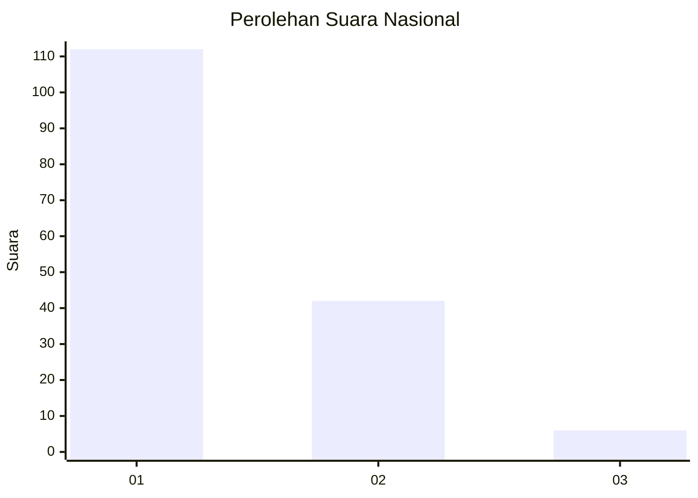
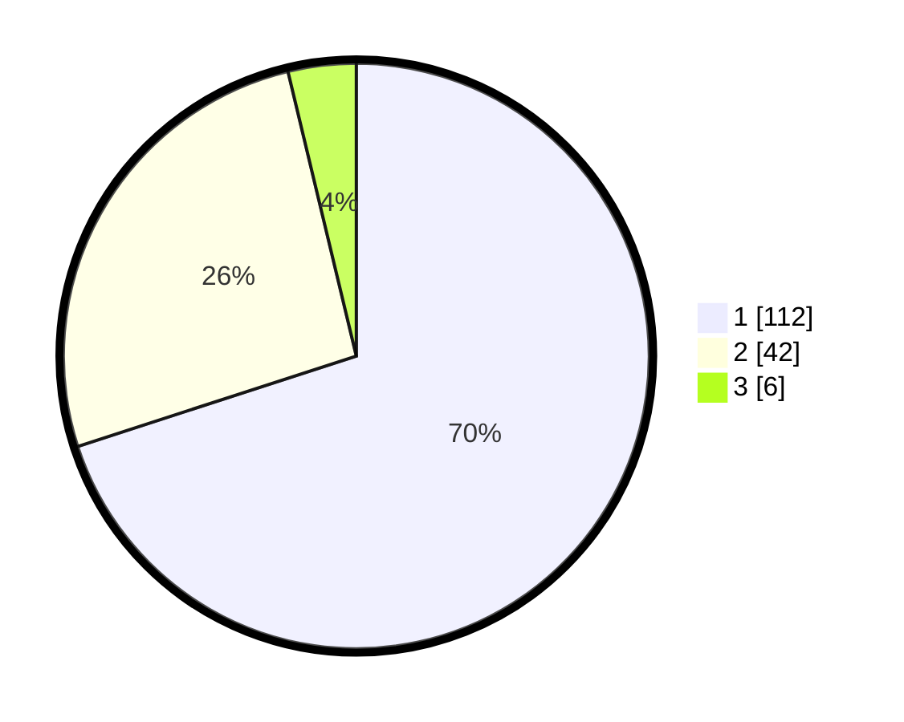

# Hasil

## Grafik

## Tabel

| No. | Nama Paslon    | Suara | Suara (raw) | Persentase |
|:--- |:-------------- | -----:| -----------:| ----------:|
| 1   | ANIES MUHAIMIN | 112   | [112][p-1]  | 70,00      |
| 2   | PRABOWO GIBRAN | 42    | [42][p-2]   | 26,25      |
| 3   | GANJAR MAHFUD  | 6     | [6][p-3]    | 3,75       |

[p-1]: https://github.com/gigit-pemilu/pemilu-2024/blob/main/pilpres/hitung-suara/sub/11-aceh/sub/13-gayo-lues/sub/05-pining/sub/2006-pintu-rime/sub/001-tps/sub/paslon-1.txt
[p-2]: https://github.com/gigit-pemilu/pemilu-2024/blob/main/pilpres/hitung-suara/sub/11-aceh/sub/13-gayo-lues/sub/05-pining/sub/2006-pintu-rime/sub/001-tps/sub/paslon-2.txt
[p-3]: https://github.com/gigit-pemilu/pemilu-2024/blob/main/pilpres/hitung-suara/sub/11-aceh/sub/13-gayo-lues/sub/05-pining/sub/2006-pintu-rime/sub/001-tps/sub/paslon-3.txt

## Foto C Plano

https://sirekap-obj-formc.kpu.go.id/9812/pemilu/ppwp/11/13/05/20/06/1113052006001-20240215-025126--b4828e66-e48a-44e2-a798-728af0b129b3.jpg

https://sirekap-obj-formc.kpu.go.id/9812/pemilu/ppwp/11/13/05/20/06/1113052006001-20240215-024001--5fac2149-0fad-4f74-9853-9ee600509a34.jpg

https://sirekap-obj-formc.kpu.go.id/9812/pemilu/ppwp/11/13/05/20/06/1113052006001-20240214-184953--db899dc5-d29a-4c2d-be0c-1f222e509620.jpg

## Metadata

| Key        | Value               |
| ---------- | ------------------- |
| Time Stamp | 2024-02-24 22:31:28 |

