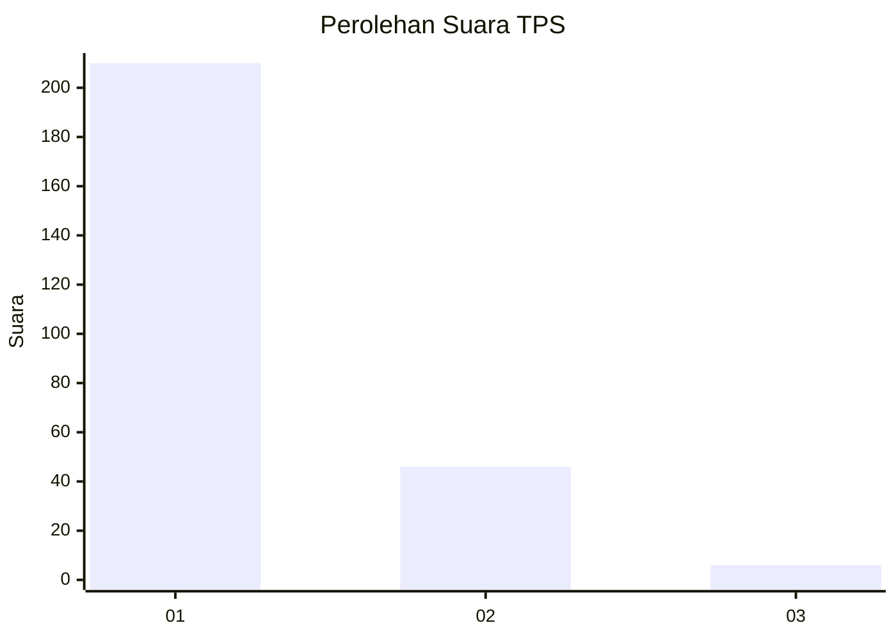
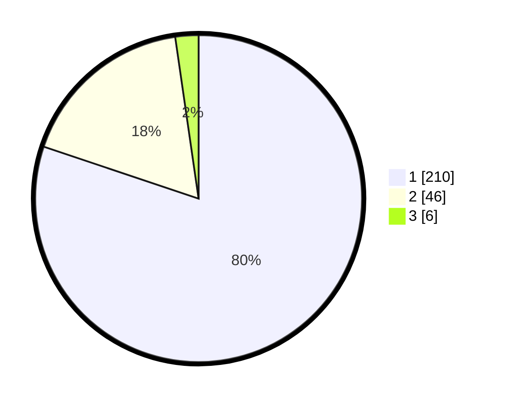

# Hasil

## Grafik

## Tabel

| No. | Nama Paslon    | Suara | Suara (raw) | Persentase |
|:--- |:-------------- | -----:| -----------:| ----------:|
| 1   | ANIES MUHAIMIN | 210   | [210][p-1]  | 80,15      |
| 2   | PRABOWO GIBRAN | 46    | [46][p-2]   | 17,56      |
| 3   | GANJAR MAHFUD  | 6     | [6][p-3]    | 2,29       |

[p-1]: https://github.com/gigit-pemilu/pemilu-2024-11-aceh/blob/main/pilpres/hitung-suara/sub/11-aceh/sub/13-gayo-lues/sub/06-blangpegayon/sub/2002-kutabukit/sub/001-tps/sub/paslon-1.txt
[p-2]: https://github.com/gigit-pemilu/pemilu-2024-11-aceh/blob/main/pilpres/hitung-suara/sub/11-aceh/sub/13-gayo-lues/sub/06-blangpegayon/sub/2002-kutabukit/sub/001-tps/sub/paslon-2.txt
[p-3]: https://github.com/gigit-pemilu/pemilu-2024-11-aceh/blob/main/pilpres/hitung-suara/sub/11-aceh/sub/13-gayo-lues/sub/06-blangpegayon/sub/2002-kutabukit/sub/001-tps/sub/paslon-3.txt

## Foto C Plano

https://sirekap-obj-formc.kpu.go.id/ae3b/pemilu/ppwp/11/13/06/20/02/1113062002001-20240215-162858--9e008414-55dd-4dab-8963-2aaf52812ce1.jpg

https://sirekap-obj-formc.kpu.go.id/ae3b/pemilu/ppwp/11/13/06/20/02/1113062002001-20240215-162938--292e5568-65b0-4a62-928b-115009ba360a.jpg

https://sirekap-obj-formc.kpu.go.id/ae3b/pemilu/ppwp/11/13/06/20/02/1113062002001-20240215-163020--5cf85f9b-6a0a-48d1-a6e9-8728af38900c.jpg

## Metadata

| Key        | Value               |
| ---------- | ------------------- |
| Time Stamp | 2024-02-19 06:16:00 |

## DATA PEMILIH TETAP

Jumlah pemilih dalam DPT: **293**.
 * L: **142**.
 * P: **151**.

## DATA PENGGUNA HAK PILIH

Jumlah pengguna hak pilih dalam DPT: **267**.
 * L: **128**.
 * P: **139**.

Jumlah pengguna hak pilih dalam DPTb: **1**.
 * L: **0**.
 * P: **1**.

Jumlah pengguna hak pilih dalam DPK: **0**.
 * L: **0**.
 * P: **0**.

Jumlah pengguna hak pilih: **268**.
 * L: **128**.
 * P: **140**.

## JUMLAH SUARA SAH DAN TIDAK SAH

JUMLAH SELURUH SUARA SAH: **262**.

JUMLAH SUARA TIDAK SAH: **6**.

JUMLAH SELURUH SUARA SAH DAN SUARA TIDAK SAH: **268**.

