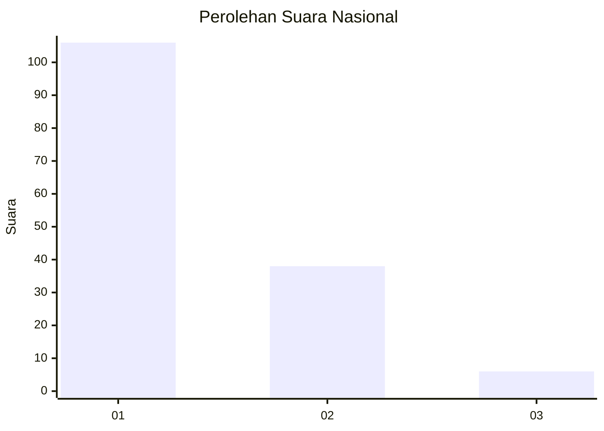
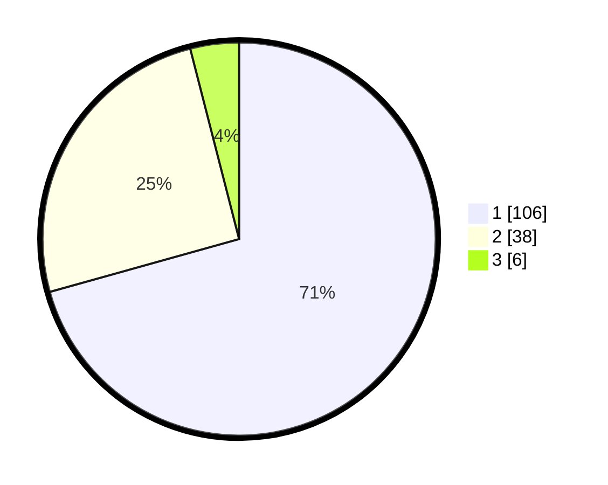

# Hasil

## Grafik

## Tabel

| No. | Nama Paslon    | Suara | Suara (raw) | Persentase |
|:--- |:-------------- | -----:| -----------:| ----------:|
| 1   | ANIES MUHAIMIN | 106   | [106][p-1]  | 70,67      |
| 2   | PRABOWO GIBRAN | 38    | [38][p-2]   | 25,33      |
| 3   | GANJAR MAHFUD  | 6     | [6][p-3]    | 4,00       |

[p-1]: https://github.com/gigit-pemilu/pemilu-2024/blob/main/pilpres/hitung-suara/sub/11-aceh/sub/13-gayo-lues/sub/06-blangpegayon/sub/2002-kutabukit/sub/002-tps/sub/paslon-1.txt
[p-2]: https://github.com/gigit-pemilu/pemilu-2024/blob/main/pilpres/hitung-suara/sub/11-aceh/sub/13-gayo-lues/sub/06-blangpegayon/sub/2002-kutabukit/sub/002-tps/sub/paslon-2.txt
[p-3]: https://github.com/gigit-pemilu/pemilu-2024/blob/main/pilpres/hitung-suara/sub/11-aceh/sub/13-gayo-lues/sub/06-blangpegayon/sub/2002-kutabukit/sub/002-tps/sub/paslon-3.txt

## Foto C Plano

https://sirekap-obj-formc.kpu.go.id/9d6f/pemilu/ppwp/11/13/06/20/02/1113062002002-20240216-143822--fa61b7ca-df04-4545-9f9b-ee6f1f429e52.jpg

https://sirekap-obj-formc.kpu.go.id/9d6f/pemilu/ppwp/11/13/06/20/02/1113062002002-20240216-143823--465eec76-e030-4de6-9801-a421a16fc872.jpg

https://sirekap-obj-formc.kpu.go.id/9d6f/pemilu/ppwp/11/13/06/20/02/1113062002002-20240216-143823--22153b76-3a72-4db3-af23-3c7e9b907cd4.jpg

## Metadata

| Key        | Value               |
| ---------- | ------------------- |
| Time Stamp | 2024-02-16 22:01:00 |

## DATA PEMILIH TETAP

Jumlah pemilih dalam DPT: **168**.
 * L: **94**.
 * P: **74**.

## DATA PENGGUNA HAK PILIH

Jumlah pengguna hak pilih dalam DPT: **155**.
 * L: **86**.
 * P: **69**.

Jumlah pengguna hak pilih dalam DPTb: **1**.
 * L: **0**.
 * P: **1**.

Jumlah pengguna hak pilih dalam DPK: **4**.
 * L: **2**.
 * P: **2**.

Jumlah pengguna hak pilih: **160**.
 * L: **88**.
 * P: **72**.

## JUMLAH SUARA SAH DAN TIDAK SAH

JUMLAH SELURUH SUARA SAH: **150**.

JUMLAH SUARA TIDAK SAH: **10**.

JUMLAH SELURUH SUARA SAH DAN SUARA TIDAK SAH: **160**.

