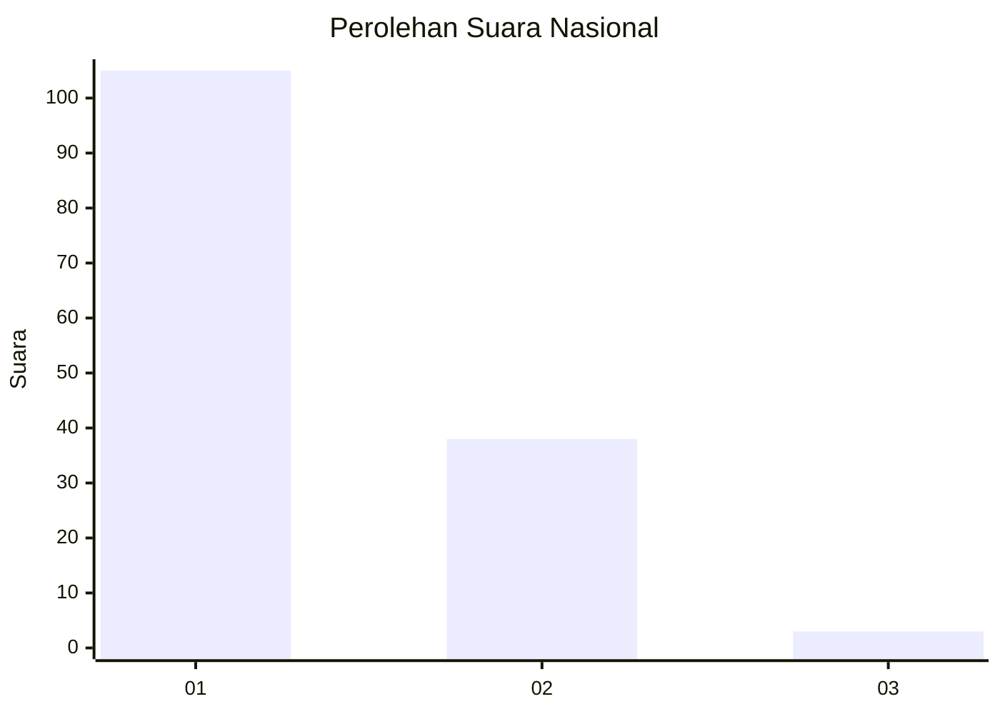
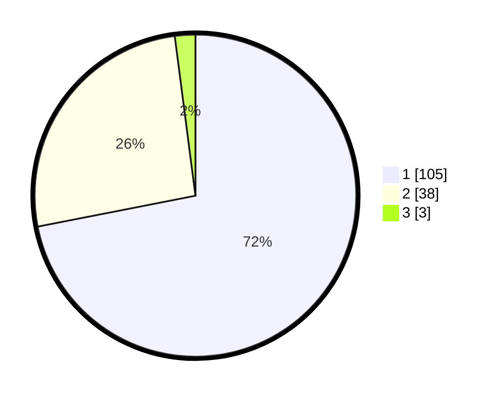

# Hasil

## Grafik

## Tabel

| No. | Nama Paslon    | Suara | Suara (raw) | Persentase |
|:--- |:-------------- | -----:| -----------:| ----------:|
| 1   | ANIES MUHAIMIN | 105   | [105][p-1]  | 71,92      |
| 2   | PRABOWO GIBRAN | 38    | [38][p-2]   | 26,03      |
| 3   | GANJAR MAHFUD  | 3     | [3][p-3]    | 2,05       |

[p-1]: https://github.com/gigit-pemilu/pemilu-2024/blob/main/pilpres/hitung-suara/sub/11-aceh/sub/13-gayo-lues/sub/06-blangpegayon/sub/2012-akang-siwah/sub/001-tps/sub/paslon-1.txt
[p-2]: https://github.com/gigit-pemilu/pemilu-2024/blob/main/pilpres/hitung-suara/sub/11-aceh/sub/13-gayo-lues/sub/06-blangpegayon/sub/2012-akang-siwah/sub/001-tps/sub/paslon-2.txt
[p-3]: https://github.com/gigit-pemilu/pemilu-2024/blob/main/pilpres/hitung-suara/sub/11-aceh/sub/13-gayo-lues/sub/06-blangpegayon/sub/2012-akang-siwah/sub/001-tps/sub/paslon-3.txt

## Foto C Plano

https://sirekap-obj-formc.kpu.go.id/005a/pemilu/ppwp/11/13/06/20/12/1113062012001-20240219-120627--40e99ff8-3ec6-4d69-bf80-60ec29fee96e.jpg

https://sirekap-obj-formc.kpu.go.id/005a/pemilu/ppwp/11/13/06/20/12/1113062012001-20240219-120913--08b8af22-29a5-4a1f-a6d1-d504bea95ca5.jpg

https://sirekap-obj-formc.kpu.go.id/005a/pemilu/ppwp/11/13/06/20/12/1113062012001-20240219-121022--d4f91798-83ce-4492-850c-4358158e0247.jpg

## Metadata

| Key        | Value               |
| ---------- | ------------------- |
| Time Stamp | 2024-02-21 21:00:04 |

## DATA PEMILIH TETAP

Jumlah pemilih dalam DPT: **165**.
 * L: **93**.
 * P: **72**.

## DATA PENGGUNA HAK PILIH

Jumlah pengguna hak pilih dalam DPT: **152**.
 * L: **87**.
 * P: **65**.

Jumlah pengguna hak pilih dalam DPTb: **403**.
 * L: **1**.
 * P: **2**.

Jumlah pengguna hak pilih dalam DPK: **2**.
 * L: **1**.
 * P: **1**.

Jumlah pengguna hak pilih: **157**.
 * L: **89**.
 * P: **68**.

## JUMLAH SUARA SAH DAN TIDAK SAH

JUMLAH SELURUH SUARA SAH: **146**.

JUMLAH SUARA TIDAK SAH: **11**.

JUMLAH SELURUH SUARA SAH DAN SUARA TIDAK SAH: **157**.

