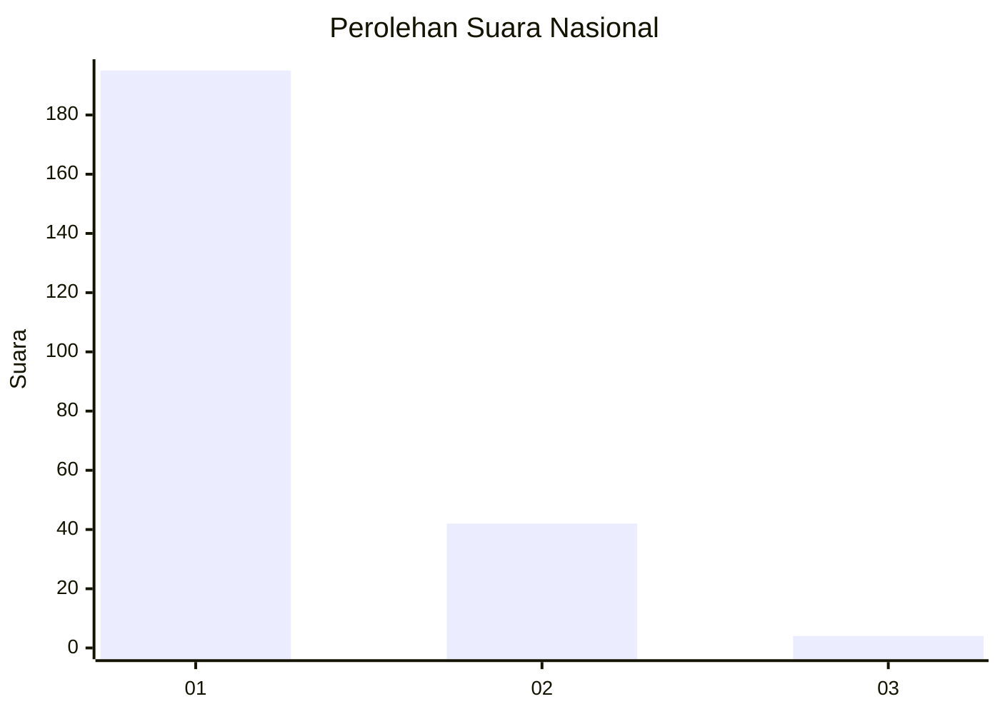
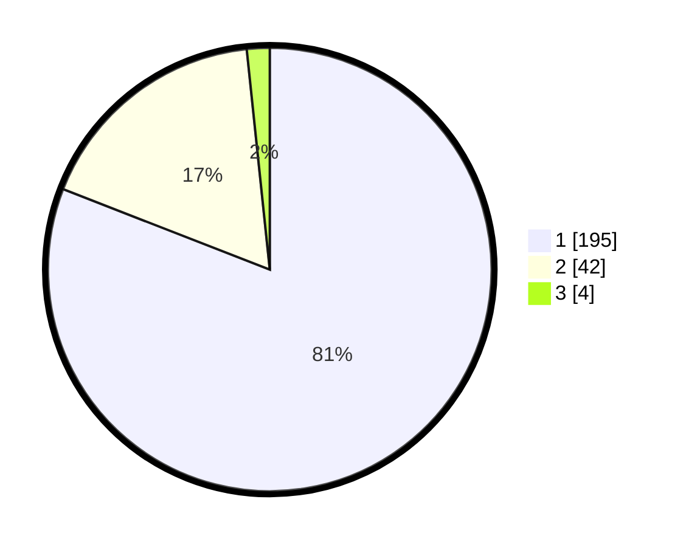

# Hasil

## Grafik

## Tabel

| No. | Nama Paslon    | Suara | Suara (raw) | Persentase |
|:--- |:-------------- | -----:| -----------:| ----------:|
| 1   | ANIES MUHAIMIN | 195   | [195][p-1]  | 80,91      |
| 2   | PRABOWO GIBRAN | 42    | [42][p-2]   | 17,43      |
| 3   | GANJAR MAHFUD  | 4     | [4][p-3]    | 1,66       |

[p-1]: https://github.com/gigit-pemilu/pemilu-2024/blob/main/pilpres/hitung-suara/sub/11-aceh/sub/13-gayo-lues/sub/07-puteri-betung/sub/2002-marpunge/sub/001-tps/sub/paslon-1.txt
[p-2]: https://github.com/gigit-pemilu/pemilu-2024/blob/main/pilpres/hitung-suara/sub/11-aceh/sub/13-gayo-lues/sub/07-puteri-betung/sub/2002-marpunge/sub/001-tps/sub/paslon-2.txt
[p-3]: https://github.com/gigit-pemilu/pemilu-2024/blob/main/pilpres/hitung-suara/sub/11-aceh/sub/13-gayo-lues/sub/07-puteri-betung/sub/2002-marpunge/sub/001-tps/sub/paslon-3.txt

## Foto C Plano

https://sirekap-obj-formc.kpu.go.id/16d7/pemilu/ppwp/11/13/07/20/02/1113072002001-20240215-141139--8a7b8b4b-c850-4103-902b-b4e79491d83b.jpg

https://sirekap-obj-formc.kpu.go.id/16d7/pemilu/ppwp/11/13/07/20/02/1113072002001-20240215-141200--677b1a9a-d0a7-4318-b3e8-daf78a215187.jpg

https://sirekap-obj-formc.kpu.go.id/16d7/pemilu/ppwp/11/13/07/20/02/1113072002001-20240215-141224--54de430b-2dee-4d0a-9762-4683ec81f1be.jpg

## Metadata

| Key        | Value               |
| ---------- | ------------------- |
| Time Stamp | 2024-02-15 17:00:25 |

## DATA PEMILIH TETAP

Jumlah pemilih dalam DPT: **266**.
 * L: **128**.
 * P: **138**.

## DATA PENGGUNA HAK PILIH

Jumlah pengguna hak pilih dalam DPT: **239**.
 * L: **114**.
 * P: **125**.

Jumlah pengguna hak pilih dalam DPTb: **3**.
 * L: **1**.
 * P: **2**.

Jumlah pengguna hak pilih dalam DPK: **0**.
 * L: **0**.
 * P: **0**.

Jumlah pengguna hak pilih: **242**.
 * L: **115**.
 * P: **127**.

## JUMLAH SUARA SAH DAN TIDAK SAH

JUMLAH SELURUH SUARA SAH: **241**.

JUMLAH SUARA TIDAK SAH: **1**.

JUMLAH SELURUH SUARA SAH DAN SUARA TIDAK SAH: **242**.

