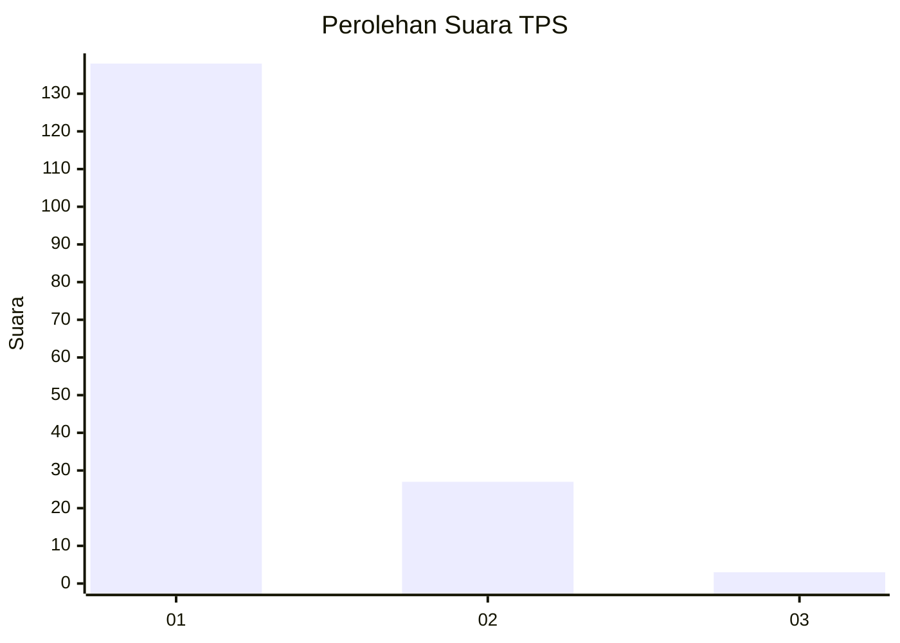
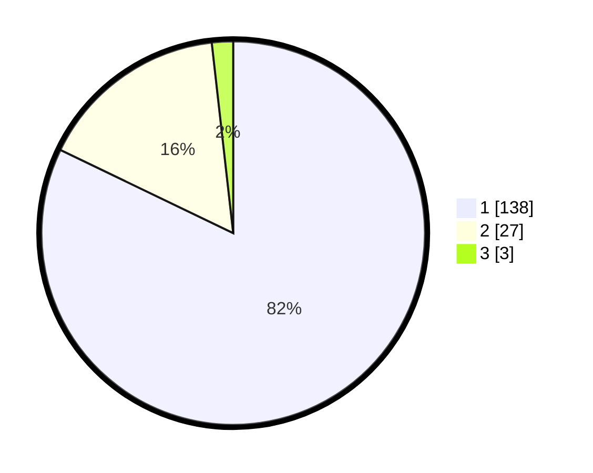

# Hasil

## Grafik

## Tabel

| No. | Nama Paslon    | Suara | Suara (raw) | Persentase |
|:--- |:-------------- | -----:| -----------:| ----------:|
| 1   | ANIES MUHAIMIN | 138   | [138][p-1]  | 82,14      |
| 2   | PRABOWO GIBRAN | 27    | [27][p-2]   | 16,07      |
| 3   | GANJAR MAHFUD  | 3     | [3][p-3]    | 1,79       |

[p-1]: https://github.com/gigit-pemilu/pemilu-2024-11-aceh/blob/main/pilpres/hitung-suara/sub/11-aceh/sub/13-gayo-lues/sub/07-puteri-betung/sub/2002-marpunge/sub/002-tps/sub/paslon-1.txt
[p-2]: https://github.com/gigit-pemilu/pemilu-2024-11-aceh/blob/main/pilpres/hitung-suara/sub/11-aceh/sub/13-gayo-lues/sub/07-puteri-betung/sub/2002-marpunge/sub/002-tps/sub/paslon-2.txt
[p-3]: https://github.com/gigit-pemilu/pemilu-2024-11-aceh/blob/main/pilpres/hitung-suara/sub/11-aceh/sub/13-gayo-lues/sub/07-puteri-betung/sub/2002-marpunge/sub/002-tps/sub/paslon-3.txt

## Foto C Plano

https://sirekap-obj-formc.kpu.go.id/c553/pemilu/ppwp/11/13/07/20/02/1113072002002-20240216-121357--43279c69-92e3-4dfd-a99b-67deee4e4d71.jpg

https://sirekap-obj-formc.kpu.go.id/c553/pemilu/ppwp/11/13/07/20/02/1113072002002-20240216-121436--0e1f5532-1137-487f-9e8a-f8f773230fff.jpg

https://sirekap-obj-formc.kpu.go.id/c553/pemilu/ppwp/11/13/07/20/02/1113072002002-20240216-121454--270e7b58-f4dd-45da-b88f-446e6a4d7972.jpg

## Metadata

| Key        | Value               |
| ---------- | ------------------- |
| Time Stamp | 2024-02-24 22:31:28 |

