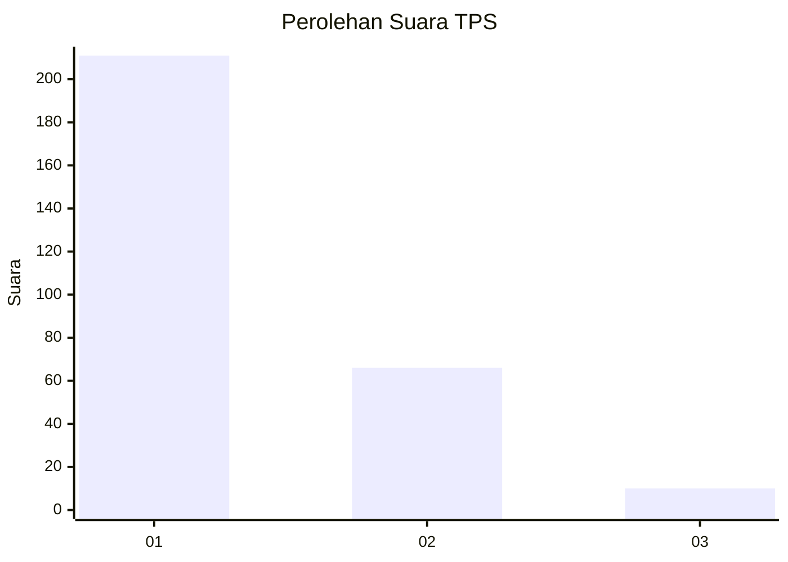
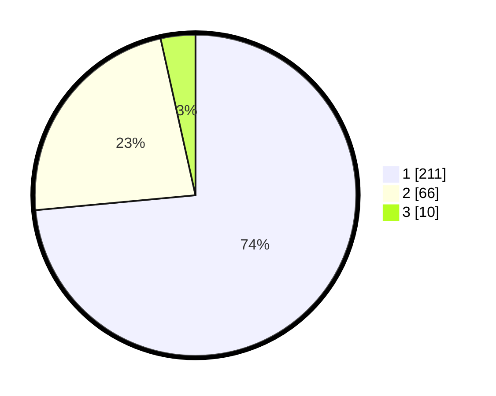

# Hasil

## Grafik

## Tabel

| No. | Nama Paslon    | Suara | Suara (raw) | Persentase |
|:--- |:-------------- | -----:| -----------:| ----------:|
| 1   | ANIES MUHAIMIN | 211   | [211][p-1]  | 73,52      |
| 2   | PRABOWO GIBRAN | 66    | [66][p-2]   | 23,00      |
| 3   | GANJAR MAHFUD  | 10    | [10][p-3]   | 3,48       |

[p-1]: https://github.com/gigit-pemilu/pemilu-2024-11-aceh/blob/main/pilpres/hitung-suara/sub/11-aceh/sub/13-gayo-lues/sub/07-puteri-betung/sub/2002-marpunge/sub/003-tps/sub/paslon-1.txt
[p-2]: https://github.com/gigit-pemilu/pemilu-2024-11-aceh/blob/main/pilpres/hitung-suara/sub/11-aceh/sub/13-gayo-lues/sub/07-puteri-betung/sub/2002-marpunge/sub/003-tps/sub/paslon-2.txt
[p-3]: https://github.com/gigit-pemilu/pemilu-2024-11-aceh/blob/main/pilpres/hitung-suara/sub/11-aceh/sub/13-gayo-lues/sub/07-puteri-betung/sub/2002-marpunge/sub/003-tps/sub/paslon-3.txt

## Foto C Plano

https://sirekap-obj-formc.kpu.go.id/ac10/pemilu/ppwp/11/13/07/20/02/1113072002003-20240216-115356--d5cc99f9-13dd-4599-b9a8-f2832666c05b.jpg

https://sirekap-obj-formc.kpu.go.id/ac10/pemilu/ppwp/11/13/07/20/02/1113072002003-20240216-115404--dc8a3f6c-5d2e-43a2-8144-e5579144e237.jpg

https://sirekap-obj-formc.kpu.go.id/ac10/pemilu/ppwp/11/13/07/20/02/1113072002003-20240216-115359--0049efcd-5660-470e-91cd-3a9fe5bfa185.jpg

## Metadata

| Key        | Value               |
| ---------- | ------------------- |
| Time Stamp | 2024-02-16 22:30:00 |

## DATA PEMILIH TETAP

Jumlah pemilih dalam DPT: **298**.
 * L: **151**.
 * P: **147**.

## DATA PENGGUNA HAK PILIH

Jumlah pengguna hak pilih dalam DPT: **283**.
 * L: **147**.
 * P: **136**.

Jumlah pengguna hak pilih dalam DPTb: **10**.
 * L: **3**.
 * P: **7**.

Jumlah pengguna hak pilih dalam DPK: **0**.
 * L: **0**.
 * P: **0**.

Jumlah pengguna hak pilih: **293**.
 * L: **150**.
 * P: **143**.

## JUMLAH SUARA SAH DAN TIDAK SAH

JUMLAH SELURUH SUARA SAH: **287**.

JUMLAH SUARA TIDAK SAH: **6**.

JUMLAH SELURUH SUARA SAH DAN SUARA TIDAK SAH: **293**.

