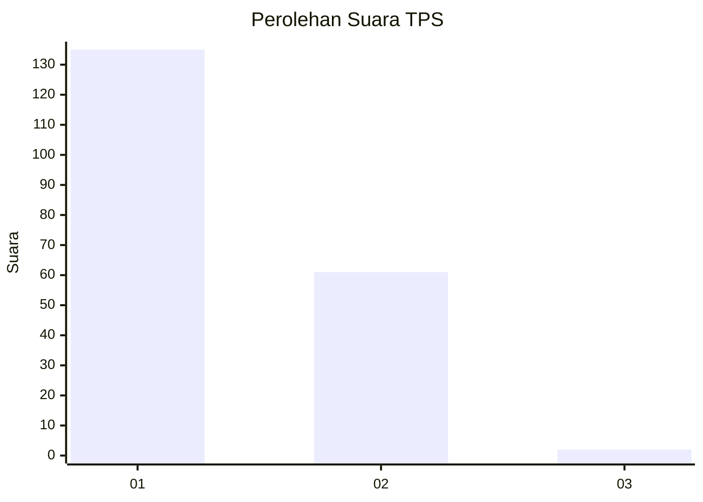
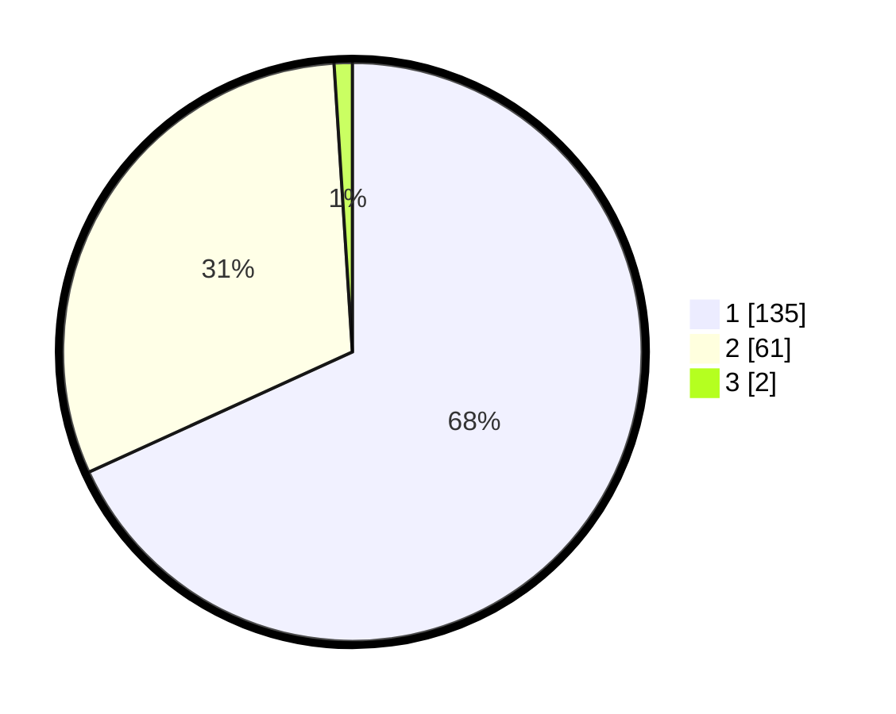

# Hasil

## Grafik

## Tabel

| No. | Nama Paslon    | Suara | Suara (raw) | Persentase |
|:--- |:-------------- | -----:| -----------:| ----------:|
| 1   | ANIES MUHAIMIN | 135   | [135][p-1]  | 68,18      |
| 2   | PRABOWO GIBRAN | 61    | [61][p-2]   | 30,81      |
| 3   | GANJAR MAHFUD  | 2     | [2][p-3]    | 1,01       |

[p-1]: https://github.com/gigit-pemilu/pemilu-2024-11-aceh/blob/main/pilpres/hitung-suara/sub/11-aceh/sub/13-gayo-lues/sub/07-puteri-betung/sub/2004-meloak-sepakat/sub/001-tps/sub/paslon-1.txt
[p-2]: https://github.com/gigit-pemilu/pemilu-2024-11-aceh/blob/main/pilpres/hitung-suara/sub/11-aceh/sub/13-gayo-lues/sub/07-puteri-betung/sub/2004-meloak-sepakat/sub/001-tps/sub/paslon-2.txt
[p-3]: https://github.com/gigit-pemilu/pemilu-2024-11-aceh/blob/main/pilpres/hitung-suara/sub/11-aceh/sub/13-gayo-lues/sub/07-puteri-betung/sub/2004-meloak-sepakat/sub/001-tps/sub/paslon-3.txt

## Foto C Plano

https://sirekap-obj-formc.kpu.go.id/1cf8/pemilu/ppwp/11/13/07/20/04/1113072004001-20240218-202716--a973573a-5022-4071-be98-ddf4d307a143.jpg

https://sirekap-obj-formc.kpu.go.id/1cf8/pemilu/ppwp/11/13/07/20/04/1113072004001-20240218-202907--8eb4d8e5-d84a-4a8a-8b2a-dd73591a82ca.jpg

https://sirekap-obj-formc.kpu.go.id/1cf8/pemilu/ppwp/11/13/07/20/04/1113072004001-20240218-203210--1ed7cc0b-d248-4b19-a6d2-3673474b6046.jpg

## Metadata

| Key        | Value               |
| ---------- | ------------------- |
| Time Stamp | 2024-02-19 06:16:00 |

## DATA PEMILIH TETAP

Jumlah pemilih dalam DPT: **204**.
 * L: **155**.
 * P: **32**.

## DATA PENGGUNA HAK PILIH

Jumlah pengguna hak pilih dalam DPT: **197**.
 * L: **153**.
 * P: **232**.

Jumlah pengguna hak pilih dalam DPTb: **777**.
 * L: **7**.
 * P: **753**.

Jumlah pengguna hak pilih dalam DPK: **772**.
 * L: **203**.
 * P: **952**.

Jumlah pengguna hak pilih: **272**.
 * L: **771**.
 * P: **997**.

## JUMLAH SUARA SAH DAN TIDAK SAH

JUMLAH SELURUH SUARA SAH: **198**.

JUMLAH SUARA TIDAK SAH: **3**.

JUMLAH SELURUH SUARA SAH DAN SUARA TIDAK SAH: **201**.

