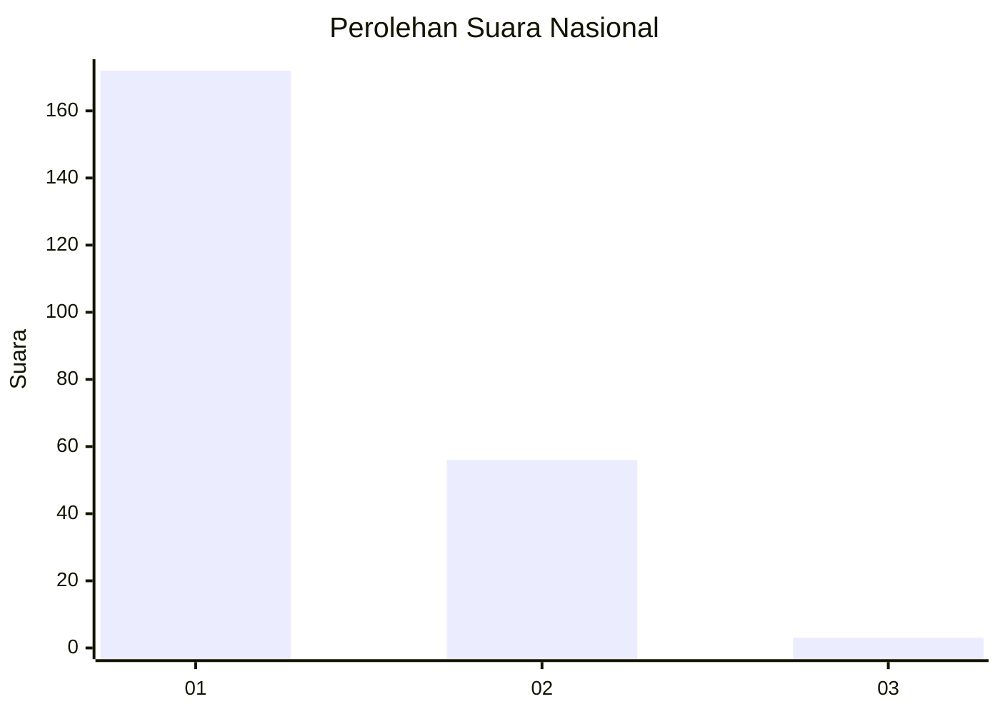
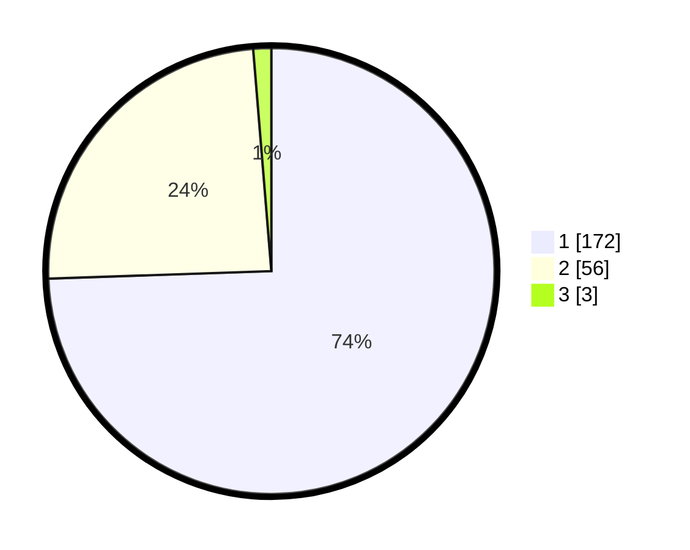

# Hasil

## Grafik

## Tabel

| No. | Nama Paslon    | Suara | Suara (raw) | Persentase |
|:--- |:-------------- | -----:| -----------:| ----------:|
| 1   | ANIES MUHAIMIN | 172   | [172][p-1]  | 74,46      |
| 2   | PRABOWO GIBRAN | 56    | [56][p-2]   | 24,24      |
| 3   | GANJAR MAHFUD  | 3     | [3][p-3]    | 1,30       |

[p-1]: https://github.com/gigit-pemilu/pemilu-2024/blob/main/pilpres/hitung-suara/sub/11-aceh/sub/13-gayo-lues/sub/07-puteri-betung/sub/2004-meloak-sepakat/sub/002-tps/sub/paslon-1.txt
[p-2]: https://github.com/gigit-pemilu/pemilu-2024/blob/main/pilpres/hitung-suara/sub/11-aceh/sub/13-gayo-lues/sub/07-puteri-betung/sub/2004-meloak-sepakat/sub/002-tps/sub/paslon-2.txt
[p-3]: https://github.com/gigit-pemilu/pemilu-2024/blob/main/pilpres/hitung-suara/sub/11-aceh/sub/13-gayo-lues/sub/07-puteri-betung/sub/2004-meloak-sepakat/sub/002-tps/sub/paslon-3.txt

## Foto C Plano

https://sirekap-obj-formc.kpu.go.id/1e47/pemilu/ppwp/11/13/07/20/04/1113072004002-20240218-204305--b157ce5d-ca51-4ff0-a2e0-00d422d30202.jpg

https://sirekap-obj-formc.kpu.go.id/1e47/pemilu/ppwp/11/13/07/20/04/1113072004002-20240218-204721--e2e1736a-aad5-411a-bcf3-0b92f1fd7e34.jpg

https://sirekap-obj-formc.kpu.go.id/1e47/pemilu/ppwp/11/13/07/20/04/1113072004002-20240218-204814--07d7a6f9-f59e-4f52-aadd-2f347304b0ce.jpg

## Metadata

| Key        | Value               |
| ---------- | ------------------- |
| Time Stamp | 2024-02-19 06:16:00 |

## DATA PEMILIH TETAP

Jumlah pemilih dalam DPT: **247**.
 * L: **125**.
 * P: **122**.

## DATA PENGGUNA HAK PILIH

Jumlah pengguna hak pilih dalam DPT: **225**.
 * L: **114**.
 * P: **111**.

Jumlah pengguna hak pilih dalam DPTb: **510**.
 * L: **5**.
 * P: **5**.

Jumlah pengguna hak pilih dalam DPK: **506**.
 * L: **55**.
 * P: **1**.

Jumlah pengguna hak pilih: **241**.
 * L: **124**.
 * P: **117**.

## JUMLAH SUARA SAH DAN TIDAK SAH

JUMLAH SELURUH SUARA SAH: **231**.

JUMLAH SUARA TIDAK SAH: **10**.

JUMLAH SELURUH SUARA SAH DAN SUARA TIDAK SAH: **241**.

