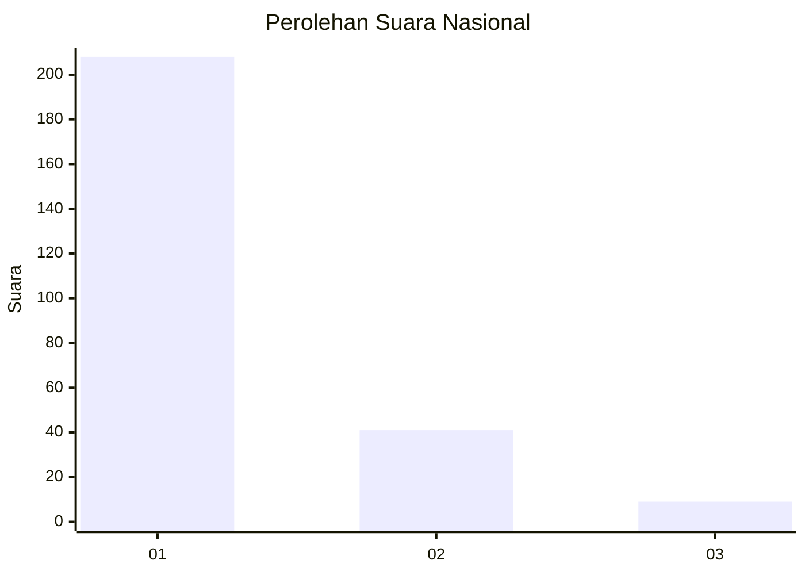
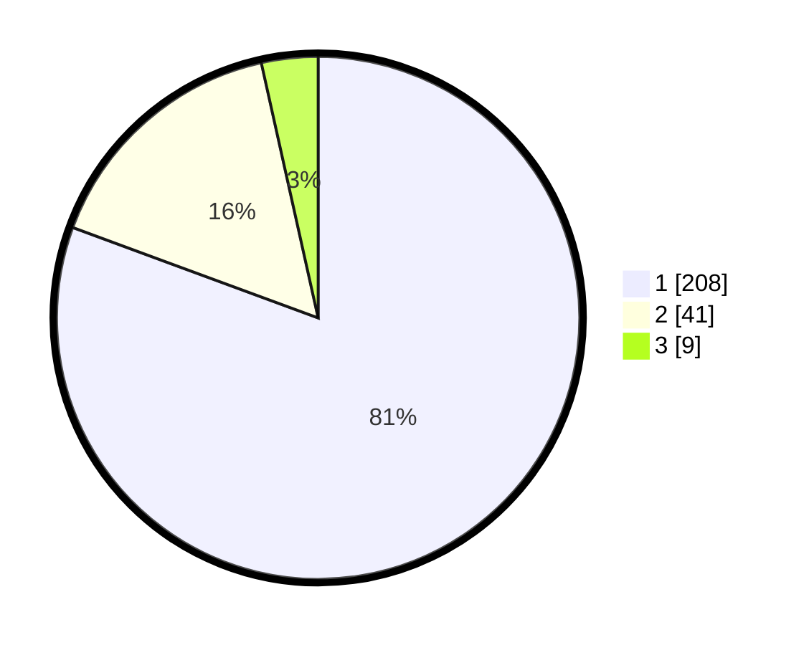

# Hasil

## Grafik

## Tabel

| No. | Nama Paslon    | Suara | Suara (raw) | Persentase |
|:--- |:-------------- | -----:| -----------:| ----------:|
| 1   | ANIES MUHAIMIN | 208   | [208][p-1]  | 80,62      |
| 2   | PRABOWO GIBRAN | 41    | [41][p-2]   | 15,89      |
| 3   | GANJAR MAHFUD  | 9     | [9][p-3]    | 3,49       |

[p-1]: https://github.com/gigit-pemilu/pemilu-2024/blob/main/pilpres/hitung-suara/sub/11-aceh/sub/13-gayo-lues/sub/07-puteri-betung/sub/2006-singah-mulo/sub/001-tps/sub/paslon-1.txt
[p-2]: https://github.com/gigit-pemilu/pemilu-2024/blob/main/pilpres/hitung-suara/sub/11-aceh/sub/13-gayo-lues/sub/07-puteri-betung/sub/2006-singah-mulo/sub/001-tps/sub/paslon-2.txt
[p-3]: https://github.com/gigit-pemilu/pemilu-2024/blob/main/pilpres/hitung-suara/sub/11-aceh/sub/13-gayo-lues/sub/07-puteri-betung/sub/2006-singah-mulo/sub/001-tps/sub/paslon-3.txt

## Foto C Plano

https://sirekap-obj-formc.kpu.go.id/9fc0/pemilu/ppwp/11/13/07/20/06/1113072006001-20240218-215134--ae9dd286-57ef-4d18-b1d4-72b7165e347e.jpg

https://sirekap-obj-formc.kpu.go.id/9fc0/pemilu/ppwp/11/13/07/20/06/1113072006001-20240218-215256--fb71d337-2d52-4fee-b944-76bfb097c885.jpg

https://sirekap-obj-formc.kpu.go.id/9fc0/pemilu/ppwp/11/13/07/20/06/1113072006001-20240218-215344--77def03c-b0cb-48f6-ba4c-f74ddeebf2c8.jpg

## Metadata

| Key        | Value               |
| ---------- | ------------------- |
| Time Stamp | 2024-02-19 06:16:00 |

## DATA PEMILIH TETAP

Jumlah pemilih dalam DPT: **281**.
 * L: **145**.
 * P: **136**.

## DATA PENGGUNA HAK PILIH

Jumlah pengguna hak pilih dalam DPT: **253**.
 * L: **120**.
 * P: **123**.

Jumlah pengguna hak pilih dalam DPTb: **5**.
 * L: **602**.
 * P: **7**.

Jumlah pengguna hak pilih dalam DPK: **3**.
 * L: **2**.
 * P: **1**.

Jumlah pengguna hak pilih: **281**.
 * L: **134**.
 * P: **127**.

## JUMLAH SUARA SAH DAN TIDAK SAH

JUMLAH SELURUH SUARA SAH: **258**.

JUMLAH SUARA TIDAK SAH: **3**.

JUMLAH SELURUH SUARA SAH DAN SUARA TIDAK SAH: **261**.

