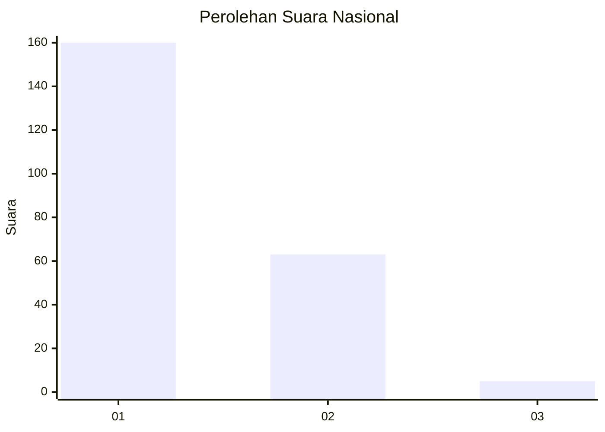
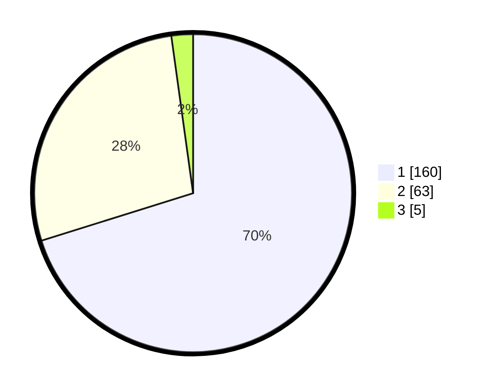

# Hasil

## Grafik

## Tabel

| No. | Nama Paslon    | Suara | Suara (raw) | Persentase |
|:--- |:-------------- | -----:| -----------:| ----------:|
| 1   | ANIES MUHAIMIN | 160   | [160][p-1]  | 70,18      |
| 2   | PRABOWO GIBRAN | 63    | [63][p-2]   | 27,63      |
| 3   | GANJAR MAHFUD  | 5     | [5][p-3]    | 2,19       |

[p-1]: https://github.com/gigit-pemilu/pemilu-2024/blob/main/pilpres/hitung-suara/sub/11-aceh/sub/13-gayo-lues/sub/07-puteri-betung/sub/2007-uning-pune/sub/001-tps/sub/paslon-1.txt
[p-2]: https://github.com/gigit-pemilu/pemilu-2024/blob/main/pilpres/hitung-suara/sub/11-aceh/sub/13-gayo-lues/sub/07-puteri-betung/sub/2007-uning-pune/sub/001-tps/sub/paslon-2.txt
[p-3]: https://github.com/gigit-pemilu/pemilu-2024/blob/main/pilpres/hitung-suara/sub/11-aceh/sub/13-gayo-lues/sub/07-puteri-betung/sub/2007-uning-pune/sub/001-tps/sub/paslon-3.txt

## Foto C Plano

https://sirekap-obj-formc.kpu.go.id/4796/pemilu/ppwp/11/13/07/20/07/1113072007001-20240215-143518--861143b1-c1d6-4337-bd7f-81c4f1610360.jpg

https://sirekap-obj-formc.kpu.go.id/4796/pemilu/ppwp/11/13/07/20/07/1113072007001-20240215-143615--ed94a163-42f6-4195-b4ae-0e3bff6ab36c.jpg

https://sirekap-obj-formc.kpu.go.id/4796/pemilu/ppwp/11/13/07/20/07/1113072007001-20240215-194834--d5565d5c-be04-4116-9f03-d8f354a87b77.jpg

## Metadata

| Key        | Value               |
| ---------- | ------------------- |
| Time Stamp | 2024-02-15 22:40:13 |

