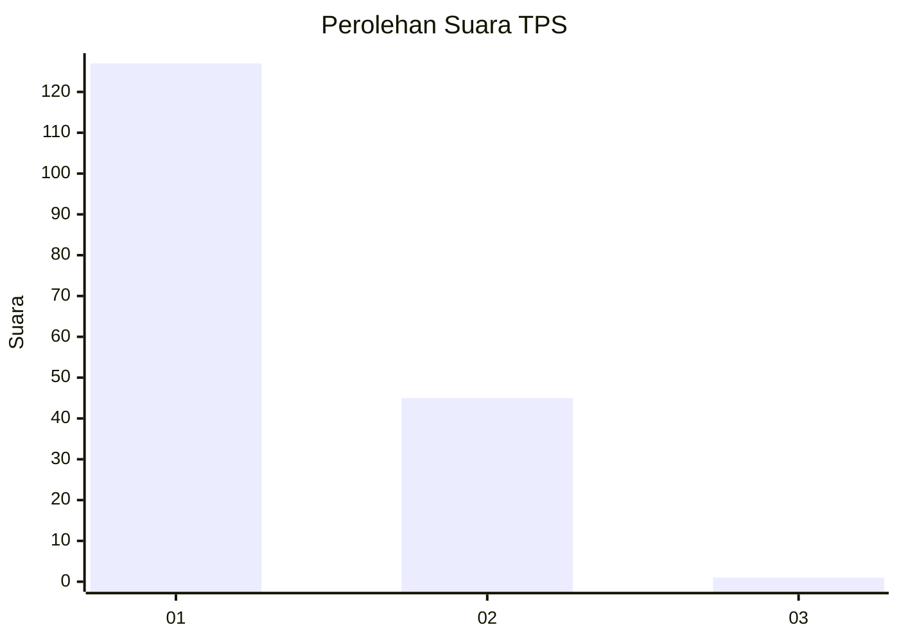
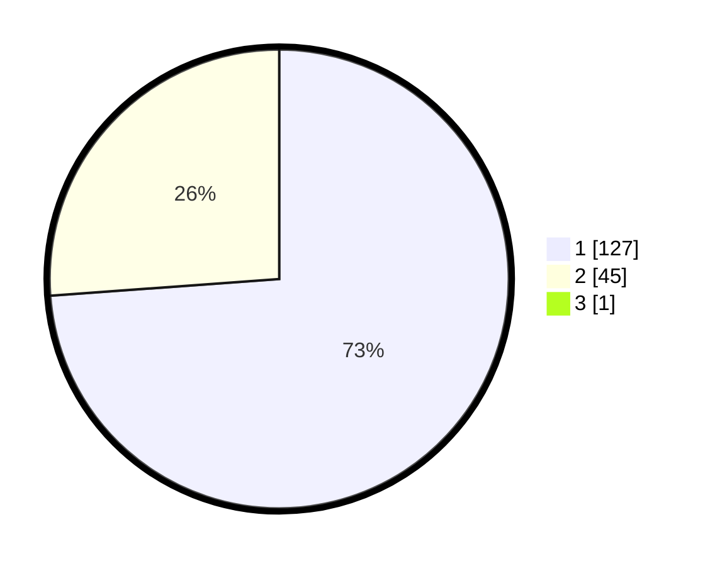

# Hasil

## Grafik

## Tabel

| No. | Nama Paslon    | Suara | Suara (raw) | Persentase |
|:--- |:-------------- | -----:| -----------:| ----------:|
| 1   | ANIES MUHAIMIN | 127   | [127][p-1]  | 73,41      |
| 2   | PRABOWO GIBRAN | 45    | [45][p-2]   | 26,01      |
| 3   | GANJAR MAHFUD  | 1     | [1][p-3]    | 0,58       |

[p-1]: https://github.com/gigit-pemilu/pemilu-2024-11-aceh/blob/main/pilpres/hitung-suara/sub/11-aceh/sub/13-gayo-lues/sub/07-puteri-betung/sub/2007-uning-pune/sub/002-tps/sub/paslon-1.txt
[p-2]: https://github.com/gigit-pemilu/pemilu-2024-11-aceh/blob/main/pilpres/hitung-suara/sub/11-aceh/sub/13-gayo-lues/sub/07-puteri-betung/sub/2007-uning-pune/sub/002-tps/sub/paslon-2.txt
[p-3]: https://github.com/gigit-pemilu/pemilu-2024-11-aceh/blob/main/pilpres/hitung-suara/sub/11-aceh/sub/13-gayo-lues/sub/07-puteri-betung/sub/2007-uning-pune/sub/002-tps/sub/paslon-3.txt

## Foto C Plano

https://sirekap-obj-formc.kpu.go.id/4827/pemilu/ppwp/11/13/07/20/07/1113072007002-20240215-115355--8e30c14a-73c8-46e1-b315-203df6718237.jpg

https://sirekap-obj-formc.kpu.go.id/4827/pemilu/ppwp/11/13/07/20/07/1113072007002-20240216-134500--2a31b182-68c7-48e0-ab05-8838c10eada3.jpg

https://sirekap-obj-formc.kpu.go.id/4827/pemilu/ppwp/11/13/07/20/07/1113072007002-20240216-134430--f5bab501-bd4f-482a-a23e-2c546ae34637.jpg

## Metadata

| Key        | Value               |
| ---------- | ------------------- |
| Time Stamp | 2024-02-16 21:01:00 |

