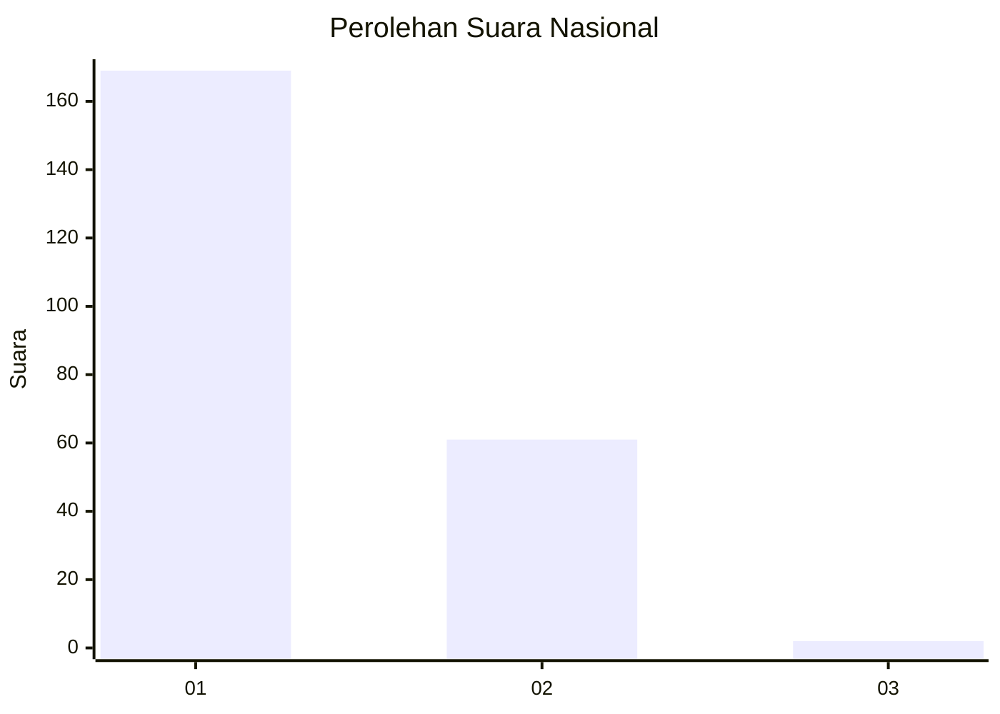
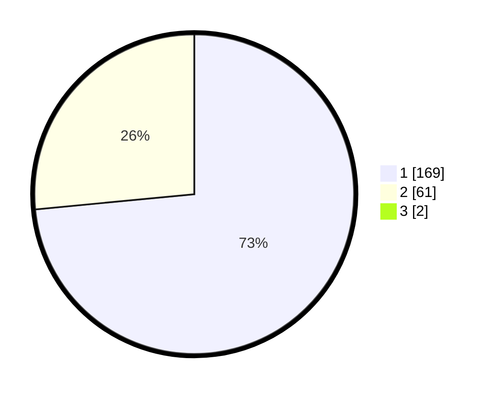

# Hasil

## Grafik

## Tabel

| No. | Nama Paslon    | Suara | Suara (raw) | Persentase |
|:--- |:-------------- | -----:| -----------:| ----------:|
| 1   | ANIES MUHAIMIN | 169   | [169][p-1]  | 72,84      |
| 2   | PRABOWO GIBRAN | 61    | [61][p-2]   | 26,29      |
| 3   | GANJAR MAHFUD  | 2     | [2][p-3]    | 0,86       |

[p-1]: https://github.com/gigit-pemilu/pemilu-2024/blob/main/pilpres/hitung-suara/sub/11-aceh/sub/13-gayo-lues/sub/07-puteri-betung/sub/2008-gumpang-lempuh/sub/001-tps/sub/paslon-1.txt
[p-2]: https://github.com/gigit-pemilu/pemilu-2024/blob/main/pilpres/hitung-suara/sub/11-aceh/sub/13-gayo-lues/sub/07-puteri-betung/sub/2008-gumpang-lempuh/sub/001-tps/sub/paslon-2.txt
[p-3]: https://github.com/gigit-pemilu/pemilu-2024/blob/main/pilpres/hitung-suara/sub/11-aceh/sub/13-gayo-lues/sub/07-puteri-betung/sub/2008-gumpang-lempuh/sub/001-tps/sub/paslon-3.txt

## Foto C Plano

https://sirekap-obj-formc.kpu.go.id/024c/pemilu/ppwp/11/13/07/20/08/1113072008001-20240215-105414--67ac3d60-75cc-4877-8bcd-a00a5f208d6e.jpg

https://sirekap-obj-formc.kpu.go.id/024c/pemilu/ppwp/11/13/07/20/08/1113072008001-20240214-215545--4f348439-4cf0-4d57-a5cf-d0ce6abe0498.jpg

https://sirekap-obj-formc.kpu.go.id/024c/pemilu/ppwp/11/13/07/20/08/1113072008001-20240215-110116--4a147ec6-a9e9-45c0-ab10-4ac7ef0bc6ae.jpg

## Metadata

| Key        | Value               |
| ---------- | ------------------- |
| Time Stamp | 2024-02-24 22:31:28 |

