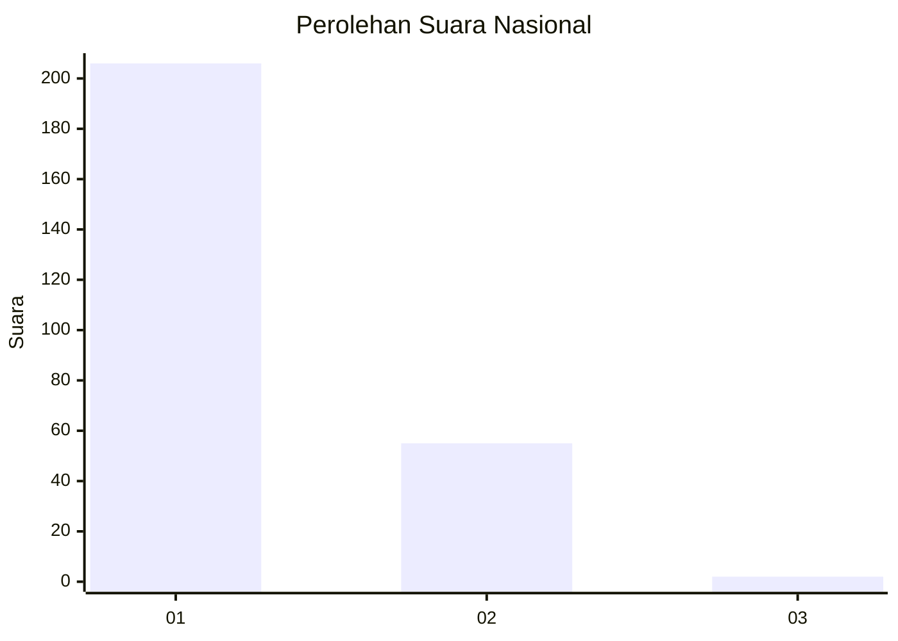
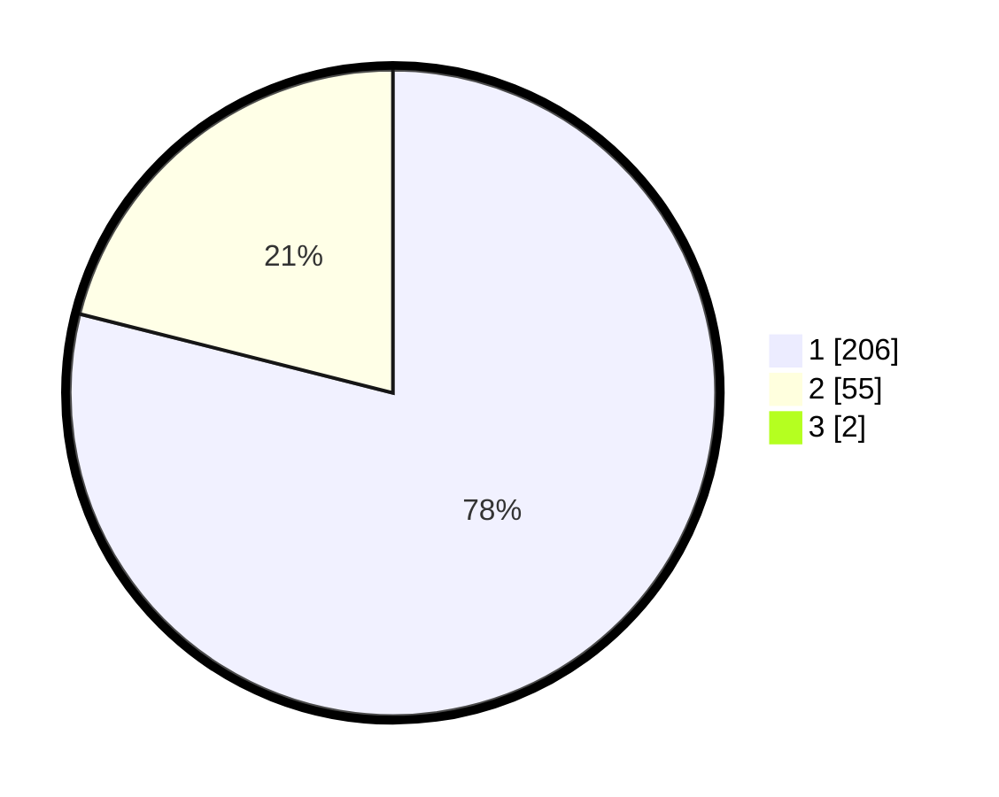

# Hasil

## Grafik

## Tabel

| No. | Nama Paslon    | Suara | Suara (raw) | Persentase |
|:--- |:-------------- | -----:| -----------:| ----------:|
| 1   | ANIES MUHAIMIN | 206   | [206][p-1]  | 78,33      |
| 2   | PRABOWO GIBRAN | 55    | [55][p-2]   | 20,91      |
| 3   | GANJAR MAHFUD  | 2     | [2][p-3]    | 0,76       |

[p-1]: https://github.com/gigit-pemilu/pemilu-2024/blob/main/pilpres/hitung-suara/sub/11-aceh/sub/13-gayo-lues/sub/08-dabun-gelang/sub/2002-badak/sub/001-tps/sub/paslon-1.txt
[p-2]: https://github.com/gigit-pemilu/pemilu-2024/blob/main/pilpres/hitung-suara/sub/11-aceh/sub/13-gayo-lues/sub/08-dabun-gelang/sub/2002-badak/sub/001-tps/sub/paslon-2.txt
[p-3]: https://github.com/gigit-pemilu/pemilu-2024/blob/main/pilpres/hitung-suara/sub/11-aceh/sub/13-gayo-lues/sub/08-dabun-gelang/sub/2002-badak/sub/001-tps/sub/paslon-3.txt

## Foto C Plano

https://sirekap-obj-formc.kpu.go.id/08fe/pemilu/ppwp/11/13/08/20/02/1113082002001-20240214-221238--82cd831f-b695-44d3-8333-e3699543448b.jpg

https://sirekap-obj-formc.kpu.go.id/08fe/pemilu/ppwp/11/13/08/20/02/1113082002001-20240214-221336--a4c451a3-bd87-45a9-a9d6-6481aff95cd5.jpg

https://sirekap-obj-formc.kpu.go.id/08fe/pemilu/ppwp/11/13/08/20/02/1113082002001-20240214-221423--c310cdf3-c798-44c4-b60b-2a879300ea20.jpg

## Metadata

| Key        | Value               |
| ---------- | ------------------- |
| Time Stamp | 2024-02-24 22:31:28 |

