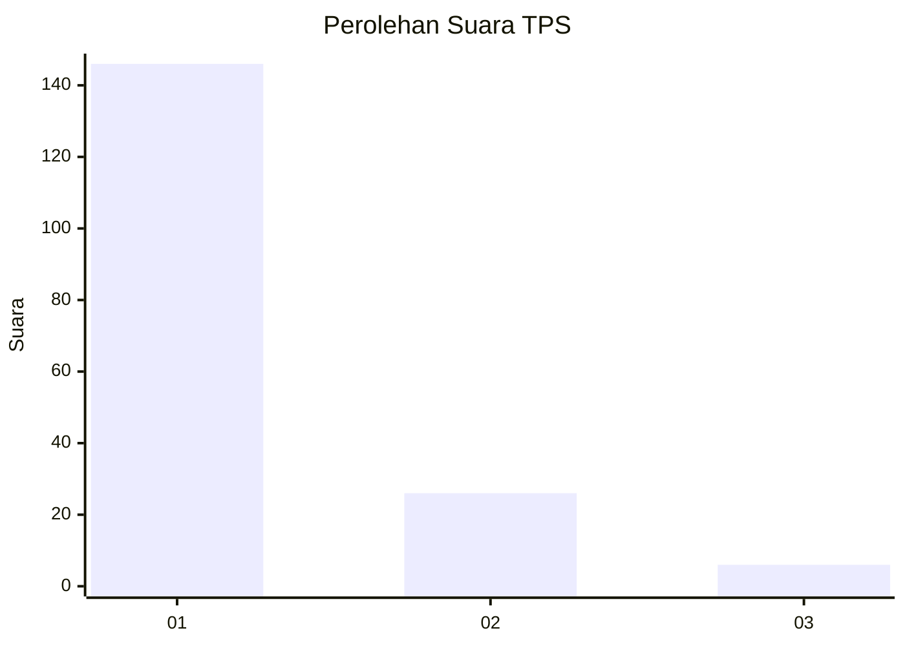
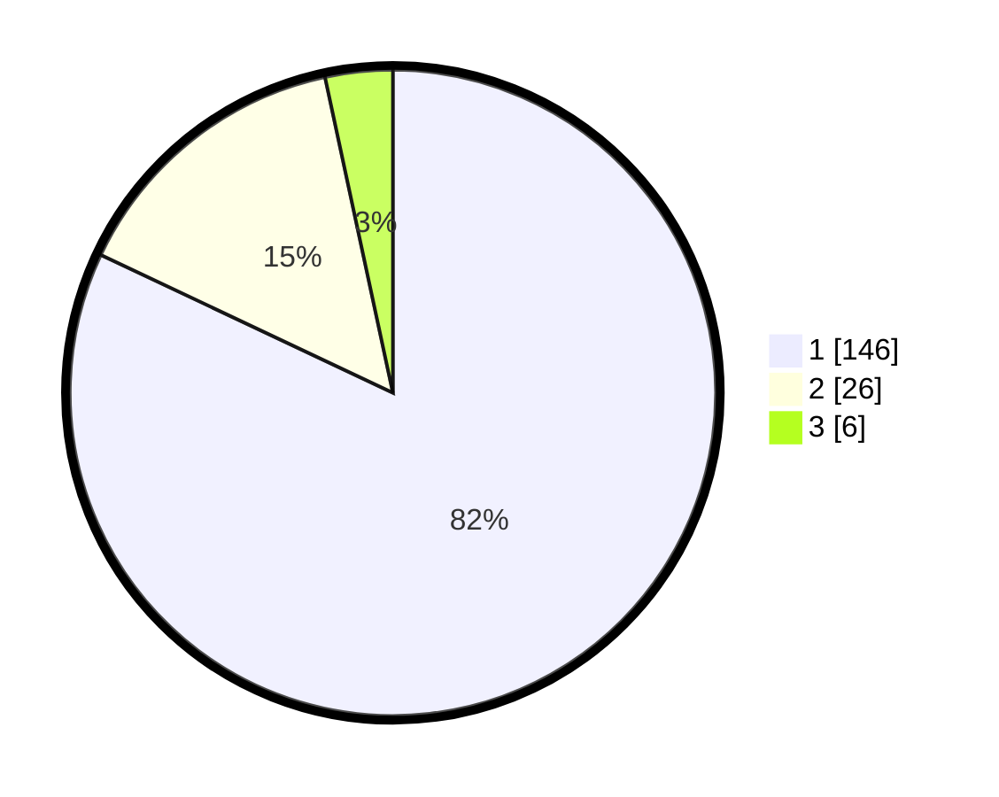

# Hasil

## Grafik

## Tabel

| No. | Nama Paslon    | Suara | Suara (raw) | Persentase |
|:--- |:-------------- | -----:| -----------:| ----------:|
| 1   | ANIES MUHAIMIN | 146   | [146][p-1]  | 82,02      |
| 2   | PRABOWO GIBRAN | 26    | [26][p-2]   | 14,61      |
| 3   | GANJAR MAHFUD  | 6     | [6][p-3]    | 3,37       |

[p-1]: https://github.com/gigit-pemilu/pemilu-2024-11-aceh/blob/main/pilpres/hitung-suara/sub/11-aceh/sub/13-gayo-lues/sub/08-dabun-gelang/sub/2002-badak/sub/003-tps/sub/paslon-1.txt
[p-2]: https://github.com/gigit-pemilu/pemilu-2024-11-aceh/blob/main/pilpres/hitung-suara/sub/11-aceh/sub/13-gayo-lues/sub/08-dabun-gelang/sub/2002-badak/sub/003-tps/sub/paslon-2.txt
[p-3]: https://github.com/gigit-pemilu/pemilu-2024-11-aceh/blob/main/pilpres/hitung-suara/sub/11-aceh/sub/13-gayo-lues/sub/08-dabun-gelang/sub/2002-badak/sub/003-tps/sub/paslon-3.txt

## Foto C Plano

https://sirekap-obj-formc.kpu.go.id/98f1/pemilu/ppwp/11/13/08/20/02/1113082002003-20240216-145423--9d9069a4-5462-48b0-8f66-5ab5eb4ae7ae.jpg

https://sirekap-obj-formc.kpu.go.id/98f1/pemilu/ppwp/11/13/08/20/02/1113082002003-20240216-105047--e2fe9a63-1d3c-452d-a27a-9ec2a68fc14d.jpg

https://sirekap-obj-formc.kpu.go.id/98f1/pemilu/ppwp/11/13/08/20/02/1113082002003-20240216-145424--b517e9f2-832e-4b77-8fe3-bcbe9a494ca7.jpg

## Metadata

| Key        | Value               |
| ---------- | ------------------- |
| Time Stamp | 2024-02-16 22:30:00 |

## DATA PEMILIH TETAP

Jumlah pemilih dalam DPT: **195**.
 * L: **94**.
 * P: **101**.

## DATA PENGGUNA HAK PILIH

Jumlah pengguna hak pilih dalam DPT: **182**.
 * L: **89**.
 * P: **93**.

Jumlah pengguna hak pilih dalam DPTb: **0**.
 * L: **0**.
 * P: **0**.

Jumlah pengguna hak pilih dalam DPK: **0**.
 * L: **0**.
 * P: **0**.

Jumlah pengguna hak pilih: **182**.
 * L: **89**.
 * P: **93**.

## JUMLAH SUARA SAH DAN TIDAK SAH

JUMLAH SELURUH SUARA SAH: **178**.

JUMLAH SUARA TIDAK SAH: **4**.

JUMLAH SELURUH SUARA SAH DAN SUARA TIDAK SAH: **182**.

