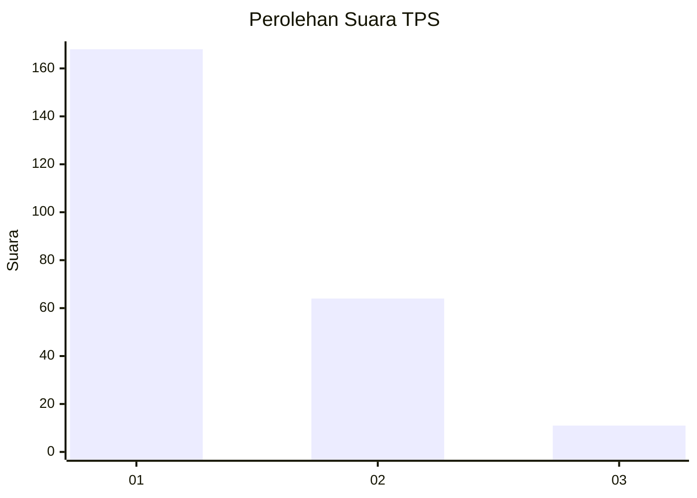
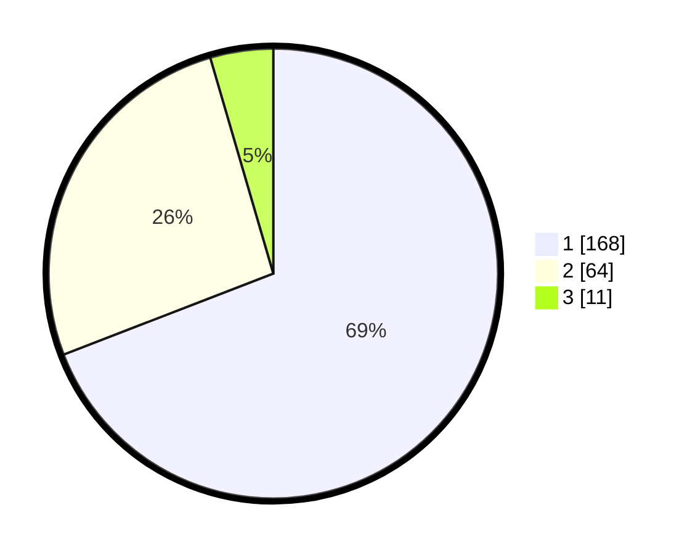

# Hasil

## Grafik

## Tabel

| No. | Nama Paslon    | Suara | Suara (raw) | Persentase |
|:--- |:-------------- | -----:| -----------:| ----------:|
| 1   | ANIES MUHAIMIN | 168   | [168][p-1]  | 69,14      |
| 2   | PRABOWO GIBRAN | 64    | [64][p-2]   | 26,34      |
| 3   | GANJAR MAHFUD  | 11    | [11][p-3]   | 4,53       |

[p-1]: https://github.com/gigit-pemilu/pemilu-2024-11-aceh/blob/main/pilpres/hitung-suara/sub/11-aceh/sub/13-gayo-lues/sub/08-dabun-gelang/sub/2005-panglima-linting/sub/001-tps/sub/paslon-1.txt
[p-2]: https://github.com/gigit-pemilu/pemilu-2024-11-aceh/blob/main/pilpres/hitung-suara/sub/11-aceh/sub/13-gayo-lues/sub/08-dabun-gelang/sub/2005-panglima-linting/sub/001-tps/sub/paslon-2.txt
[p-3]: https://github.com/gigit-pemilu/pemilu-2024-11-aceh/blob/main/pilpres/hitung-suara/sub/11-aceh/sub/13-gayo-lues/sub/08-dabun-gelang/sub/2005-panglima-linting/sub/001-tps/sub/paslon-3.txt

## Foto C Plano

https://sirekap-obj-formc.kpu.go.id/73ae/pemilu/ppwp/11/13/08/20/05/1113082005001-20240215-154459--a78c9ae6-197c-4dff-967f-a3751c2ef7cf.jpg

https://sirekap-obj-formc.kpu.go.id/73ae/pemilu/ppwp/11/13/08/20/05/1113082005001-20240215-110324--36e80542-2599-4f11-bc6a-7603878c0ba1.jpg

https://sirekap-obj-formc.kpu.go.id/73ae/pemilu/ppwp/11/13/08/20/05/1113082005001-20240215-155010--e37b5f3c-82aa-4be9-bff0-373858a912be.jpg

## Metadata

| Key        | Value               |
| ---------- | ------------------- |
| Time Stamp | 2024-02-21 12:00:00 |

