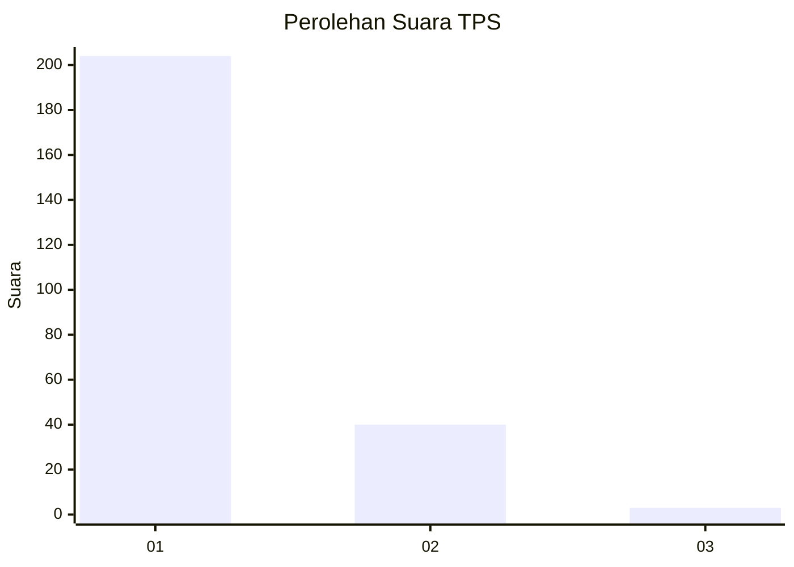
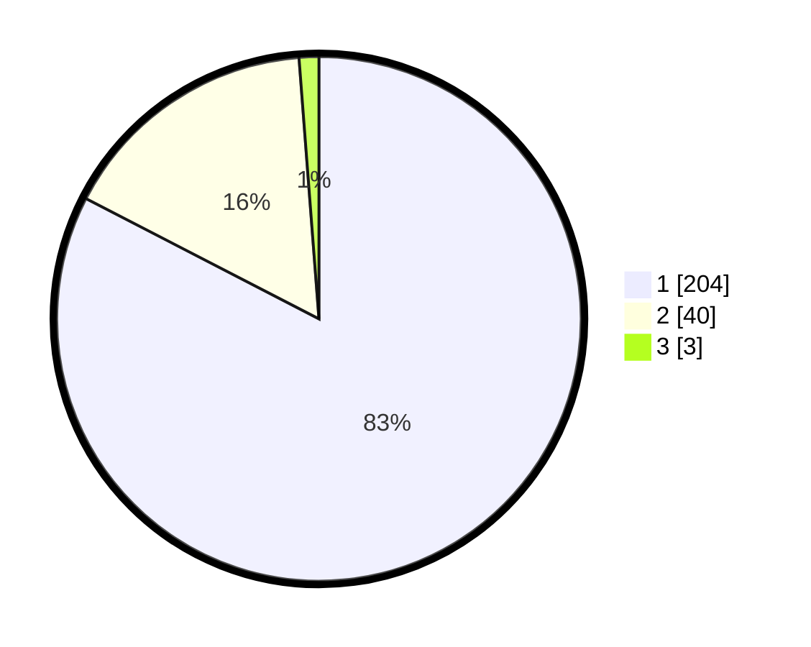

# Hasil

## Grafik

## Tabel

| No. | Nama Paslon    | Suara | Suara (raw) | Persentase |
|:--- |:-------------- | -----:| -----------:| ----------:|
| 1   | ANIES MUHAIMIN | 204   | [204][p-1]  | 82,59      |
| 2   | PRABOWO GIBRAN | 40    | [40][p-2]   | 16,19      |
| 3   | GANJAR MAHFUD  | 3     | [3][p-3]    | 1,21       |

[p-1]: https://github.com/gigit-pemilu/pemilu-2024-11-aceh/blob/main/pilpres/hitung-suara/sub/11-aceh/sub/13-gayo-lues/sub/08-dabun-gelang/sub/2005-panglima-linting/sub/004-tps/sub/paslon-1.txt
[p-2]: https://github.com/gigit-pemilu/pemilu-2024-11-aceh/blob/main/pilpres/hitung-suara/sub/11-aceh/sub/13-gayo-lues/sub/08-dabun-gelang/sub/2005-panglima-linting/sub/004-tps/sub/paslon-2.txt
[p-3]: https://github.com/gigit-pemilu/pemilu-2024-11-aceh/blob/main/pilpres/hitung-suara/sub/11-aceh/sub/13-gayo-lues/sub/08-dabun-gelang/sub/2005-panglima-linting/sub/004-tps/sub/paslon-3.txt

## Foto C Plano

https://sirekap-obj-formc.kpu.go.id/7e2f/pemilu/ppwp/11/13/08/20/05/1113082005004-20240215-090831--f7623fe0-926c-4ede-ac86-480813e53e81.jpg

https://sirekap-obj-formc.kpu.go.id/7e2f/pemilu/ppwp/11/13/08/20/05/1113082005004-20240215-110653--9c737080-997b-4b8f-b985-40e7831c18af.jpg

https://sirekap-obj-formc.kpu.go.id/7e2f/pemilu/ppwp/11/13/08/20/05/1113082005004-20240214-201106--503031c5-4e62-49d2-b196-ef6a21572fae.jpg

## Metadata

| Key        | Value               |
| ---------- | ------------------- |
| Time Stamp | 2024-02-24 22:31:28 |

