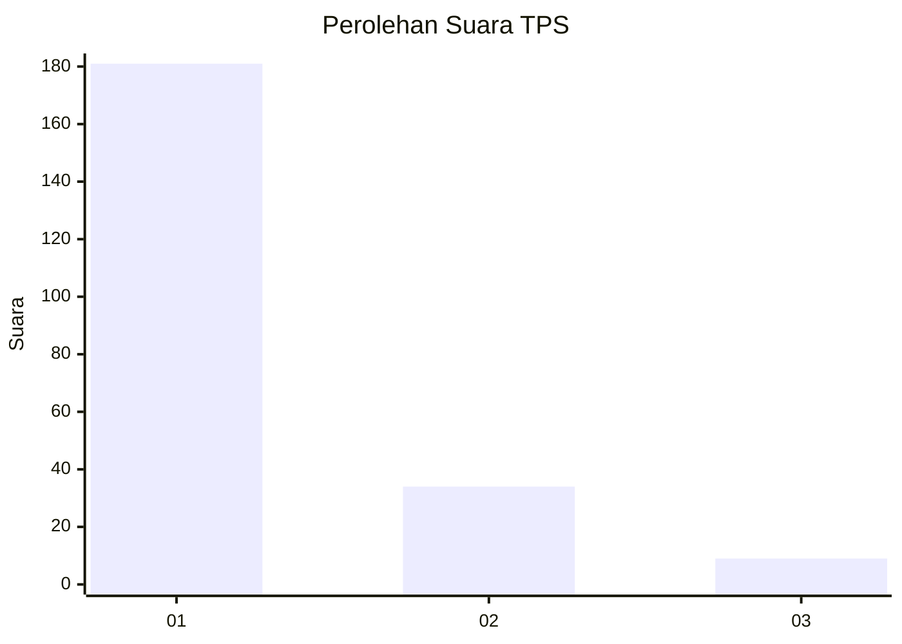
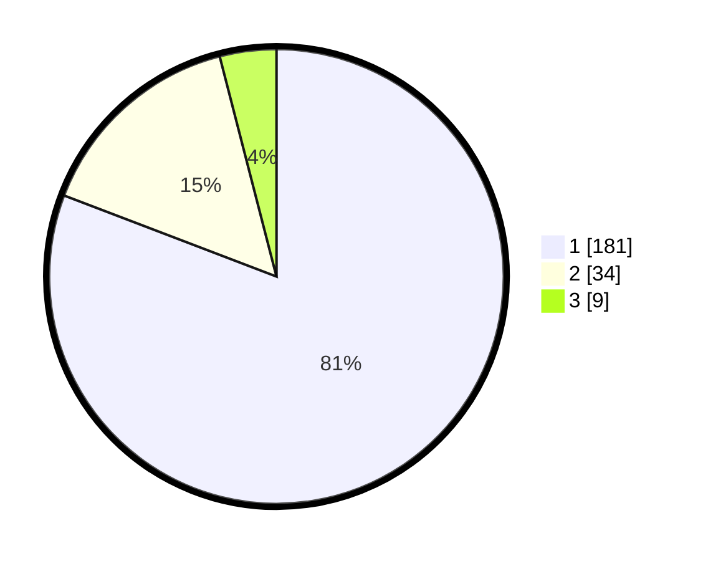

# Hasil

## Grafik

## Tabel

| No. | Nama Paslon    | Suara | Suara (raw) | Persentase |
|:--- |:-------------- | -----:| -----------:| ----------:|
| 1   | ANIES MUHAIMIN | 181   | [181][p-1]  | 80,80      |
| 2   | PRABOWO GIBRAN | 34    | [34][p-2]   | 15,18      |
| 3   | GANJAR MAHFUD  | 9     | [9][p-3]    | 4,02       |

[p-1]: https://github.com/gigit-pemilu/pemilu-2024-11-aceh/blob/main/pilpres/hitung-suara/sub/11-aceh/sub/13-gayo-lues/sub/09-blangjerango/sub/2001-penosan/sub/001-tps/sub/paslon-1.txt
[p-2]: https://github.com/gigit-pemilu/pemilu-2024-11-aceh/blob/main/pilpres/hitung-suara/sub/11-aceh/sub/13-gayo-lues/sub/09-blangjerango/sub/2001-penosan/sub/001-tps/sub/paslon-2.txt
[p-3]: https://github.com/gigit-pemilu/pemilu-2024-11-aceh/blob/main/pilpres/hitung-suara/sub/11-aceh/sub/13-gayo-lues/sub/09-blangjerango/sub/2001-penosan/sub/001-tps/sub/paslon-3.txt

## Foto C Plano

https://sirekap-obj-formc.kpu.go.id/1645/pemilu/ppwp/11/13/09/20/01/1113092001001-20240218-224759--fbed21c8-7883-4ef1-a99d-e7f6f7b849b6.jpg

https://sirekap-obj-formc.kpu.go.id/1645/pemilu/ppwp/11/13/09/20/01/1113092001001-20240218-224957--4c7f069d-1c4a-4eb5-b585-655db5dd59c3.jpg

https://sirekap-obj-formc.kpu.go.id/1645/pemilu/ppwp/11/13/09/20/01/1113092001001-20240218-225150--91b5d03f-4fab-4578-b7f5-8b42ea9a6398.jpg

## Metadata

| Key        | Value               |
| ---------- | ------------------- |
| Time Stamp | 2024-02-25 16:00:00 |

## DATA PEMILIH TETAP

Jumlah pemilih dalam DPT: **256**.
 * L: **123**.
 * P: **133**.

## DATA PENGGUNA HAK PILIH

Jumlah pengguna hak pilih dalam DPT: **227**.
 * L: **108**.
 * P: **119**.

Jumlah pengguna hak pilih dalam DPTb: **7**.
 * L: **1**.
 * P: **6**.

Jumlah pengguna hak pilih dalam DPK: **4**.
 * L: **2**.
 * P: **2**.

Jumlah pengguna hak pilih: **238**.
 * L: **111**.
 * P: **127**.

## JUMLAH SUARA SAH DAN TIDAK SAH

JUMLAH SELURUH SUARA SAH: **224**.

JUMLAH SUARA TIDAK SAH: **14**.

JUMLAH SELURUH SUARA SAH DAN SUARA TIDAK SAH: **238**.

