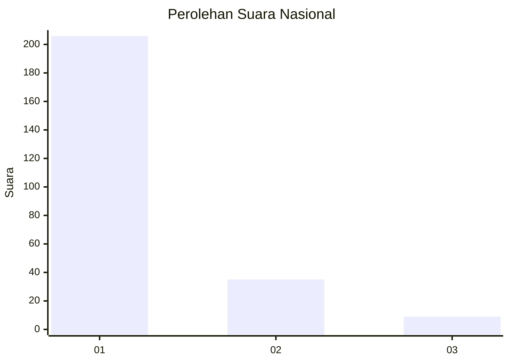
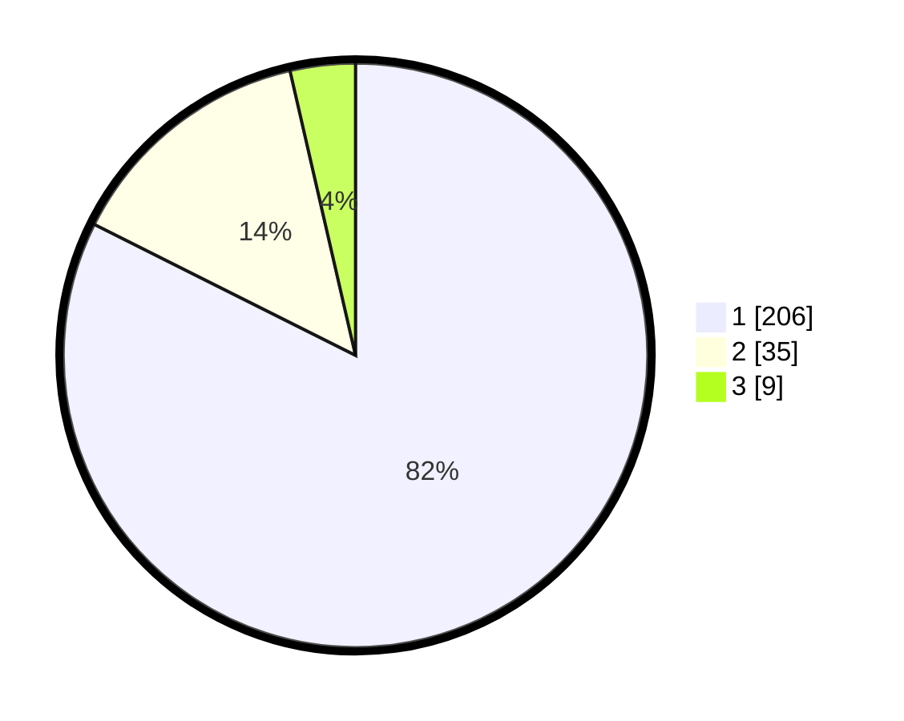

# Hasil

## Grafik

## Tabel

| No. | Nama Paslon    | Suara | Suara (raw) | Persentase |
|:--- |:-------------- | -----:| -----------:| ----------:|
| 1   | ANIES MUHAIMIN | 206   | [206][p-1]  | 82,40      |
| 2   | PRABOWO GIBRAN | 35    | [35][p-2]   | 14,00      |
| 3   | GANJAR MAHFUD  | 9     | [9][p-3]    | 3,60       |

[p-1]: https://github.com/gigit-pemilu/pemilu-2024/blob/main/pilpres/hitung-suara/sub/11-aceh/sub/13-gayo-lues/sub/09-blangjerango/sub/2001-penosan/sub/002-tps/sub/paslon-1.txt
[p-2]: https://github.com/gigit-pemilu/pemilu-2024/blob/main/pilpres/hitung-suara/sub/11-aceh/sub/13-gayo-lues/sub/09-blangjerango/sub/2001-penosan/sub/002-tps/sub/paslon-2.txt
[p-3]: https://github.com/gigit-pemilu/pemilu-2024/blob/main/pilpres/hitung-suara/sub/11-aceh/sub/13-gayo-lues/sub/09-blangjerango/sub/2001-penosan/sub/002-tps/sub/paslon-3.txt

## Foto C Plano

https://sirekap-obj-formc.kpu.go.id/5868/pemilu/ppwp/11/13/09/20/01/1113092001002-20240218-171831--0912b354-1312-4299-bcf1-469f72c21b38.jpg

https://sirekap-obj-formc.kpu.go.id/5868/pemilu/ppwp/11/13/09/20/01/1113092001002-20240214-194255--e69e1349-c41a-4b37-aa7c-380aec10d020.jpg

https://sirekap-obj-formc.kpu.go.id/5868/pemilu/ppwp/11/13/09/20/01/1113092001002-20240214-194412--872cc82b-1bf0-41af-8c29-4eb83a221531.jpg

## Metadata

| Key        | Value               |
| ---------- | ------------------- |
| Time Stamp | 2024-02-19 06:16:00 |

## DATA PEMILIH TETAP

Jumlah pemilih dalam DPT: **224**.
 * L: **114**.
 * P: **110**.

## DATA PENGGUNA HAK PILIH

Jumlah pengguna hak pilih dalam DPT: **207**.
 * L: **103**.
 * P: **104**.

Jumlah pengguna hak pilih dalam DPTb: **3**.
 * L: **0**.
 * P: **3**.

Jumlah pengguna hak pilih dalam DPK: **3**.
 * L: **3**.
 * P: **0**.

Jumlah pengguna hak pilih: **213**.
 * L: **106**.
 * P: **107**.

## JUMLAH SUARA SAH DAN TIDAK SAH

JUMLAH SELURUH SUARA SAH: **250**.

JUMLAH SUARA TIDAK SAH: **20**.

JUMLAH SELURUH SUARA SAH DAN SUARA TIDAK SAH: **270**.

