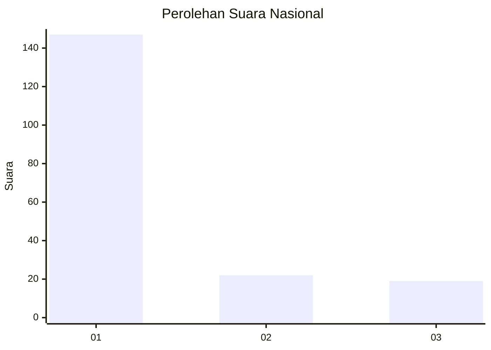
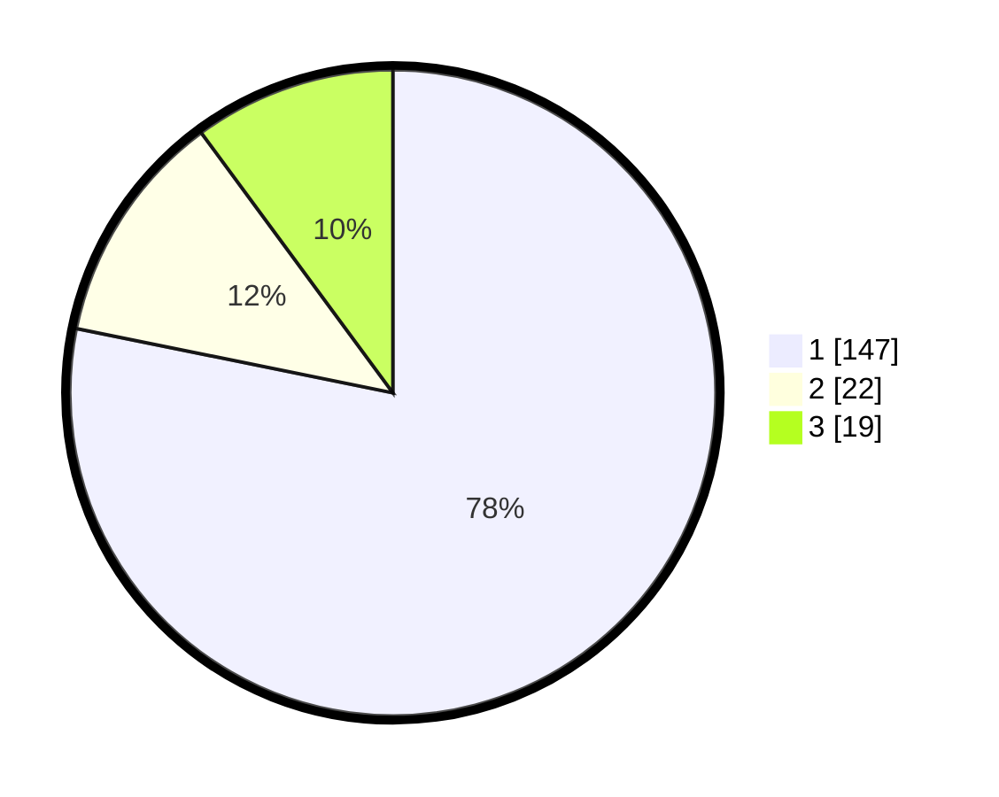

# Hasil

## Grafik

## Tabel

| No. | Nama Paslon    | Suara | Suara (raw) | Persentase |
|:--- |:-------------- | -----:| -----------:| ----------:|
| 1   | ANIES MUHAIMIN | 147   | [147][p-1]  | 78,19      |
| 2   | PRABOWO GIBRAN | 22    | [22][p-2]   | 11,70      |
| 3   | GANJAR MAHFUD  | 19    | [19][p-3]   | 10,11      |

[p-1]: https://github.com/gigit-pemilu/pemilu-2024/blob/main/pilpres/hitung-suara/sub/11-aceh/sub/13-gayo-lues/sub/09-blangjerango/sub/2001-penosan/sub/003-tps/sub/paslon-1.txt
[p-2]: https://github.com/gigit-pemilu/pemilu-2024/blob/main/pilpres/hitung-suara/sub/11-aceh/sub/13-gayo-lues/sub/09-blangjerango/sub/2001-penosan/sub/003-tps/sub/paslon-2.txt
[p-3]: https://github.com/gigit-pemilu/pemilu-2024/blob/main/pilpres/hitung-suara/sub/11-aceh/sub/13-gayo-lues/sub/09-blangjerango/sub/2001-penosan/sub/003-tps/sub/paslon-3.txt

## Foto C Plano

https://sirekap-obj-formc.kpu.go.id/1e9d/pemilu/ppwp/11/13/09/20/01/1113092001003-20240216-142256--ce51631e-fbeb-4eab-96b8-0bfa527f88ec.jpg

https://sirekap-obj-formc.kpu.go.id/1e9d/pemilu/ppwp/11/13/09/20/01/1113092001003-20240216-142258--101ed7c6-f776-4b31-a7ef-e2f3909c39fd.jpg

https://sirekap-obj-formc.kpu.go.id/1e9d/pemilu/ppwp/11/13/09/20/01/1113092001003-20240216-142257--2568ff90-95f3-48b2-94b2-53b033eb74bd.jpg

## Metadata

| Key        | Value               |
| ---------- | ------------------- |
| Time Stamp | 2024-02-16 22:30:00 |

## DATA PEMILIH TETAP

Jumlah pemilih dalam DPT: **237**.
 * L: **111**.
 * P: **126**.

## DATA PENGGUNA HAK PILIH

Jumlah pengguna hak pilih dalam DPT: **206**.
 * L: **103**.
 * P: **103**.

Jumlah pengguna hak pilih dalam DPTb: **0**.
 * L: **0**.
 * P: **0**.

Jumlah pengguna hak pilih dalam DPK: **0**.
 * L: **0**.
 * P: **0**.

Jumlah pengguna hak pilih: **206**.
 * L: **103**.
 * P: **103**.

## JUMLAH SUARA SAH DAN TIDAK SAH

JUMLAH SELURUH SUARA SAH: **188**.

JUMLAH SUARA TIDAK SAH: **18**.

JUMLAH SELURUH SUARA SAH DAN SUARA TIDAK SAH: **206**.

