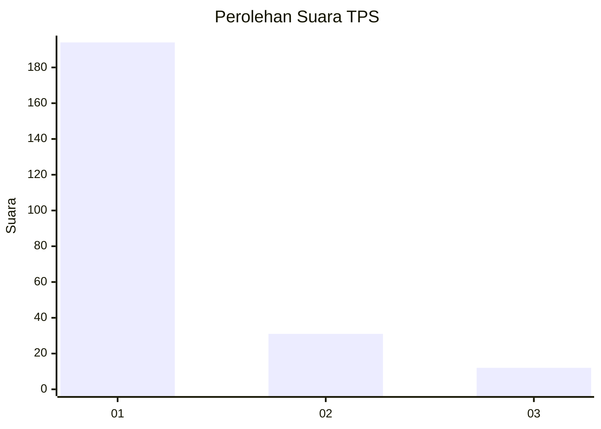
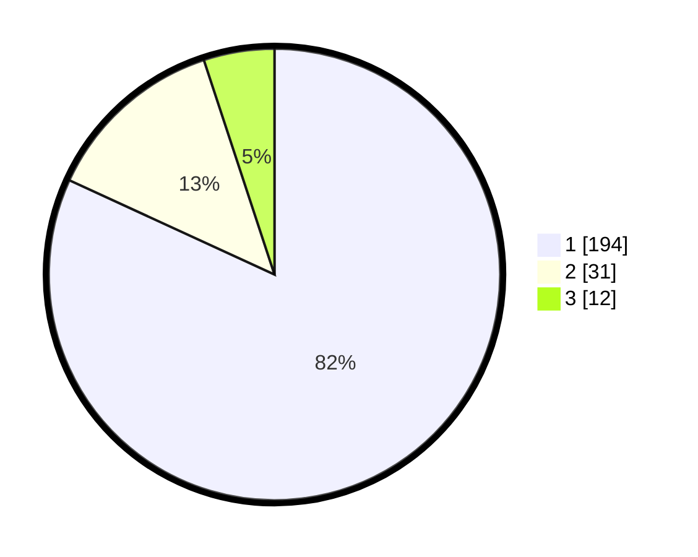

# Hasil

## Grafik

## Tabel

| No. | Nama Paslon    | Suara | Suara (raw) | Persentase |
|:--- |:-------------- | -----:| -----------:| ----------:|
| 1   | ANIES MUHAIMIN | 194   | [194][p-1]  | 81,86      |
| 2   | PRABOWO GIBRAN | 31    | [31][p-2]   | 13,08      |
| 3   | GANJAR MAHFUD  | 12    | [12][p-3]   | 5,06       |

[p-1]: https://github.com/gigit-pemilu/pemilu-2024-11-aceh/blob/main/pilpres/hitung-suara/sub/11-aceh/sub/13-gayo-lues/sub/09-blangjerango/sub/2001-penosan/sub/005-tps/sub/paslon-1.txt
[p-2]: https://github.com/gigit-pemilu/pemilu-2024-11-aceh/blob/main/pilpres/hitung-suara/sub/11-aceh/sub/13-gayo-lues/sub/09-blangjerango/sub/2001-penosan/sub/005-tps/sub/paslon-2.txt
[p-3]: https://github.com/gigit-pemilu/pemilu-2024-11-aceh/blob/main/pilpres/hitung-suara/sub/11-aceh/sub/13-gayo-lues/sub/09-blangjerango/sub/2001-penosan/sub/005-tps/sub/paslon-3.txt

## Foto C Plano

https://sirekap-obj-formc.kpu.go.id/de1b/pemilu/ppwp/11/13/09/20/01/1113092001005-20240218-232842--25cd5d61-0396-4d82-92d3-eff96d79aa7d.jpg

https://sirekap-obj-formc.kpu.go.id/de1b/pemilu/ppwp/11/13/09/20/01/1113092001005-20240218-232419--f36b5e24-ab1b-4125-862d-8c5551d8d6bf.jpg

https://sirekap-obj-formc.kpu.go.id/de1b/pemilu/ppwp/11/13/09/20/01/1113092001005-20240218-232519--1a11ca34-76b4-4a36-b5e7-07f6a8e07ef6.jpg

## Metadata

| Key        | Value               |
| ---------- | ------------------- |
| Time Stamp | 2024-02-19 06:16:00 |

## DATA PEMILIH TETAP

Jumlah pemilih dalam DPT: **275**.
 * L: **139**.
 * P: **136**.

## DATA PENGGUNA HAK PILIH

Jumlah pengguna hak pilih dalam DPT: **253**.
 * L: **123**.
 * P: **130**.

Jumlah pengguna hak pilih dalam DPTb: **2**.
 * L: **1**.
 * P: **1**.

Jumlah pengguna hak pilih dalam DPK: **3**.
 * L: **2**.
 * P: **1**.

Jumlah pengguna hak pilih: **258**.
 * L: **126**.
 * P: **132**.

## JUMLAH SUARA SAH DAN TIDAK SAH

JUMLAH SELURUH SUARA SAH: **237**.

JUMLAH SUARA TIDAK SAH: **21**.

JUMLAH SELURUH SUARA SAH DAN SUARA TIDAK SAH: **258**.

