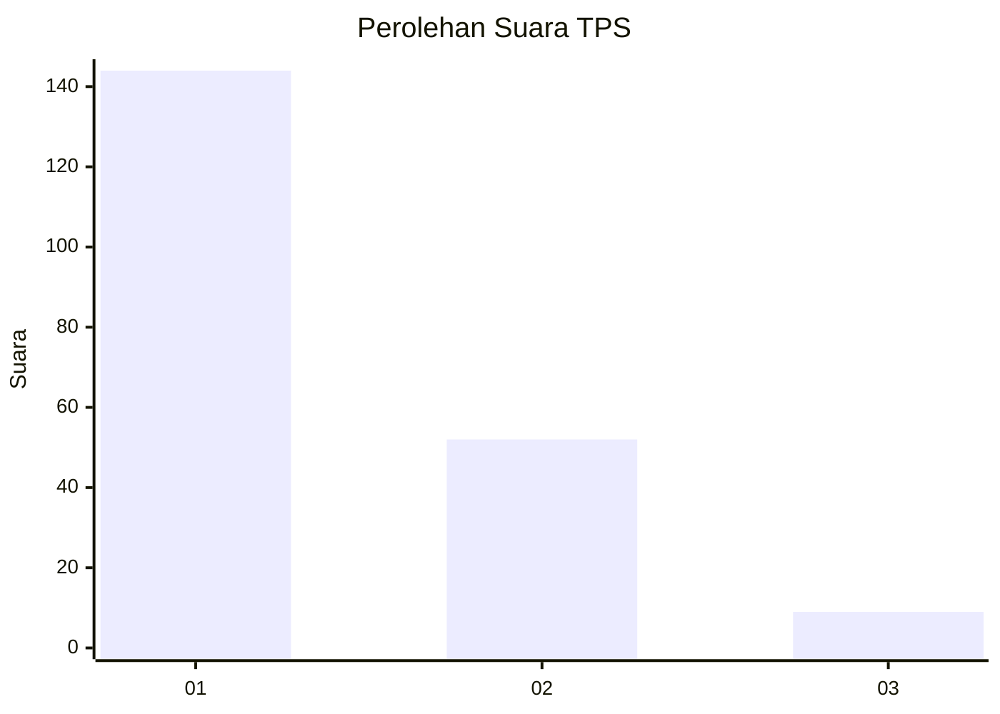
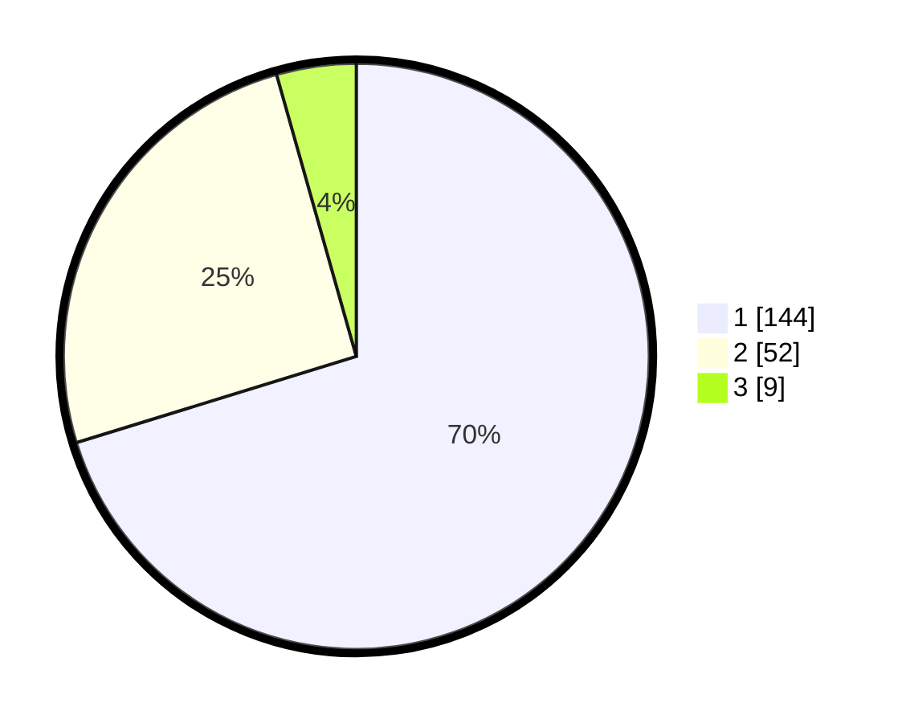

# Hasil

## Grafik

## Tabel

| No. | Nama Paslon    | Suara | Suara (raw) | Persentase |
|:--- |:-------------- | -----:| -----------:| ----------:|
| 1   | ANIES MUHAIMIN | 144   | [144][p-1]  | 70,24      |
| 2   | PRABOWO GIBRAN | 52    | [52][p-2]   | 25,37      |
| 3   | GANJAR MAHFUD  | 9     | [9][p-3]    | 4,39       |

[p-1]: https://github.com/gigit-pemilu/pemilu-2024-11-aceh/blob/main/pilpres/hitung-suara/sub/11-aceh/sub/13-gayo-lues/sub/09-blangjerango/sub/2007-tingkem/sub/001-tps/sub/paslon-1.txt
[p-2]: https://github.com/gigit-pemilu/pemilu-2024-11-aceh/blob/main/pilpres/hitung-suara/sub/11-aceh/sub/13-gayo-lues/sub/09-blangjerango/sub/2007-tingkem/sub/001-tps/sub/paslon-2.txt
[p-3]: https://github.com/gigit-pemilu/pemilu-2024-11-aceh/blob/main/pilpres/hitung-suara/sub/11-aceh/sub/13-gayo-lues/sub/09-blangjerango/sub/2007-tingkem/sub/001-tps/sub/paslon-3.txt

## Foto C Plano

https://sirekap-obj-formc.kpu.go.id/43bd/pemilu/ppwp/11/13/09/20/07/1113092007001-20240218-201529--6d97d624-239f-4b38-946c-0227017daa7d.jpg

https://sirekap-obj-formc.kpu.go.id/43bd/pemilu/ppwp/11/13/09/20/07/1113092007001-20240218-201646--9dc8278b-0bd6-4bca-b4a1-e818ae23aad4.jpg

https://sirekap-obj-formc.kpu.go.id/43bd/pemilu/ppwp/11/13/09/20/07/1113092007001-20240218-201835--a8146a59-a0d8-45f7-ab28-3b886453901f.jpg

## Metadata

| Key        | Value               |
| ---------- | ------------------- |
| Time Stamp | 2024-02-24 22:31:28 |

