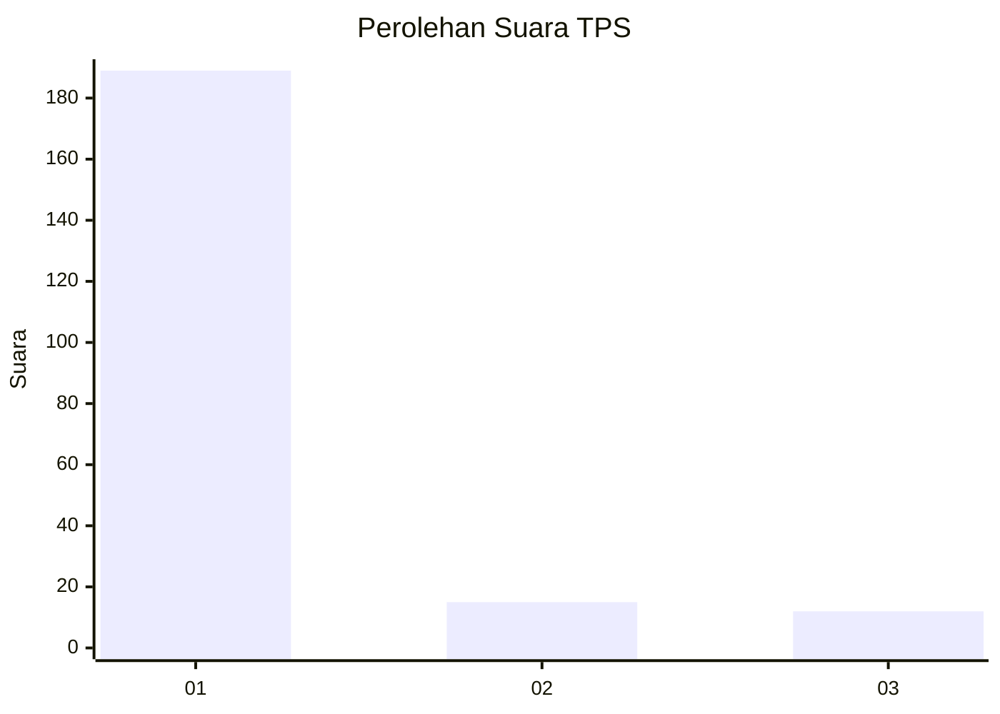
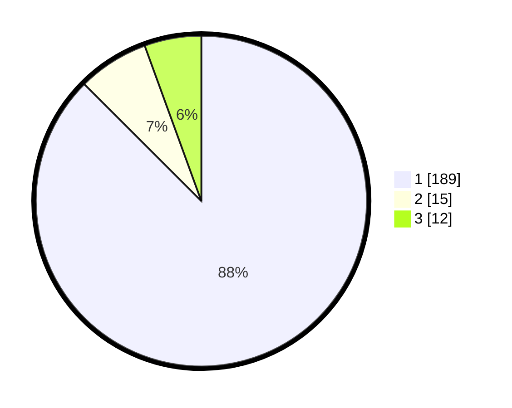

# Hasil

## Grafik

## Tabel

| No. | Nama Paslon    | Suara | Suara (raw) | Persentase |
|:--- |:-------------- | -----:| -----------:| ----------:|
| 1   | ANIES MUHAIMIN | 189   | [189][p-1]  | 87,50      |
| 2   | PRABOWO GIBRAN | 15    | [15][p-2]   | 6,94       |
| 3   | GANJAR MAHFUD  | 12    | [12][p-3]   | 5,56       |

[p-1]: https://github.com/gigit-pemilu/pemilu-2024-11-aceh/blob/main/pilpres/hitung-suara/sub/11-aceh/sub/13-gayo-lues/sub/10-teripe-jaya/sub/2001-perlak/sub/002-tps/sub/paslon-1.txt
[p-2]: https://github.com/gigit-pemilu/pemilu-2024-11-aceh/blob/main/pilpres/hitung-suara/sub/11-aceh/sub/13-gayo-lues/sub/10-teripe-jaya/sub/2001-perlak/sub/002-tps/sub/paslon-2.txt
[p-3]: https://github.com/gigit-pemilu/pemilu-2024-11-aceh/blob/main/pilpres/hitung-suara/sub/11-aceh/sub/13-gayo-lues/sub/10-teripe-jaya/sub/2001-perlak/sub/002-tps/sub/paslon-3.txt

## Foto C Plano

https://sirekap-obj-formc.kpu.go.id/8b24/pemilu/ppwp/11/13/10/20/01/1113102001002-20240216-100620--bcfa4315-2bc9-4a15-8c25-4104bf6e3820.jpg

https://sirekap-obj-formc.kpu.go.id/8b24/pemilu/ppwp/11/13/10/20/01/1113102001002-20240216-101137--78f68c58-c349-461d-94a8-22666ec6c532.jpg

https://sirekap-obj-formc.kpu.go.id/8b24/pemilu/ppwp/11/13/10/20/01/1113102001002-20240216-101201--de954254-ee6d-46db-b9c3-290effecfa5e.jpg

## Metadata

| Key        | Value               |
| ---------- | ------------------- |
| Time Stamp | 2024-02-17 10:30:03 |

## DATA PEMILIH TETAP

Jumlah pemilih dalam DPT: **233**.
 * L: **117**.
 * P: **116**.

## DATA PENGGUNA HAK PILIH

Jumlah pengguna hak pilih dalam DPT: **218**.
 * L: **105**.
 * P: **113**.

Jumlah pengguna hak pilih dalam DPTb: **6**.
 * L: **3**.
 * P: **3**.

Jumlah pengguna hak pilih dalam DPK: **4**.
 * L: **3**.
 * P: **1**.

Jumlah pengguna hak pilih: **228**.
 * L: **111**.
 * P: **117**.

## JUMLAH SUARA SAH DAN TIDAK SAH

JUMLAH SELURUH SUARA SAH: **216**.

JUMLAH SUARA TIDAK SAH: **12**.

JUMLAH SELURUH SUARA SAH DAN SUARA TIDAK SAH: **228**.

