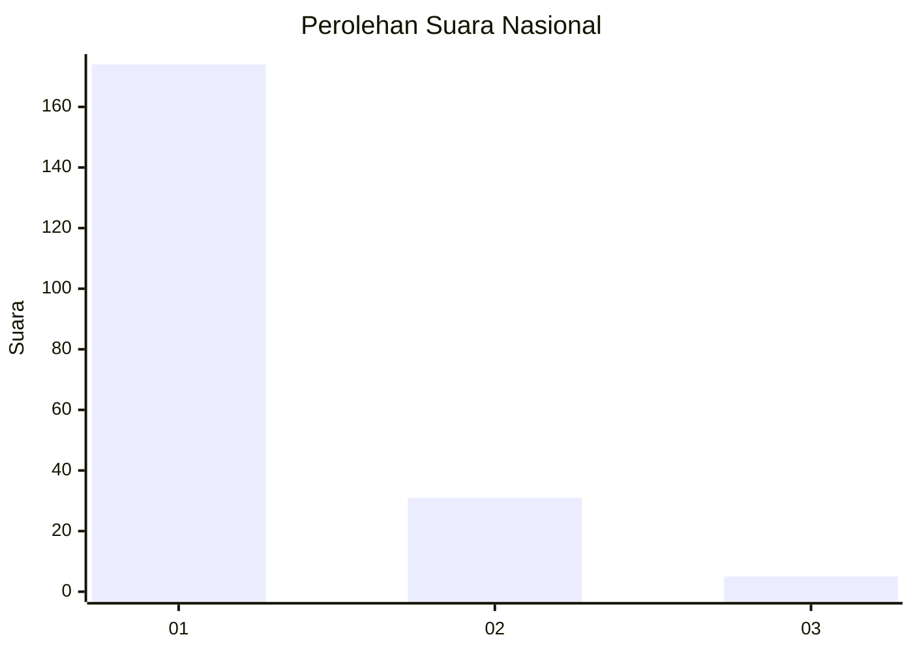
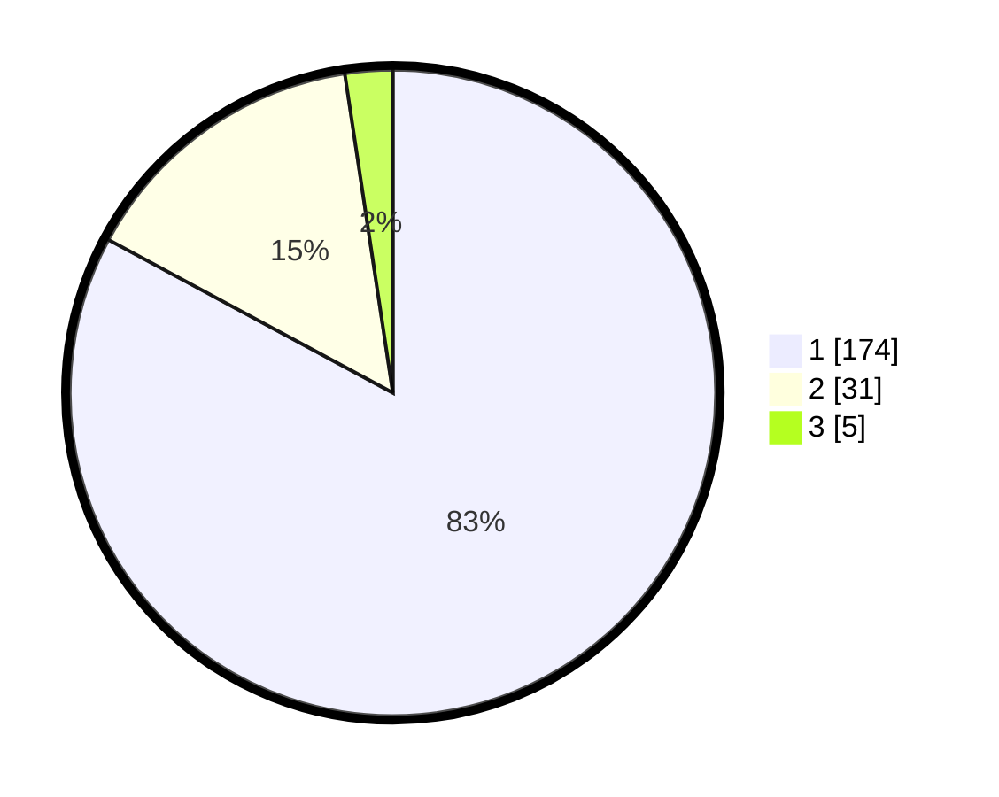

# Hasil

## Grafik

## Tabel

| No. | Nama Paslon    | Suara | Suara (raw) | Persentase |
|:--- |:-------------- | -----:| -----------:| ----------:|
| 1   | ANIES MUHAIMIN | 174   | [174][p-1]  | 82,86      |
| 2   | PRABOWO GIBRAN | 31    | [31][p-2]   | 14,76      |
| 3   | GANJAR MAHFUD  | 5     | [5][p-3]    | 2,38       |

[p-1]: https://github.com/gigit-pemilu/pemilu-2024/blob/main/pilpres/hitung-suara/sub/11-aceh/sub/13-gayo-lues/sub/10-teripe-jaya/sub/2002-rerebe/sub/003-tps/sub/paslon-1.txt
[p-2]: https://github.com/gigit-pemilu/pemilu-2024/blob/main/pilpres/hitung-suara/sub/11-aceh/sub/13-gayo-lues/sub/10-teripe-jaya/sub/2002-rerebe/sub/003-tps/sub/paslon-2.txt
[p-3]: https://github.com/gigit-pemilu/pemilu-2024/blob/main/pilpres/hitung-suara/sub/11-aceh/sub/13-gayo-lues/sub/10-teripe-jaya/sub/2002-rerebe/sub/003-tps/sub/paslon-3.txt

## Foto C Plano

https://sirekap-obj-formc.kpu.go.id/8244/pemilu/ppwp/11/13/10/20/02/1113102002003-20240214-185613--c57e3860-b599-4267-a5d2-0d1b2eac8f89.jpg

https://sirekap-obj-formc.kpu.go.id/8244/pemilu/ppwp/11/13/10/20/02/1113102002003-20240214-195838--2d62bf34-97e0-4e3c-a886-05e920dcadaf.jpg

https://sirekap-obj-formc.kpu.go.id/8244/pemilu/ppwp/11/13/10/20/02/1113102002003-20240214-200134--03fb3914-13de-4414-bd7a-3dd19f9afb01.jpg

## Metadata

| Key        | Value               |
| ---------- | ------------------- |
| Time Stamp | 2024-02-15 00:41:44 |

## DATA PEMILIH TETAP

Jumlah pemilih dalam DPT: **234**.
 * L: **108**.
 * P: **126**.

## DATA PENGGUNA HAK PILIH

Jumlah pengguna hak pilih dalam DPT: **207**.
 * L: **94**.
 * P: **113**.

Jumlah pengguna hak pilih dalam DPTb: **1**.
 * L: **0**.
 * P: **1**.

Jumlah pengguna hak pilih dalam DPK: **9**.
 * L: **3**.
 * P: **6**.

Jumlah pengguna hak pilih: **217**.
 * L: **97**.
 * P: **120**.

## JUMLAH SUARA SAH DAN TIDAK SAH

JUMLAH SELURUH SUARA SAH: **210**.

JUMLAH SUARA TIDAK SAH: **7**.

JUMLAH SELURUH SUARA SAH DAN SUARA TIDAK SAH: **217**.

