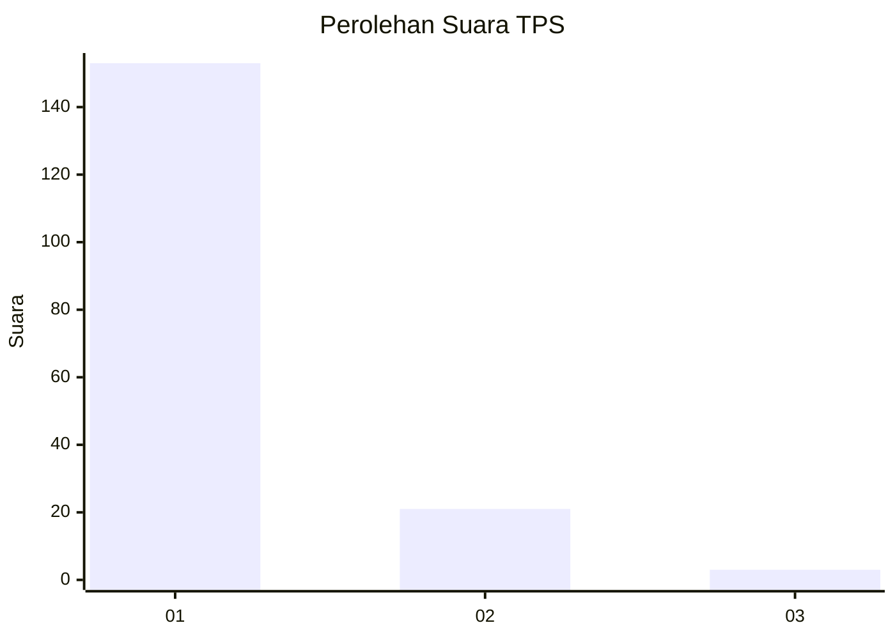
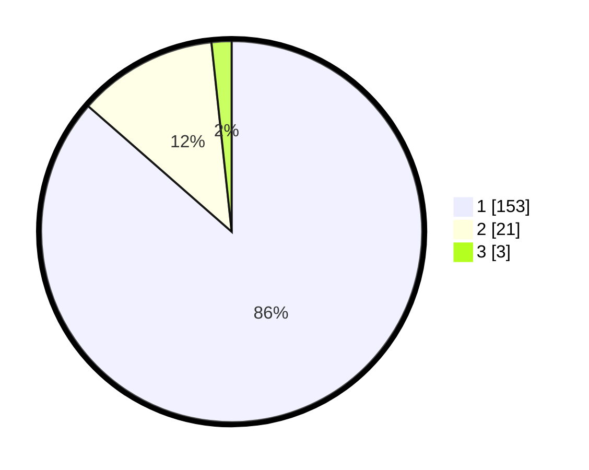

# Hasil

## Grafik

## Tabel

| No. | Nama Paslon    | Suara | Suara (raw) | Persentase |
|:--- |:-------------- | -----:| -----------:| ----------:|
| 1   | ANIES MUHAIMIN | 153   | [153][p-1]  | 86,44      |
| 2   | PRABOWO GIBRAN | 21    | [21][p-2]   | 11,86      |
| 3   | GANJAR MAHFUD  | 3     | [3][p-3]    | 1,69       |

[p-1]: https://github.com/gigit-pemilu/pemilu-2024-11-aceh/blob/main/pilpres/hitung-suara/sub/11-aceh/sub/13-gayo-lues/sub/10-teripe-jaya/sub/2003-pasir/sub/003-tps/sub/paslon-1.txt
[p-2]: https://github.com/gigit-pemilu/pemilu-2024-11-aceh/blob/main/pilpres/hitung-suara/sub/11-aceh/sub/13-gayo-lues/sub/10-teripe-jaya/sub/2003-pasir/sub/003-tps/sub/paslon-2.txt
[p-3]: https://github.com/gigit-pemilu/pemilu-2024-11-aceh/blob/main/pilpres/hitung-suara/sub/11-aceh/sub/13-gayo-lues/sub/10-teripe-jaya/sub/2003-pasir/sub/003-tps/sub/paslon-3.txt

## Foto C Plano

https://sirekap-obj-formc.kpu.go.id/eeb1/pemilu/ppwp/11/13/10/20/03/1113102003003-20240217-102741--1e2cb40c-0b96-40ab-bc61-8a5ca1abbd3f.jpg

https://sirekap-obj-formc.kpu.go.id/eeb1/pemilu/ppwp/11/13/10/20/03/1113102003003-20240215-180349--7060996e-d2e9-41d5-a258-e9e6bef3c470.jpg

https://sirekap-obj-formc.kpu.go.id/eeb1/pemilu/ppwp/11/13/10/20/03/1113102003003-20240217-163444--45d6c92b-9cf3-4136-baac-31c660f12811.jpg

## Metadata

| Key        | Value               |
| ---------- | ------------------- |
| Time Stamp | 2024-02-19 06:16:00 |

