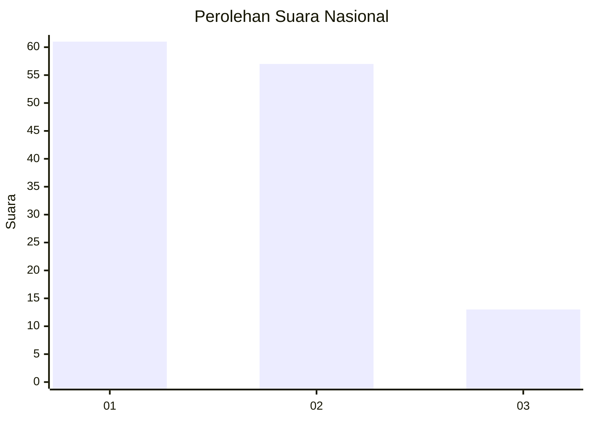
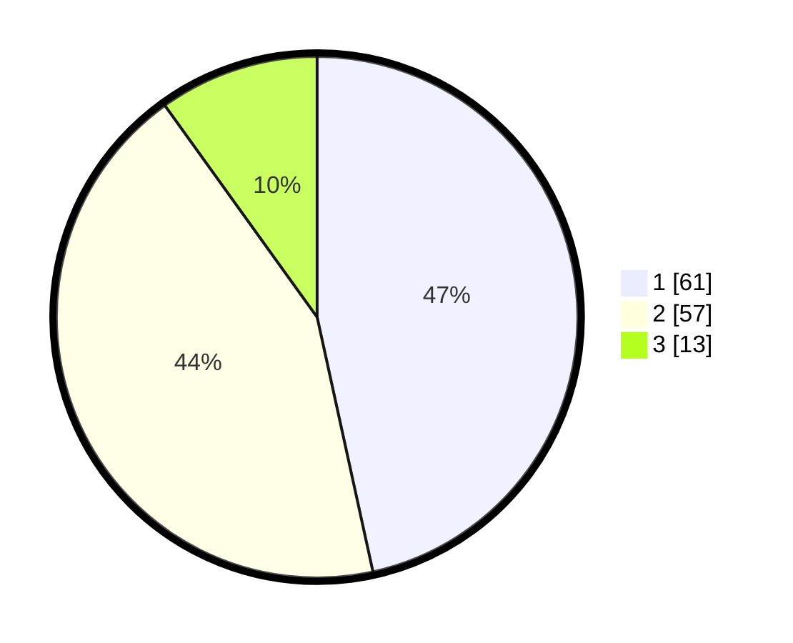

# Hasil

## Grafik

## Tabel

| No. | Nama Paslon    | Suara | Suara (raw) | Persentase |
|:--- |:-------------- | -----:| -----------:| ----------:|
| 1   | ANIES MUHAIMIN | 61    | [61][p-1]   | 46,56      |
| 2   | PRABOWO GIBRAN | 57    | [57][p-2]   | 43,51      |
| 3   | GANJAR MAHFUD  | 13    | [13][p-3]   | 9,92       |

[p-1]: https://github.com/gigit-pemilu/pemilu-2024/blob/main/pilpres/hitung-suara/sub/11-aceh/sub/13-gayo-lues/sub/10-teripe-jaya/sub/2005-upt-paya-kumer/sub/001-tps/sub/paslon-1.txt
[p-2]: https://github.com/gigit-pemilu/pemilu-2024/blob/main/pilpres/hitung-suara/sub/11-aceh/sub/13-gayo-lues/sub/10-teripe-jaya/sub/2005-upt-paya-kumer/sub/001-tps/sub/paslon-2.txt
[p-3]: https://github.com/gigit-pemilu/pemilu-2024/blob/main/pilpres/hitung-suara/sub/11-aceh/sub/13-gayo-lues/sub/10-teripe-jaya/sub/2005-upt-paya-kumer/sub/001-tps/sub/paslon-3.txt

## Foto C Plano

https://sirekap-obj-formc.kpu.go.id/d5aa/pemilu/ppwp/11/13/10/20/05/1113102005001-20240216-031506--1cab4c39-9f4e-4f08-810e-93035d119915.jpg

https://sirekap-obj-formc.kpu.go.id/d5aa/pemilu/ppwp/11/13/10/20/05/1113102005001-20240216-031508--e0032b0f-4966-4ef2-955d-dd7cdfca06f5.jpg

https://sirekap-obj-formc.kpu.go.id/d5aa/pemilu/ppwp/11/13/10/20/05/1113102005001-20240216-031506--8c884dbc-1f0a-4e46-9ae9-0f9b8303b89f.jpg

## Metadata

| Key        | Value               |
| ---------- | ------------------- |
| Time Stamp | 2024-02-16 23:00:00 |

## DATA PEMILIH TETAP

Jumlah pemilih dalam DPT: **146**.
 * L: **83**.
 * P: **63**.

## DATA PENGGUNA HAK PILIH

Jumlah pengguna hak pilih dalam DPT: **128**.
 * L: **72**.
 * P: **56**.

Jumlah pengguna hak pilih dalam DPTb: **1**.
 * L: **1**.
 * P: **0**.

Jumlah pengguna hak pilih dalam DPK: **3**.
 * L: **1**.
 * P: **2**.

Jumlah pengguna hak pilih: **132**.
 * L: **74**.
 * P: **58**.

## JUMLAH SUARA SAH DAN TIDAK SAH

JUMLAH SELURUH SUARA SAH: **131**.

JUMLAH SUARA TIDAK SAH: **1**.

JUMLAH SELURUH SUARA SAH DAN SUARA TIDAK SAH: **132**.

