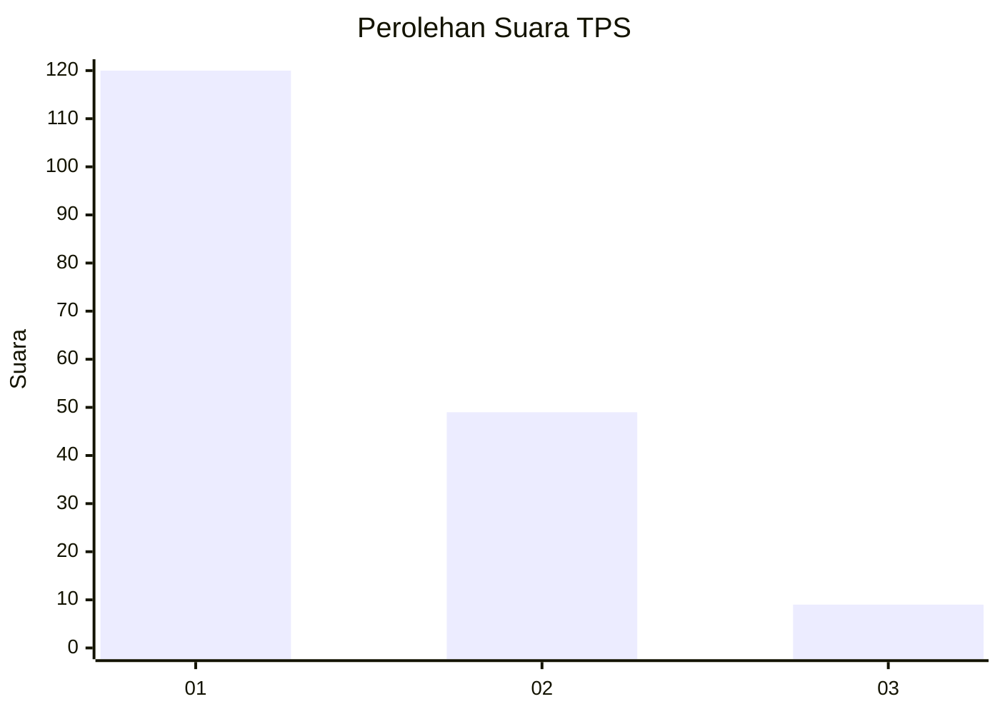
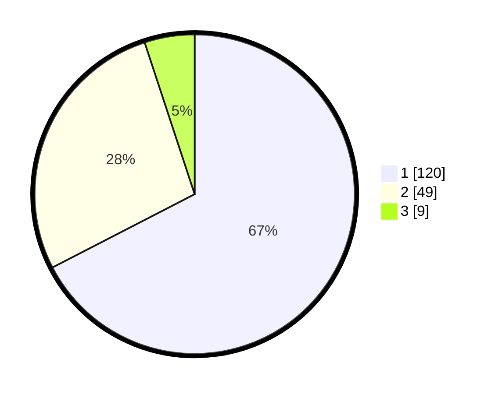

# Hasil

## Grafik

## Tabel

| No. | Nama Paslon    | Suara | Suara (raw) | Persentase |
|:--- |:-------------- | -----:| -----------:| ----------:|
| 1   | ANIES MUHAIMIN | 120   | [120][p-1]  | 67,42      |
| 2   | PRABOWO GIBRAN | 49    | [49][p-2]   | 27,53      |
| 3   | GANJAR MAHFUD  | 9     | [9][p-3]    | 5,06       |

[p-1]: https://github.com/gigit-pemilu/pemilu-2024-11-aceh/blob/main/pilpres/hitung-suara/sub/11-aceh/sub/13-gayo-lues/sub/11-pantan-cuaca/sub/2002-remukut/sub/002-tps/sub/paslon-1.txt
[p-2]: https://github.com/gigit-pemilu/pemilu-2024-11-aceh/blob/main/pilpres/hitung-suara/sub/11-aceh/sub/13-gayo-lues/sub/11-pantan-cuaca/sub/2002-remukut/sub/002-tps/sub/paslon-2.txt
[p-3]: https://github.com/gigit-pemilu/pemilu-2024-11-aceh/blob/main/pilpres/hitung-suara/sub/11-aceh/sub/13-gayo-lues/sub/11-pantan-cuaca/sub/2002-remukut/sub/002-tps/sub/paslon-3.txt

## Foto C Plano

https://sirekap-obj-formc.kpu.go.id/74f4/pemilu/ppwp/11/13/11/20/02/1113112002002-20240217-000655--3f0b1ff4-ee78-4660-804c-8a75bd721dbf.jpg

https://sirekap-obj-formc.kpu.go.id/74f4/pemilu/ppwp/11/13/11/20/02/1113112002002-20240219-150524--87f646ce-7e5b-43e4-af54-eb3c81cb1801.jpg

https://sirekap-obj-formc.kpu.go.id/74f4/pemilu/ppwp/11/13/11/20/02/1113112002002-20240217-003326--847d4a5d-4b87-4480-8dd3-d43bb4074525.jpg

## Metadata

| Key        | Value               |
| ---------- | ------------------- |
| Time Stamp | 2024-02-19 16:00:00 |

## DATA PEMILIH TETAP

Jumlah pemilih dalam DPT: **193**.
 * L: **97**.
 * P: **96**.

## DATA PENGGUNA HAK PILIH

Jumlah pengguna hak pilih dalam DPT: **180**.
 * L: **91**.
 * P: **89**.

Jumlah pengguna hak pilih dalam DPTb: **0**.
 * L: **0**.
 * P: **0**.

Jumlah pengguna hak pilih dalam DPK: **4**.
 * L: **3**.
 * P: **1**.

Jumlah pengguna hak pilih: **184**.
 * L: **94**.
 * P: **90**.

## JUMLAH SUARA SAH DAN TIDAK SAH

JUMLAH SELURUH SUARA SAH: **178**.

JUMLAH SUARA TIDAK SAH: **6**.

JUMLAH SELURUH SUARA SAH DAN SUARA TIDAK SAH: **184**.

