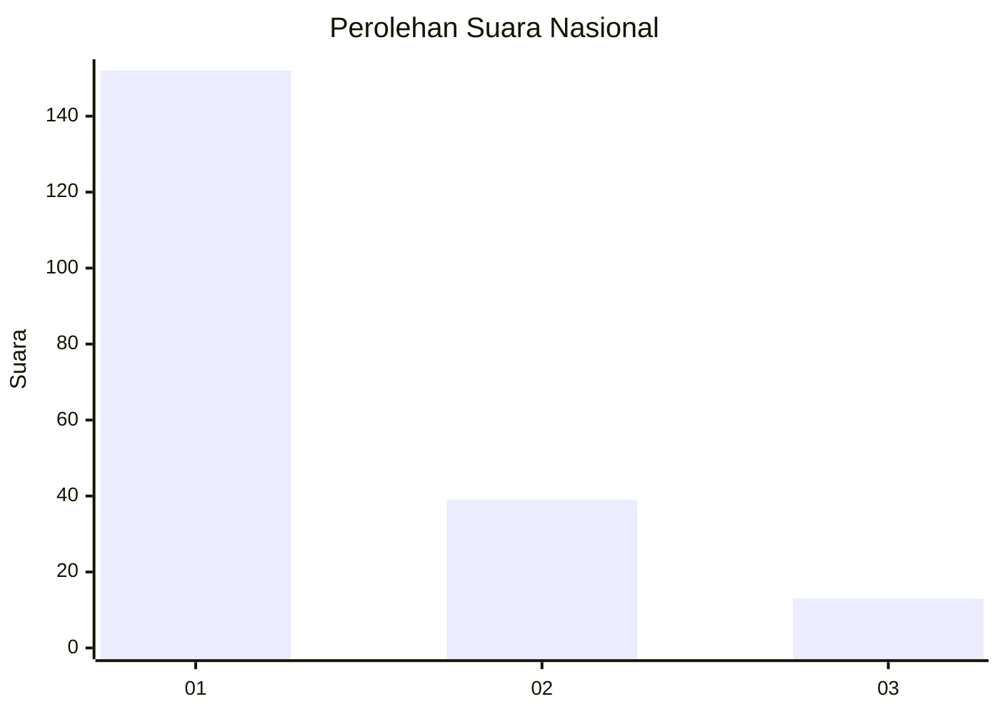
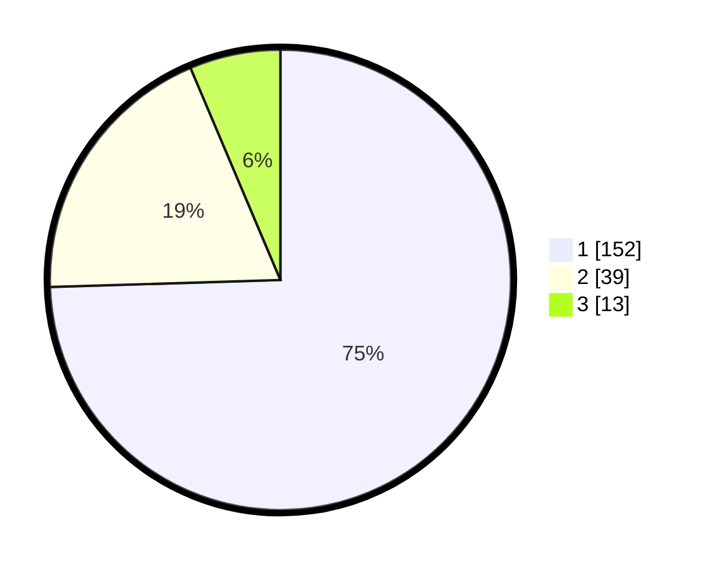

# Hasil

## Grafik

## Tabel

| No. | Nama Paslon    | Suara | Suara (raw) | Persentase |
|:--- |:-------------- | -----:| -----------:| ----------:|
| 1   | ANIES MUHAIMIN | 152   | [152][p-1]  | 74,51      |
| 2   | PRABOWO GIBRAN | 39    | [39][p-2]   | 19,12      |
| 3   | GANJAR MAHFUD  | 13    | [13][p-3]   | 6,37       |

[p-1]: https://github.com/gigit-pemilu/pemilu-2024/blob/main/pilpres/hitung-suara/sub/11-aceh/sub/13-gayo-lues/sub/11-pantan-cuaca/sub/2003-kenyaran/sub/001-tps/sub/paslon-1.txt
[p-2]: https://github.com/gigit-pemilu/pemilu-2024/blob/main/pilpres/hitung-suara/sub/11-aceh/sub/13-gayo-lues/sub/11-pantan-cuaca/sub/2003-kenyaran/sub/001-tps/sub/paslon-2.txt
[p-3]: https://github.com/gigit-pemilu/pemilu-2024/blob/main/pilpres/hitung-suara/sub/11-aceh/sub/13-gayo-lues/sub/11-pantan-cuaca/sub/2003-kenyaran/sub/001-tps/sub/paslon-3.txt

## Foto C Plano

https://sirekap-obj-formc.kpu.go.id/7643/pemilu/ppwp/11/13/11/20/03/1113112003001-20240216-090413--4d17c362-0211-473f-a1ee-7f849286993f.jpg

https://sirekap-obj-formc.kpu.go.id/7643/pemilu/ppwp/11/13/11/20/03/1113112003001-20240216-090415--b13b2fc7-a5ea-4ee7-bdf0-dcec7c1583db.jpg

https://sirekap-obj-formc.kpu.go.id/7643/pemilu/ppwp/11/13/11/20/03/1113112003001-20240216-090414--da18aebf-722d-48f1-9e6d-5b8db1d8af40.jpg

## Metadata

| Key        | Value               |
| ---------- | ------------------- |
| Time Stamp | 2024-02-16 23:00:00 |

## DATA PEMILIH TETAP

Jumlah pemilih dalam DPT: **218**.
 * L: **113**.
 * P: **105**.

## DATA PENGGUNA HAK PILIH

Jumlah pengguna hak pilih dalam DPT: **204**.
 * L: **105**.
 * P: **99**.

Jumlah pengguna hak pilih dalam DPTb: **1**.
 * L: **0**.
 * P: **1**.

Jumlah pengguna hak pilih dalam DPK: **1**.
 * L: **0**.
 * P: **1**.

Jumlah pengguna hak pilih: **206**.
 * L: **105**.
 * P: **101**.

## JUMLAH SUARA SAH DAN TIDAK SAH

JUMLAH SELURUH SUARA SAH: **204**.

JUMLAH SUARA TIDAK SAH: **2**.

JUMLAH SELURUH SUARA SAH DAN SUARA TIDAK SAH: **206**.

