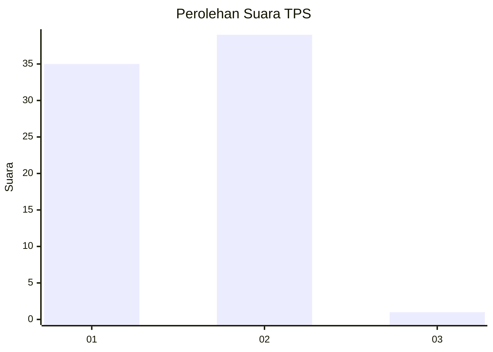
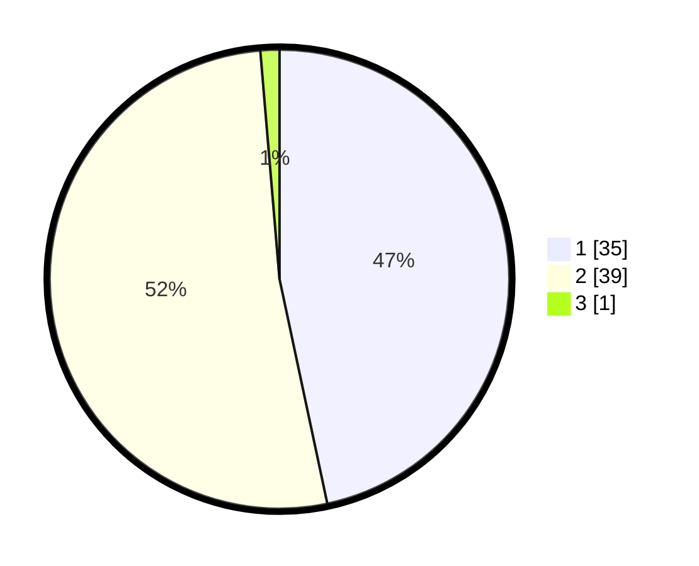

# Hasil

## Grafik

## Tabel

| No. | Nama Paslon    | Suara | Suara (raw) | Persentase |
|:--- |:-------------- | -----:| -----------:| ----------:|
| 1   | ANIES MUHAIMIN | 35    | [35][p-1]   | 46,67      |
| 2   | PRABOWO GIBRAN | 39    | [39][p-2]   | 52,00      |
| 3   | GANJAR MAHFUD  | 1     | [1][p-3]    | 1,33       |

[p-1]: https://github.com/gigit-pemilu/pemilu-2024-11-aceh/blob/main/pilpres/hitung-suara/sub/11-aceh/sub/13-gayo-lues/sub/11-pantan-cuaca/sub/2003-kenyaran/sub/003-tps/sub/paslon-1.txt
[p-2]: https://github.com/gigit-pemilu/pemilu-2024-11-aceh/blob/main/pilpres/hitung-suara/sub/11-aceh/sub/13-gayo-lues/sub/11-pantan-cuaca/sub/2003-kenyaran/sub/003-tps/sub/paslon-2.txt
[p-3]: https://github.com/gigit-pemilu/pemilu-2024-11-aceh/blob/main/pilpres/hitung-suara/sub/11-aceh/sub/13-gayo-lues/sub/11-pantan-cuaca/sub/2003-kenyaran/sub/003-tps/sub/paslon-3.txt

## Foto C Plano

https://sirekap-obj-formc.kpu.go.id/59f3/pemilu/ppwp/11/13/11/20/03/1113112003003-20240216-002628--06c5eff0-902d-4626-8a92-ee29e6769006.jpg

https://sirekap-obj-formc.kpu.go.id/59f3/pemilu/ppwp/11/13/11/20/03/1113112003003-20240216-002631--7847138c-1c77-46fa-b15a-6f683c865109.jpg

https://sirekap-obj-formc.kpu.go.id/59f3/pemilu/ppwp/11/13/11/20/03/1113112003003-20240216-002630--39ca3ce3-acc7-4133-ba81-71ddc444af38.jpg

## Metadata

| Key        | Value               |
| ---------- | ------------------- |
| Time Stamp | 2024-02-16 01:00:27 |

## DATA PEMILIH TETAP

Jumlah pemilih dalam DPT: **73**.
 * L: **40**.
 * P: **33**.

## DATA PENGGUNA HAK PILIH

Jumlah pengguna hak pilih dalam DPT: **70**.
 * L: **37**.
 * P: **33**.

Jumlah pengguna hak pilih dalam DPTb: **4**.
 * L: **3**.
 * P: **1**.

Jumlah pengguna hak pilih dalam DPK: **1**.
 * L: **0**.
 * P: **1**.

Jumlah pengguna hak pilih: **75**.
 * L: **40**.
 * P: **35**.

## JUMLAH SUARA SAH DAN TIDAK SAH

JUMLAH SELURUH SUARA SAH: **75**.

JUMLAH SUARA TIDAK SAH: **0**.

JUMLAH SELURUH SUARA SAH DAN SUARA TIDAK SAH: **75**.

