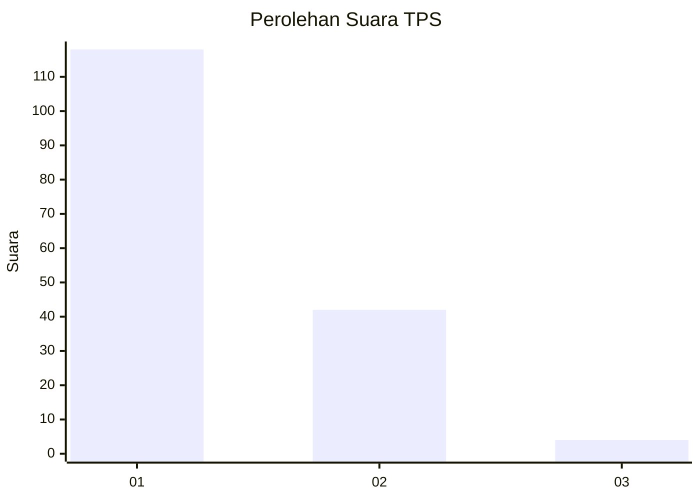
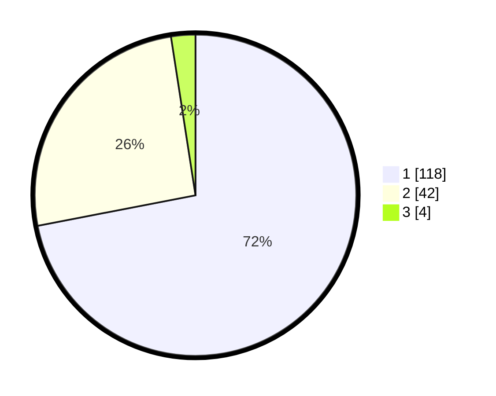

# Hasil

## Grafik

## Tabel

| No. | Nama Paslon    | Suara | Suara (raw) | Persentase |
|:--- |:-------------- | -----:| -----------:| ----------:|
| 1   | ANIES MUHAIMIN | 118   | [118][p-1]  | 71,95      |
| 2   | PRABOWO GIBRAN | 42    | [42][p-2]   | 25,61      |
| 3   | GANJAR MAHFUD  | 4     | [4][p-3]    | 2,44       |

[p-1]: https://github.com/gigit-pemilu/pemilu-2024-11-aceh/blob/main/pilpres/hitung-suara/sub/11-aceh/sub/14-aceh-jaya/sub/01-teunom/sub/2001-keude-teunom/sub/001-tps/sub/paslon-1.txt
[p-2]: https://github.com/gigit-pemilu/pemilu-2024-11-aceh/blob/main/pilpres/hitung-suara/sub/11-aceh/sub/14-aceh-jaya/sub/01-teunom/sub/2001-keude-teunom/sub/001-tps/sub/paslon-2.txt
[p-3]: https://github.com/gigit-pemilu/pemilu-2024-11-aceh/blob/main/pilpres/hitung-suara/sub/11-aceh/sub/14-aceh-jaya/sub/01-teunom/sub/2001-keude-teunom/sub/001-tps/sub/paslon-3.txt

## Foto C Plano

https://sirekap-obj-formc.kpu.go.id/271e/pemilu/ppwp/11/14/01/20/01/1114012001001-20240214-235601--be2363d6-1451-42c0-be19-0d5e7ab3011b.jpg

https://sirekap-obj-formc.kpu.go.id/271e/pemilu/ppwp/11/14/01/20/01/1114012001001-20240214-235923--db12d821-ca8a-45fc-ba4d-bdf28aa4fb0b.jpg

https://sirekap-obj-formc.kpu.go.id/271e/pemilu/ppwp/11/14/01/20/01/1114012001001-20240215-000141--1736a5a6-c911-488d-a36b-857402dab5dd.jpg

## Metadata

| Key        | Value               |
| ---------- | ------------------- |
| Time Stamp | 2024-02-15 19:30:26 |

## DATA PEMILIH TETAP

Jumlah pemilih dalam DPT: **210**.
 * L: **102**.
 * P: **108**.

## DATA PENGGUNA HAK PILIH

Jumlah pengguna hak pilih dalam DPT: **168**.
 * L: **82**.
 * P: **86**.

Jumlah pengguna hak pilih dalam DPTb: **2**.
 * L: **0**.
 * P: **2**.

Jumlah pengguna hak pilih dalam DPK: **0**.
 * L: **0**.
 * P: **0**.

Jumlah pengguna hak pilih: **170**.
 * L: **82**.
 * P: **88**.

## JUMLAH SUARA SAH DAN TIDAK SAH

JUMLAH SELURUH SUARA SAH: **164**.

JUMLAH SUARA TIDAK SAH: **6**.

JUMLAH SELURUH SUARA SAH DAN SUARA TIDAK SAH: **170**.

