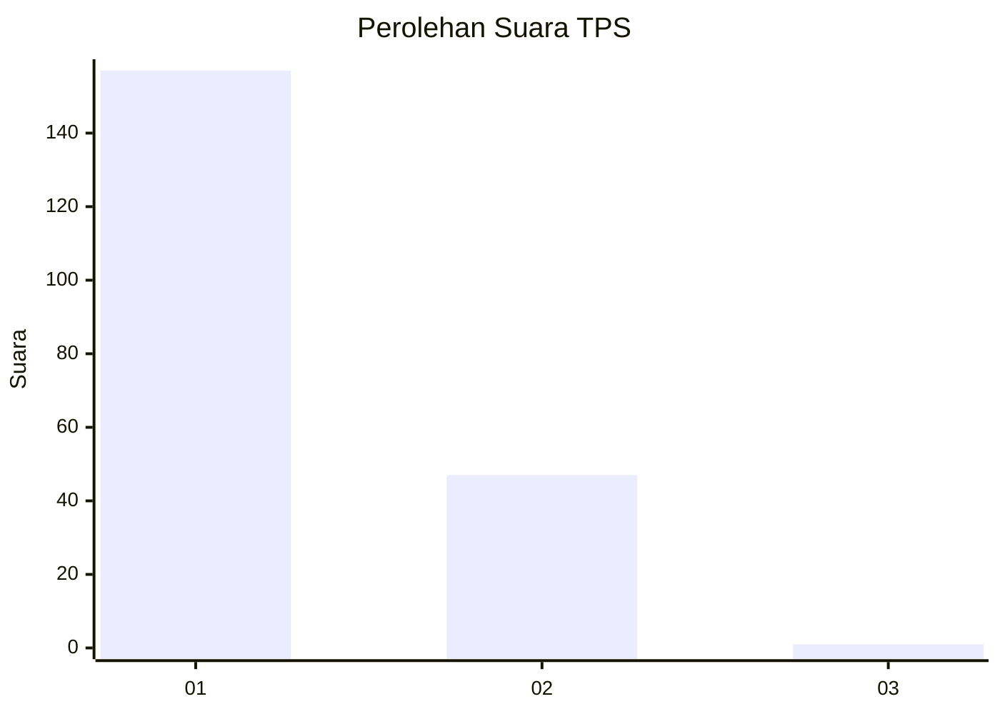
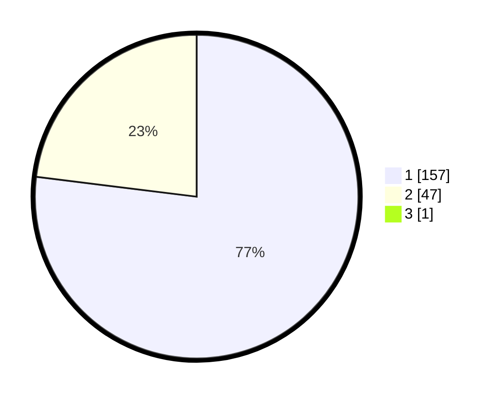

# Hasil

## Grafik

## Tabel

| No. | Nama Paslon    | Suara | Suara (raw) | Persentase |
|:--- |:-------------- | -----:| -----------:| ----------:|
| 1   | ANIES MUHAIMIN | 157   | [157][p-1]  | 76,59      |
| 2   | PRABOWO GIBRAN | 47    | [47][p-2]   | 22,93      |
| 3   | GANJAR MAHFUD  | 1     | [1][p-3]    | 0,49       |

[p-1]: https://github.com/gigit-pemilu/pemilu-2024-11-aceh/blob/main/pilpres/hitung-suara/sub/11-aceh/sub/14-aceh-jaya/sub/01-teunom/sub/2001-keude-teunom/sub/002-tps/sub/paslon-1.txt
[p-2]: https://github.com/gigit-pemilu/pemilu-2024-11-aceh/blob/main/pilpres/hitung-suara/sub/11-aceh/sub/14-aceh-jaya/sub/01-teunom/sub/2001-keude-teunom/sub/002-tps/sub/paslon-2.txt
[p-3]: https://github.com/gigit-pemilu/pemilu-2024-11-aceh/blob/main/pilpres/hitung-suara/sub/11-aceh/sub/14-aceh-jaya/sub/01-teunom/sub/2001-keude-teunom/sub/002-tps/sub/paslon-3.txt

## Foto C Plano

https://sirekap-obj-formc.kpu.go.id/dd9e/pemilu/ppwp/11/14/01/20/01/1114012001002-20240215-025537--3caf0ecd-0ad1-464e-9e99-3702151e68ef.jpg

https://sirekap-obj-formc.kpu.go.id/dd9e/pemilu/ppwp/11/14/01/20/01/1114012001002-20240215-025559--e4df6d86-682d-43c1-a8d1-85e79108e1b9.jpg

https://sirekap-obj-formc.kpu.go.id/dd9e/pemilu/ppwp/11/14/01/20/01/1114012001002-20240215-025617--2b5ec3f2-10f6-4349-83fd-84b678b2742b.jpg

## Metadata

| Key        | Value               |
| ---------- | ------------------- |
| Time Stamp | 2024-02-15 12:00:28 |

## DATA PEMILIH TETAP

Jumlah pemilih dalam DPT: **236**.
 * L: **120**.
 * P: **116**.

## DATA PENGGUNA HAK PILIH

Jumlah pengguna hak pilih dalam DPT: **207**.
 * L: **103**.
 * P: **104**.

Jumlah pengguna hak pilih dalam DPTb: **0**.
 * L: **0**.
 * P: **0**.

Jumlah pengguna hak pilih dalam DPK: **0**.
 * L: **0**.
 * P: **0**.

Jumlah pengguna hak pilih: **207**.
 * L: **103**.
 * P: **104**.

## JUMLAH SUARA SAH DAN TIDAK SAH

JUMLAH SELURUH SUARA SAH: **205**.

JUMLAH SUARA TIDAK SAH: **2**.

JUMLAH SELURUH SUARA SAH DAN SUARA TIDAK SAH: **207**.

