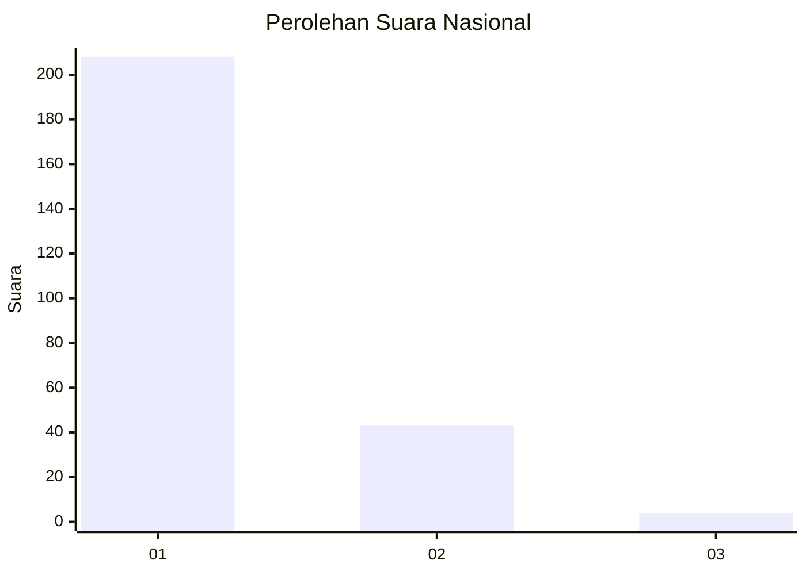
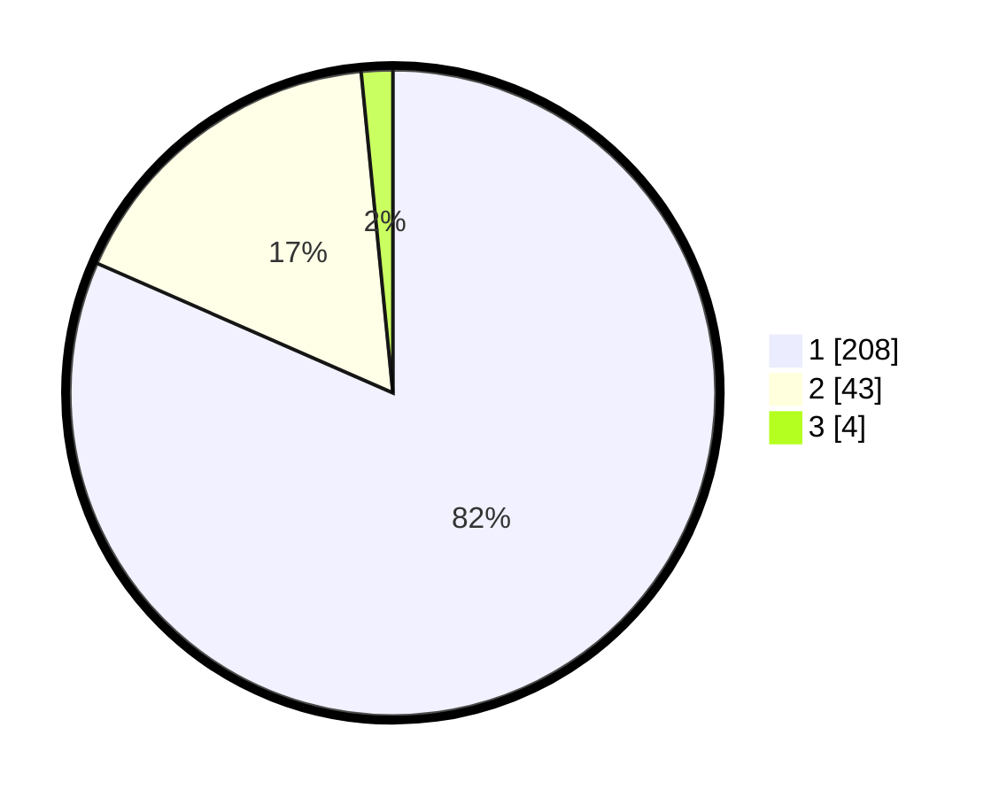

# Hasil

## Grafik

## Tabel

| No. | Nama Paslon    | Suara | Suara (raw) | Persentase |
|:--- |:-------------- | -----:| -----------:| ----------:|
| 1   | ANIES MUHAIMIN | 208   | [208][p-1]  | 81,57      |
| 2   | PRABOWO GIBRAN | 43    | [43][p-2]   | 16,86      |
| 3   | GANJAR MAHFUD  | 4     | [4][p-3]    | 1,57       |

[p-1]: https://github.com/gigit-pemilu/pemilu-2024/blob/main/pilpres/hitung-suara/sub/11-aceh/sub/14-aceh-jaya/sub/01-teunom/sub/2003-padang-kleng/sub/001-tps/sub/paslon-1.txt
[p-2]: https://github.com/gigit-pemilu/pemilu-2024/blob/main/pilpres/hitung-suara/sub/11-aceh/sub/14-aceh-jaya/sub/01-teunom/sub/2003-padang-kleng/sub/001-tps/sub/paslon-2.txt
[p-3]: https://github.com/gigit-pemilu/pemilu-2024/blob/main/pilpres/hitung-suara/sub/11-aceh/sub/14-aceh-jaya/sub/01-teunom/sub/2003-padang-kleng/sub/001-tps/sub/paslon-3.txt

## Foto C Plano

https://sirekap-obj-formc.kpu.go.id/1e46/pemilu/ppwp/11/14/01/20/03/1114012003001-20240216-144516--5796cbc1-4f64-4d5d-ba8e-d4fabffe4c90.jpg

https://sirekap-obj-formc.kpu.go.id/1e46/pemilu/ppwp/11/14/01/20/03/1114012003001-20240216-144517--c822aa11-59ad-430c-8194-192182190459.jpg

https://sirekap-obj-formc.kpu.go.id/1e46/pemilu/ppwp/11/14/01/20/03/1114012003001-20240216-144517--fa2088a0-a555-4d1c-8607-26b11f016761.jpg

## Metadata

| Key        | Value               |
| ---------- | ------------------- |
| Time Stamp | 2024-02-16 21:01:00 |

## DATA PEMILIH TETAP

Jumlah pemilih dalam DPT: **286**.
 * L: **129**.
 * P: **157**.

## DATA PENGGUNA HAK PILIH

Jumlah pengguna hak pilih dalam DPT: **251**.
 * L: **105**.
 * P: **146**.

Jumlah pengguna hak pilih dalam DPTb: **4**.
 * L: **1**.
 * P: **3**.

Jumlah pengguna hak pilih dalam DPK: **0**.
 * L: **0**.
 * P: **0**.

Jumlah pengguna hak pilih: **255**.
 * L: **106**.
 * P: **149**.

## JUMLAH SUARA SAH DAN TIDAK SAH

JUMLAH SELURUH SUARA SAH: **255**.

JUMLAH SUARA TIDAK SAH: **0**.

JUMLAH SELURUH SUARA SAH DAN SUARA TIDAK SAH: **255**.

