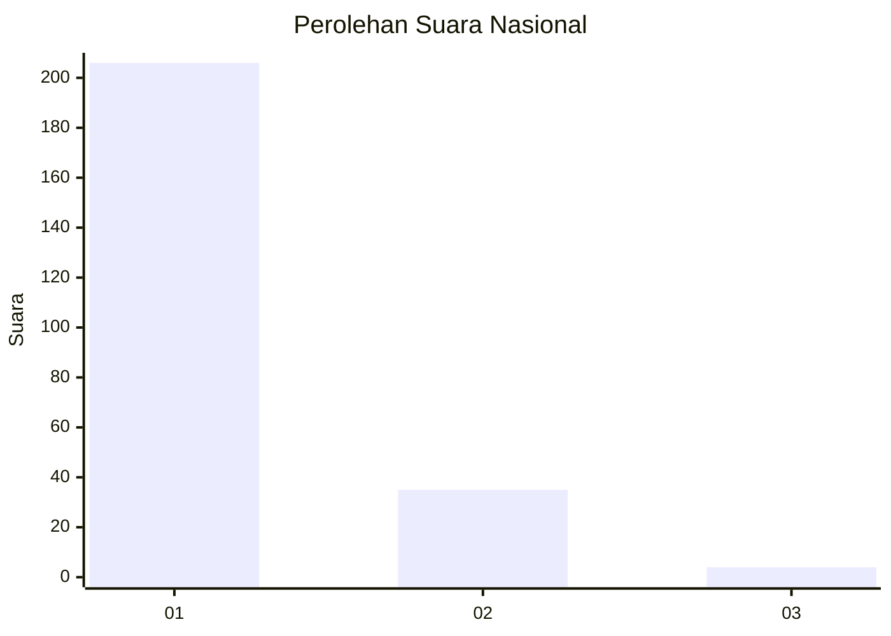
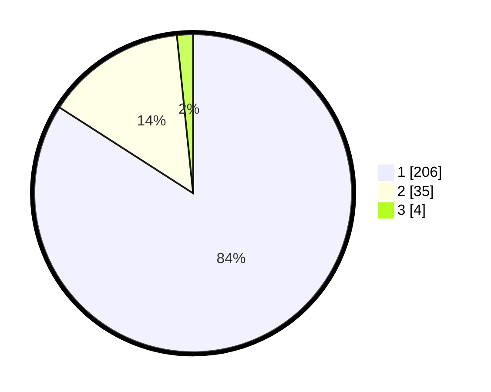

# Hasil

## Grafik

## Tabel

| No. | Nama Paslon    | Suara | Suara (raw) | Persentase |
|:--- |:-------------- | -----:| -----------:| ----------:|
| 1   | ANIES MUHAIMIN | 206   | [206][p-1]  | 84,08      |
| 2   | PRABOWO GIBRAN | 35    | [35][p-2]   | 14,29      |
| 3   | GANJAR MAHFUD  | 4     | [4][p-3]    | 1,63       |

[p-1]: https://github.com/gigit-pemilu/pemilu-2024/blob/main/pilpres/hitung-suara/sub/11-aceh/sub/14-aceh-jaya/sub/01-teunom/sub/2003-padang-kleng/sub/002-tps/sub/paslon-1.txt
[p-2]: https://github.com/gigit-pemilu/pemilu-2024/blob/main/pilpres/hitung-suara/sub/11-aceh/sub/14-aceh-jaya/sub/01-teunom/sub/2003-padang-kleng/sub/002-tps/sub/paslon-2.txt
[p-3]: https://github.com/gigit-pemilu/pemilu-2024/blob/main/pilpres/hitung-suara/sub/11-aceh/sub/14-aceh-jaya/sub/01-teunom/sub/2003-padang-kleng/sub/002-tps/sub/paslon-3.txt

## Foto C Plano

https://sirekap-obj-formc.kpu.go.id/f757/pemilu/ppwp/11/14/01/20/03/1114012003002-20240214-195315--362abc9c-56c6-49f7-a32e-e645a5bcbdca.jpg

https://sirekap-obj-formc.kpu.go.id/f757/pemilu/ppwp/11/14/01/20/03/1114012003002-20240214-195421--1b7aa6e9-6593-4517-a2dd-642b6a2b354f.jpg

https://sirekap-obj-formc.kpu.go.id/f757/pemilu/ppwp/11/14/01/20/03/1114012003002-20240214-195711--809c396c-da85-4c17-b5b7-e50cea31c8a4.jpg

## Metadata

| Key        | Value               |
| ---------- | ------------------- |
| Time Stamp | 2024-02-15 00:41:44 |

## DATA PEMILIH TETAP

Jumlah pemilih dalam DPT: **288**.
 * L: **147**.
 * P: **141**.

## DATA PENGGUNA HAK PILIH

Jumlah pengguna hak pilih dalam DPT: **244**.
 * L: **122**.
 * P: **122**.

Jumlah pengguna hak pilih dalam DPTb: **5**.
 * L: **3**.
 * P: **2**.

Jumlah pengguna hak pilih dalam DPK: **1**.
 * L: **0**.
 * P: **1**.

Jumlah pengguna hak pilih: **250**.
 * L: **125**.
 * P: **125**.

## JUMLAH SUARA SAH DAN TIDAK SAH

JUMLAH SELURUH SUARA SAH: **245**.

JUMLAH SUARA TIDAK SAH: **5**.

JUMLAH SELURUH SUARA SAH DAN SUARA TIDAK SAH: **250**.

