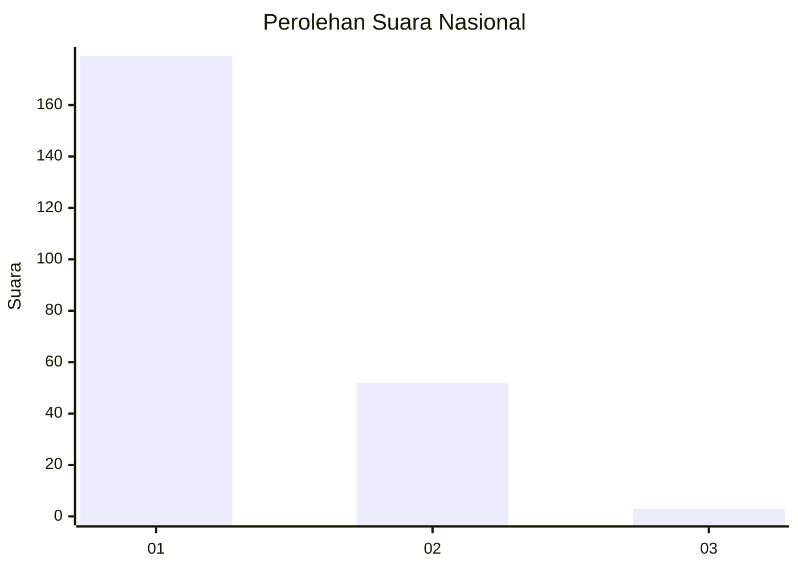
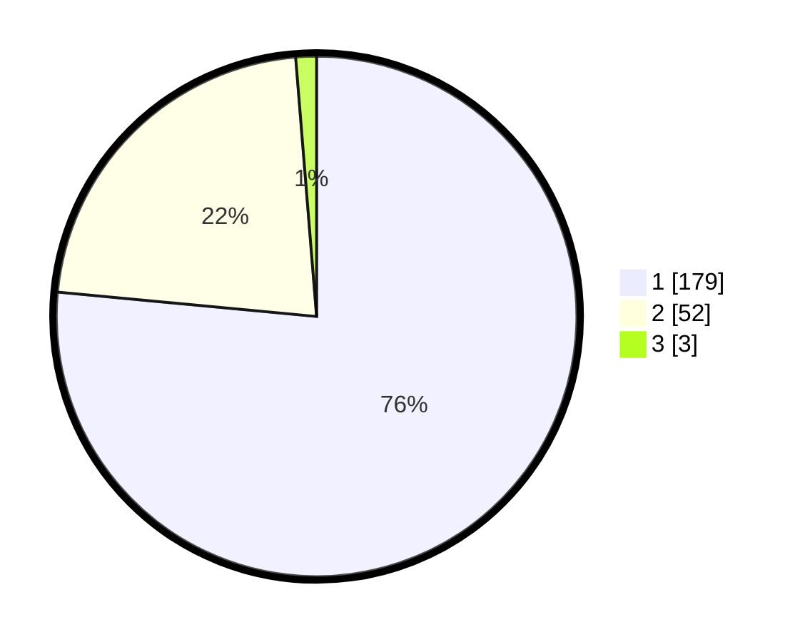

# Hasil

## Grafik

## Tabel

| No. | Nama Paslon    | Suara | Suara (raw) | Persentase |
|:--- |:-------------- | -----:| -----------:| ----------:|
| 1   | ANIES MUHAIMIN | 179   | [179][p-1]  | 76,50      |
| 2   | PRABOWO GIBRAN | 52    | [52][p-2]   | 22,22      |
| 3   | GANJAR MAHFUD  | 3     | [3][p-3]    | 1,28       |

[p-1]: https://github.com/gigit-pemilu/pemilu-2024/blob/main/pilpres/hitung-suara/sub/11-aceh/sub/14-aceh-jaya/sub/01-teunom/sub/2003-padang-kleng/sub/003-tps/sub/paslon-1.txt
[p-2]: https://github.com/gigit-pemilu/pemilu-2024/blob/main/pilpres/hitung-suara/sub/11-aceh/sub/14-aceh-jaya/sub/01-teunom/sub/2003-padang-kleng/sub/003-tps/sub/paslon-2.txt
[p-3]: https://github.com/gigit-pemilu/pemilu-2024/blob/main/pilpres/hitung-suara/sub/11-aceh/sub/14-aceh-jaya/sub/01-teunom/sub/2003-padang-kleng/sub/003-tps/sub/paslon-3.txt

## Foto C Plano

https://sirekap-obj-formc.kpu.go.id/fbd7/pemilu/ppwp/11/14/01/20/03/1114012003003-20240216-144834--29528be0-3582-4d41-84ac-324405e1f2d1.jpg

https://sirekap-obj-formc.kpu.go.id/fbd7/pemilu/ppwp/11/14/01/20/03/1114012003003-20240216-144836--abb5d5cd-050f-4a29-845e-bc309b04d070.jpg

https://sirekap-obj-formc.kpu.go.id/fbd7/pemilu/ppwp/11/14/01/20/03/1114012003003-20240216-144835--714f7a5f-e91a-465c-8521-53754638263f.jpg

## Metadata

| Key        | Value               |
| ---------- | ------------------- |
| Time Stamp | 2024-02-16 21:01:00 |

## DATA PEMILIH TETAP

Jumlah pemilih dalam DPT: **264**.
 * L: **132**.
 * P: **132**.

## DATA PENGGUNA HAK PILIH

Jumlah pengguna hak pilih dalam DPT: **234**.
 * L: **115**.
 * P: **119**.

Jumlah pengguna hak pilih dalam DPTb: **2**.
 * L: **2**.
 * P: **0**.

Jumlah pengguna hak pilih dalam DPK: **0**.
 * L: **0**.
 * P: **0**.

Jumlah pengguna hak pilih: **236**.
 * L: **117**.
 * P: **119**.

## JUMLAH SUARA SAH DAN TIDAK SAH

JUMLAH SELURUH SUARA SAH: **234**.

JUMLAH SUARA TIDAK SAH: **2**.

JUMLAH SELURUH SUARA SAH DAN SUARA TIDAK SAH: **236**.

