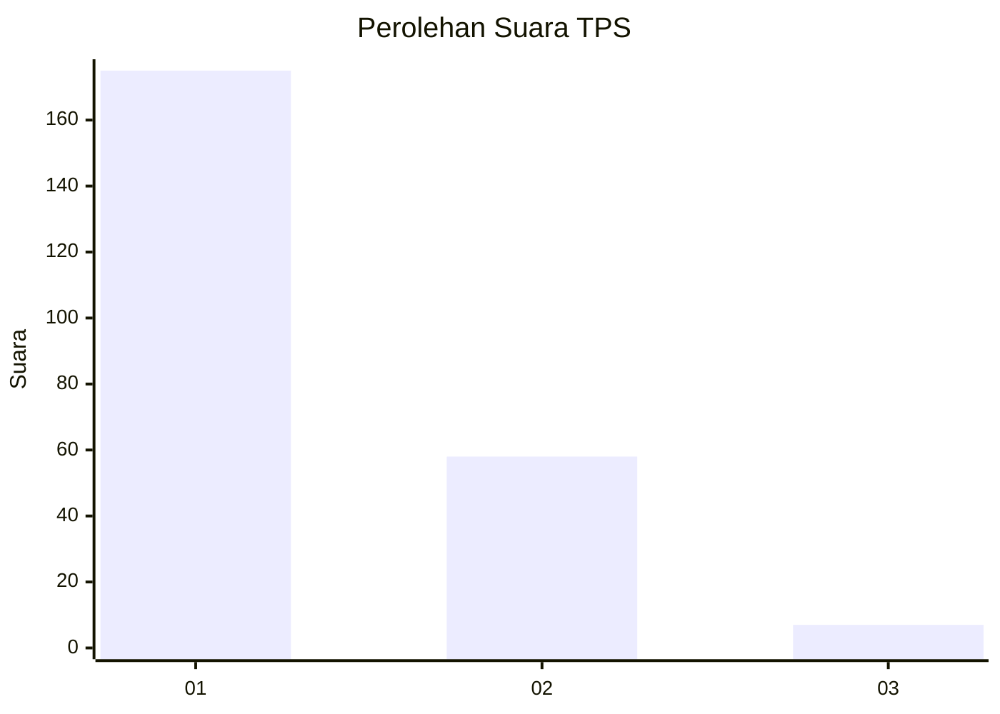
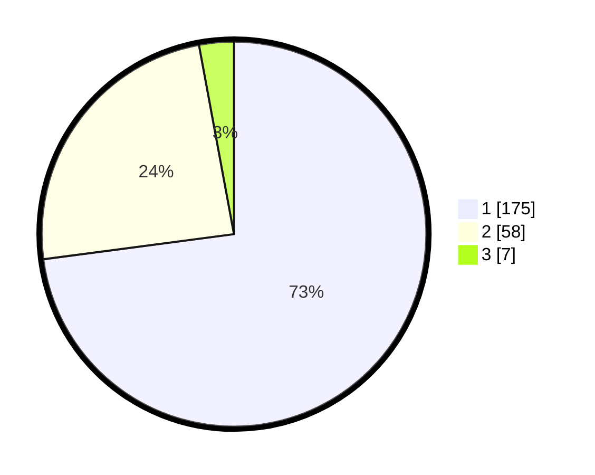

# Hasil

## Grafik

## Tabel

| No. | Nama Paslon    | Suara | Suara (raw) | Persentase |
|:--- |:-------------- | -----:| -----------:| ----------:|
| 1   | ANIES MUHAIMIN | 175   | [175][p-1]  | 72,92      |
| 2   | PRABOWO GIBRAN | 58    | [58][p-2]   | 24,17      |
| 3   | GANJAR MAHFUD  | 7     | [7][p-3]    | 2,92       |

[p-1]: https://github.com/gigit-pemilu/pemilu-2024-11-aceh/blob/main/pilpres/hitung-suara/sub/11-aceh/sub/14-aceh-jaya/sub/01-teunom/sub/2011-tanoh-manyang/sub/001-tps/sub/paslon-1.txt
[p-2]: https://github.com/gigit-pemilu/pemilu-2024-11-aceh/blob/main/pilpres/hitung-suara/sub/11-aceh/sub/14-aceh-jaya/sub/01-teunom/sub/2011-tanoh-manyang/sub/001-tps/sub/paslon-2.txt
[p-3]: https://github.com/gigit-pemilu/pemilu-2024-11-aceh/blob/main/pilpres/hitung-suara/sub/11-aceh/sub/14-aceh-jaya/sub/01-teunom/sub/2011-tanoh-manyang/sub/001-tps/sub/paslon-3.txt

## Foto C Plano

https://sirekap-obj-formc.kpu.go.id/f978/pemilu/ppwp/11/14/01/20/11/1114012011001-20240214-220043--c2559078-397f-4e93-9d86-ccea8547501d.jpg

https://sirekap-obj-formc.kpu.go.id/f978/pemilu/ppwp/11/14/01/20/11/1114012011001-20240215-115104--7e1f53eb-294b-478a-8e84-0d4ca4e0c55e.jpg

https://sirekap-obj-formc.kpu.go.id/f978/pemilu/ppwp/11/14/01/20/11/1114012011001-20240215-115200--3380450b-6139-49c7-b7c0-f199c577a0af.jpg

## Metadata

| Key        | Value               |
| ---------- | ------------------- |
| Time Stamp | 2024-02-15 18:30:25 |

