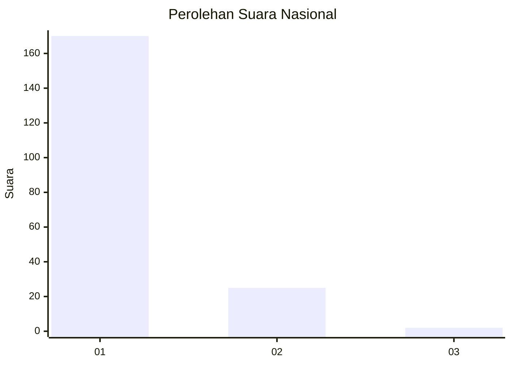
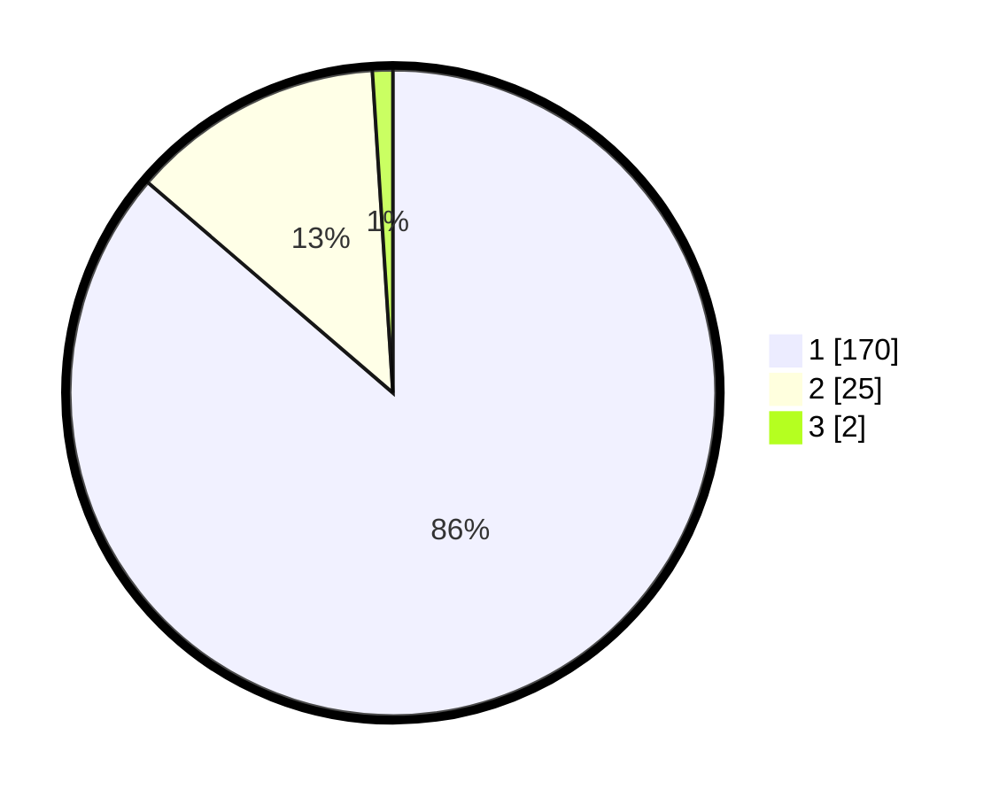

# Hasil

## Grafik

## Tabel

| No. | Nama Paslon    | Suara | Suara (raw) | Persentase |
|:--- |:-------------- | -----:| -----------:| ----------:|
| 1   | ANIES MUHAIMIN | 170   | [170][p-1]  | 86,29      |
| 2   | PRABOWO GIBRAN | 25    | [25][p-2]   | 12,69      |
| 3   | GANJAR MAHFUD  | 2     | [2][p-3]    | 1,02       |

[p-1]: https://github.com/gigit-pemilu/pemilu-2024/blob/main/pilpres/hitung-suara/sub/11-aceh/sub/14-aceh-jaya/sub/01-teunom/sub/2022-pasi-timon/sub/002-tps/sub/paslon-1.txt
[p-2]: https://github.com/gigit-pemilu/pemilu-2024/blob/main/pilpres/hitung-suara/sub/11-aceh/sub/14-aceh-jaya/sub/01-teunom/sub/2022-pasi-timon/sub/002-tps/sub/paslon-2.txt
[p-3]: https://github.com/gigit-pemilu/pemilu-2024/blob/main/pilpres/hitung-suara/sub/11-aceh/sub/14-aceh-jaya/sub/01-teunom/sub/2022-pasi-timon/sub/002-tps/sub/paslon-3.txt

## Foto C Plano

https://sirekap-obj-formc.kpu.go.id/fcf0/pemilu/ppwp/11/14/01/20/22/1114012022002-20240215-010123--0c778765-7183-452c-be1b-f0aa1395c478.jpg

https://sirekap-obj-formc.kpu.go.id/fcf0/pemilu/ppwp/11/14/01/20/22/1114012022002-20240215-010255--ea196a8b-e7ce-4b08-8c60-ba1955e3a4d5.jpg

https://sirekap-obj-formc.kpu.go.id/fcf0/pemilu/ppwp/11/14/01/20/22/1114012022002-20240215-010645--74f5ad4a-fd04-4200-8c78-08adbbb59a32.jpg

## Metadata

| Key        | Value               |
| ---------- | ------------------- |
| Time Stamp | 2024-02-15 16:30:25 |

