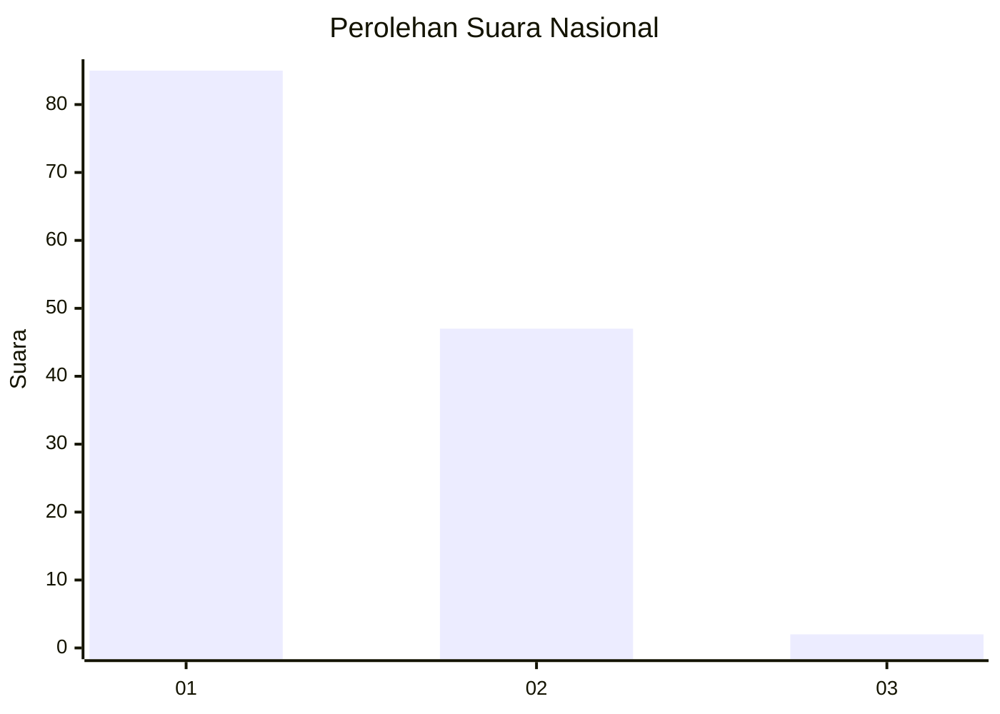
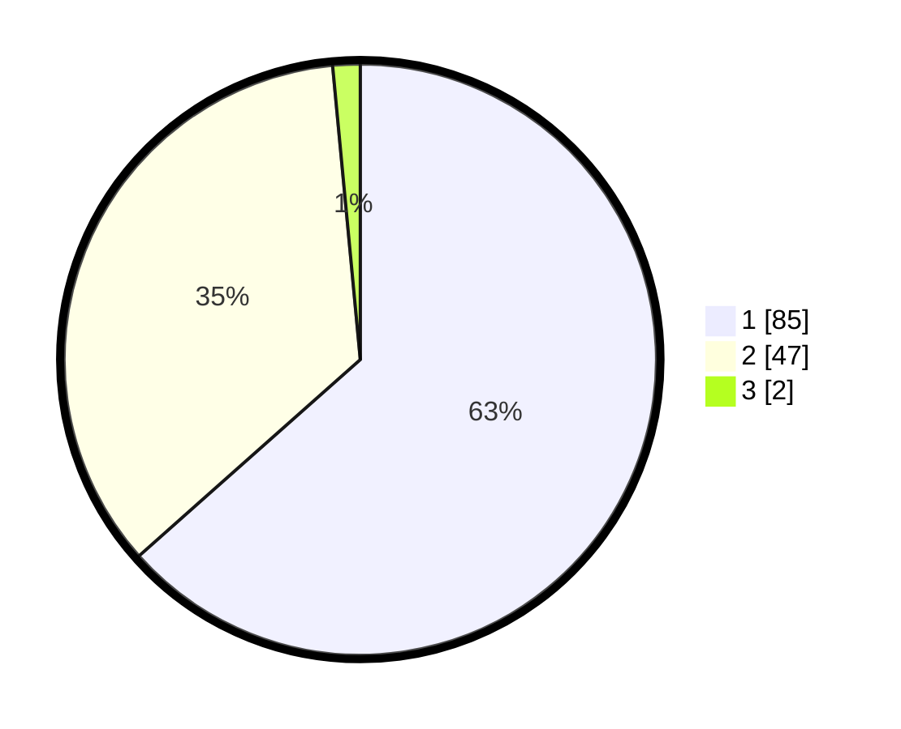

# Hasil

## Grafik

## Tabel

| No. | Nama Paslon    | Suara | Suara (raw) | Persentase |
|:--- |:-------------- | -----:| -----------:| ----------:|
| 1   | ANIES MUHAIMIN | 85    | [85][p-1]   | 63,43      |
| 2   | PRABOWO GIBRAN | 47    | [47][p-2]   | 35,07      |
| 3   | GANJAR MAHFUD  | 2     | [2][p-3]    | 1,49       |

[p-1]: https://github.com/gigit-pemilu/pemilu-2024/blob/main/pilpres/hitung-suara/sub/11-aceh/sub/14-aceh-jaya/sub/02-krueng-sabee/sub/2001-bahagia/sub/001-tps/sub/paslon-1.txt
[p-2]: https://github.com/gigit-pemilu/pemilu-2024/blob/main/pilpres/hitung-suara/sub/11-aceh/sub/14-aceh-jaya/sub/02-krueng-sabee/sub/2001-bahagia/sub/001-tps/sub/paslon-2.txt
[p-3]: https://github.com/gigit-pemilu/pemilu-2024/blob/main/pilpres/hitung-suara/sub/11-aceh/sub/14-aceh-jaya/sub/02-krueng-sabee/sub/2001-bahagia/sub/001-tps/sub/paslon-3.txt

## Foto C Plano

https://sirekap-obj-formc.kpu.go.id/4fd2/pemilu/ppwp/11/14/02/20/01/1114022001001-20240215-120329--6f70bd3b-e7c3-4930-ae09-87ec74d0c77f.jpg

https://sirekap-obj-formc.kpu.go.id/4fd2/pemilu/ppwp/11/14/02/20/01/1114022001001-20240215-120339--32ac178c-3c99-4268-a673-29710a970019.jpg

https://sirekap-obj-formc.kpu.go.id/4fd2/pemilu/ppwp/11/14/02/20/01/1114022001001-20240215-120348--ac0769db-c8ba-4536-b2ad-9364acf2a8a6.jpg

## Metadata

| Key        | Value               |
| ---------- | ------------------- |
| Time Stamp | 2024-02-15 16:30:25 |

