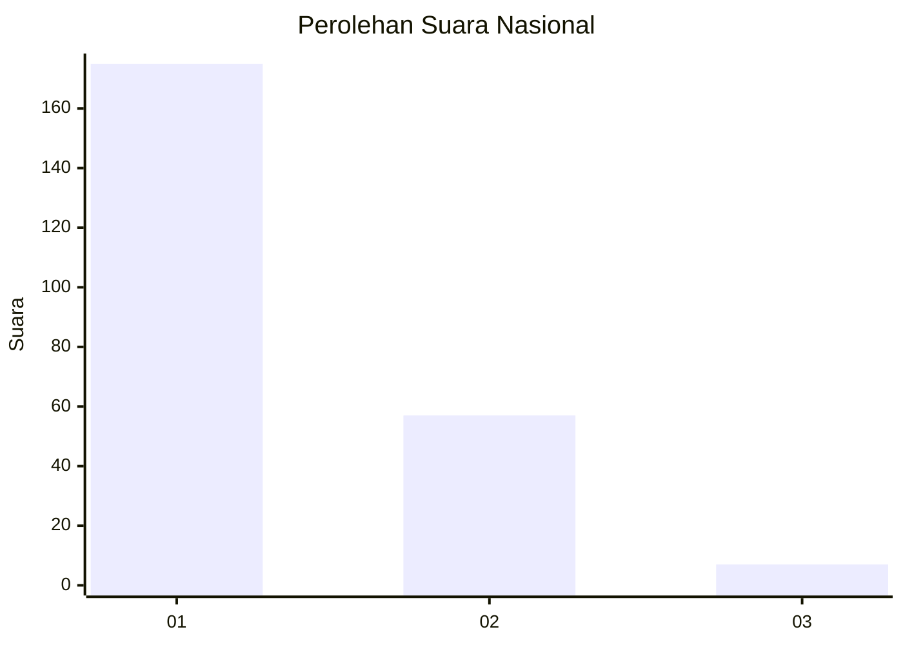
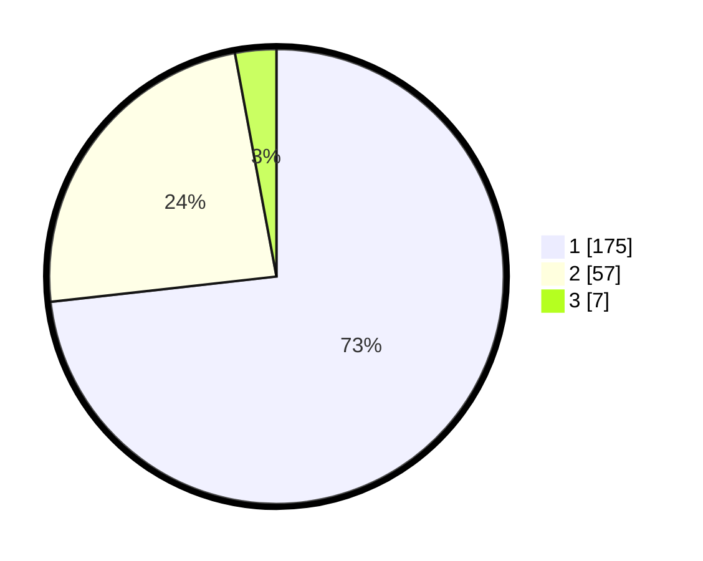

# Hasil

## Grafik

## Tabel

| No. | Nama Paslon    | Suara | Suara (raw) | Persentase |
|:--- |:-------------- | -----:| -----------:| ----------:|
| 1   | ANIES MUHAIMIN | 175   | [175][p-1]  | 73,22      |
| 2   | PRABOWO GIBRAN | 57    | [57][p-2]   | 23,85      |
| 3   | GANJAR MAHFUD  | 7     | [7][p-3]    | 2,93       |

[p-1]: https://github.com/gigit-pemilu/pemilu-2024/blob/main/pilpres/hitung-suara/sub/11-aceh/sub/14-aceh-jaya/sub/02-krueng-sabee/sub/2002-sentosa/sub/001-tps/sub/paslon-1.txt
[p-2]: https://github.com/gigit-pemilu/pemilu-2024/blob/main/pilpres/hitung-suara/sub/11-aceh/sub/14-aceh-jaya/sub/02-krueng-sabee/sub/2002-sentosa/sub/001-tps/sub/paslon-2.txt
[p-3]: https://github.com/gigit-pemilu/pemilu-2024/blob/main/pilpres/hitung-suara/sub/11-aceh/sub/14-aceh-jaya/sub/02-krueng-sabee/sub/2002-sentosa/sub/001-tps/sub/paslon-3.txt

## Foto C Plano

https://sirekap-obj-formc.kpu.go.id/2a0a/pemilu/ppwp/11/14/02/20/02/1114022002001-20240217-093310--892025f6-8c1d-4fc6-9a58-1009a36411fa.jpg

https://sirekap-obj-formc.kpu.go.id/2a0a/pemilu/ppwp/11/14/02/20/02/1114022002001-20240217-093311--966fcc13-6ce5-4377-a190-b1c532501f92.jpg

https://sirekap-obj-formc.kpu.go.id/2a0a/pemilu/ppwp/11/14/02/20/02/1114022002001-20240217-093310--8ed22082-86f4-4ea6-810f-ebd35ee09b9e.jpg

## Metadata

| Key        | Value               |
| ---------- | ------------------- |
| Time Stamp | 2024-02-17 12:00:00 |

## DATA PEMILIH TETAP

Jumlah pemilih dalam DPT: **295**.
 * L: **137**.
 * P: **158**.

## DATA PENGGUNA HAK PILIH

Jumlah pengguna hak pilih dalam DPT: **235**.
 * L: **102**.
 * P: **133**.

Jumlah pengguna hak pilih dalam DPTb: **5**.
 * L: **3**.
 * P: **2**.

Jumlah pengguna hak pilih dalam DPK: **0**.
 * L: **0**.
 * P: **0**.

Jumlah pengguna hak pilih: **240**.
 * L: **105**.
 * P: **135**.

## JUMLAH SUARA SAH DAN TIDAK SAH

JUMLAH SELURUH SUARA SAH: **239**.

JUMLAH SUARA TIDAK SAH: **1**.

JUMLAH SELURUH SUARA SAH DAN SUARA TIDAK SAH: **240**.

