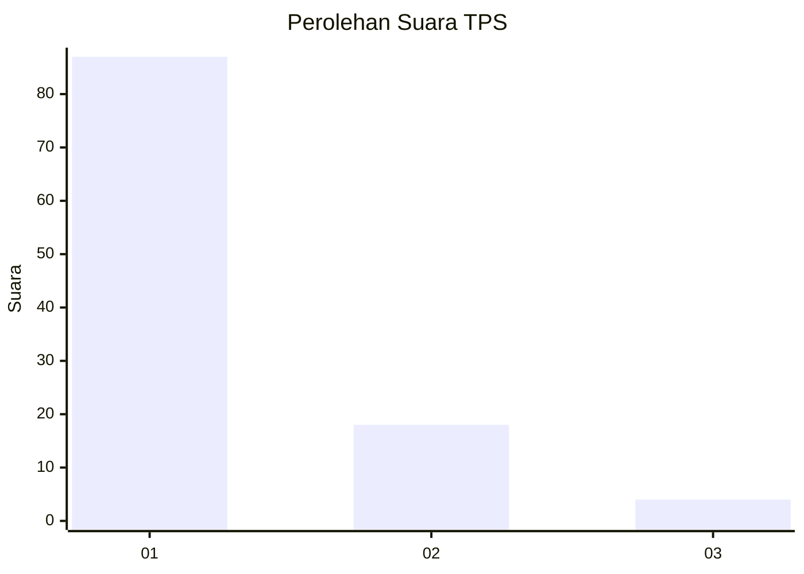
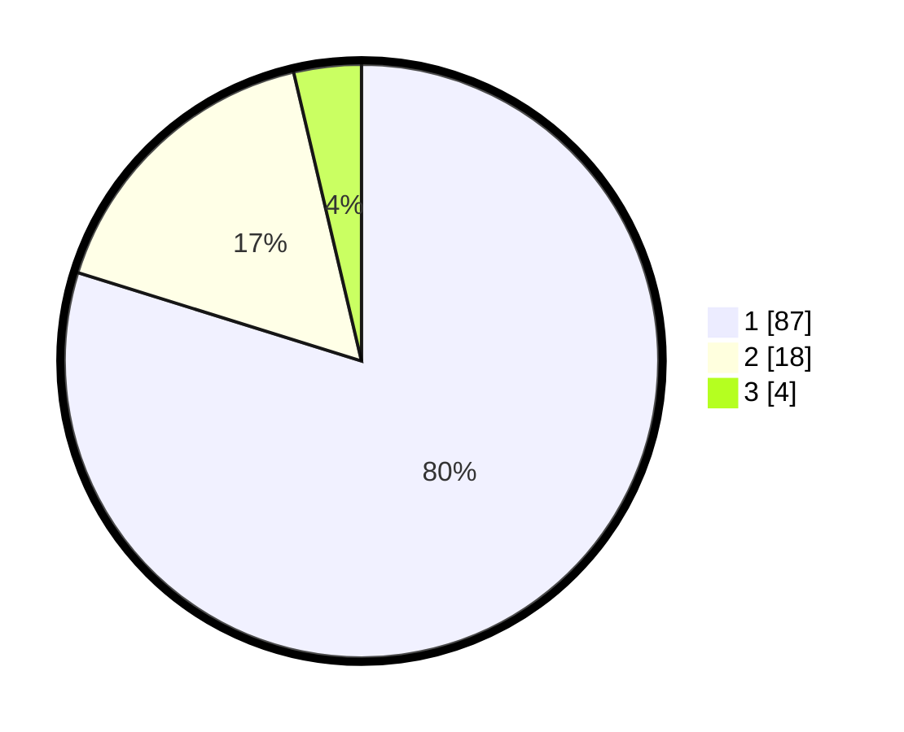

# Hasil

## Grafik

## Tabel

| No. | Nama Paslon    | Suara | Suara (raw) | Persentase |
|:--- |:-------------- | -----:| -----------:| ----------:|
| 1   | ANIES MUHAIMIN | 87    | [87][p-1]   | 79,82      |
| 2   | PRABOWO GIBRAN | 18    | [18][p-2]   | 16,51      |
| 3   | GANJAR MAHFUD  | 4     | [4][p-3]    | 3,67       |

[p-1]: https://github.com/gigit-pemilu/pemilu-2024-11-aceh/blob/main/pilpres/hitung-suara/sub/11-aceh/sub/14-aceh-jaya/sub/02-krueng-sabee/sub/2004-gampong-blang/sub/901-tps/sub/paslon-1.txt
[p-2]: https://github.com/gigit-pemilu/pemilu-2024-11-aceh/blob/main/pilpres/hitung-suara/sub/11-aceh/sub/14-aceh-jaya/sub/02-krueng-sabee/sub/2004-gampong-blang/sub/901-tps/sub/paslon-2.txt
[p-3]: https://github.com/gigit-pemilu/pemilu-2024-11-aceh/blob/main/pilpres/hitung-suara/sub/11-aceh/sub/14-aceh-jaya/sub/02-krueng-sabee/sub/2004-gampong-blang/sub/901-tps/sub/paslon-3.txt

## Foto C Plano

https://sirekap-obj-formc.kpu.go.id/12b6/pemilu/ppwp/11/14/02/20/04/1114022004901-20240215-091224--b6dc426c-6ef7-40e8-adf4-456522f6111b.jpg

https://sirekap-obj-formc.kpu.go.id/12b6/pemilu/ppwp/11/14/02/20/04/1114022004901-20240215-091244--7a3e19a4-007e-43c3-a830-54bf319f2c52.jpg

https://sirekap-obj-formc.kpu.go.id/12b6/pemilu/ppwp/11/14/02/20/04/1114022004901-20240215-091257--dc4054fc-e213-4642-a324-50ee4a240ca6.jpg

## Metadata

| Key        | Value               |
| ---------- | ------------------- |
| Time Stamp | 2024-02-16 16:25:10 |

## DATA PEMILIH TETAP

Jumlah pemilih dalam DPT: **113**.
 * L: **112**.
 * P: **1**.

## DATA PENGGUNA HAK PILIH

Jumlah pengguna hak pilih dalam DPT: **61**.
 * L: **61**.
 * P: **0**.

Jumlah pengguna hak pilih dalam DPTb: **52**.
 * L: **51**.
 * P: **1**.

Jumlah pengguna hak pilih dalam DPK: **0**.
 * L: **0**.
 * P: **0**.

Jumlah pengguna hak pilih: **113**.
 * L: **112**.
 * P: **1**.

## JUMLAH SUARA SAH DAN TIDAK SAH

JUMLAH SELURUH SUARA SAH: **109**.

JUMLAH SUARA TIDAK SAH: **4**.

JUMLAH SELURUH SUARA SAH DAN SUARA TIDAK SAH: **113**.

