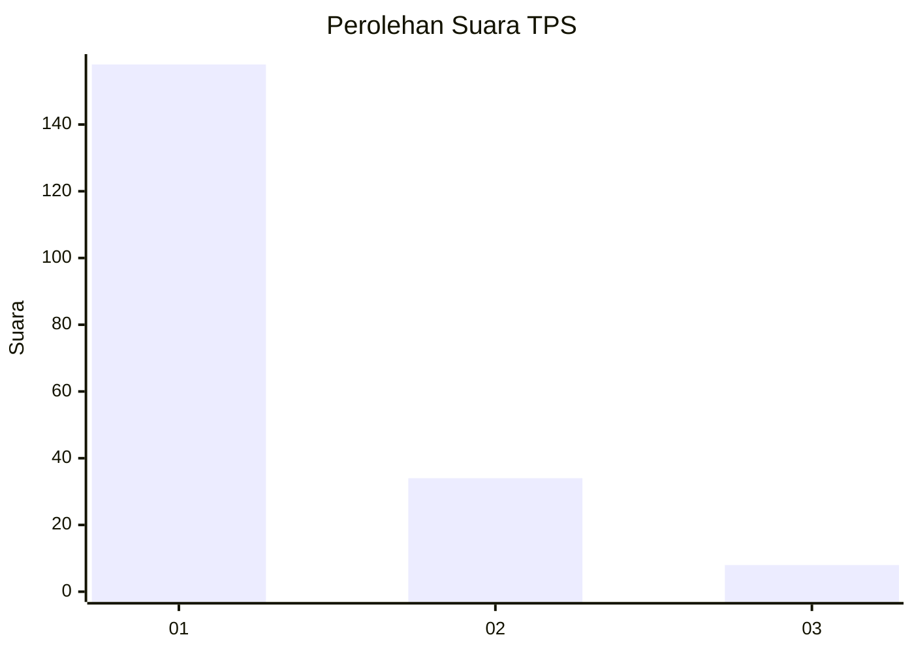
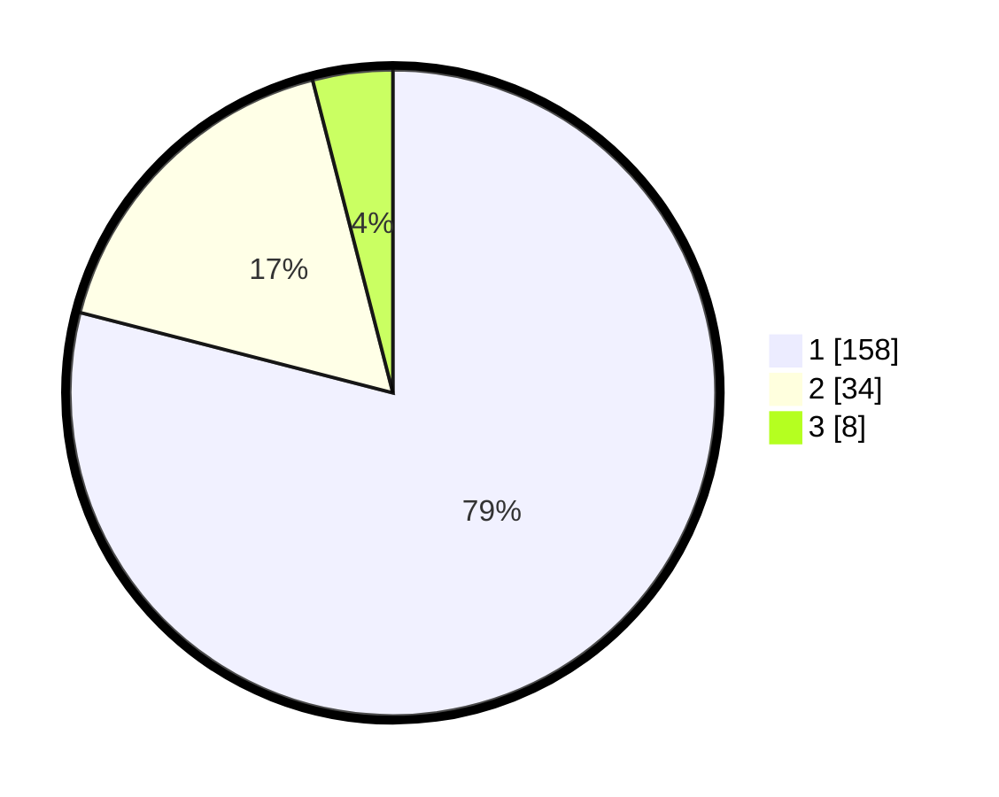

# Hasil

## Grafik

## Tabel

| No. | Nama Paslon    | Suara | Suara (raw) | Persentase |
|:--- |:-------------- | -----:| -----------:| ----------:|
| 1   | ANIES MUHAIMIN | 158   | [158][p-1]  | 79,00      |
| 2   | PRABOWO GIBRAN | 34    | [34][p-2]   | 17,00      |
| 3   | GANJAR MAHFUD  | 8     | [8][p-3]    | 4,00       |

[p-1]: https://github.com/gigit-pemilu/pemilu-2024-11-aceh/blob/main/pilpres/hitung-suara/sub/11-aceh/sub/14-aceh-jaya/sub/02-krueng-sabee/sub/2012-buntha/sub/001-tps/sub/paslon-1.txt
[p-2]: https://github.com/gigit-pemilu/pemilu-2024-11-aceh/blob/main/pilpres/hitung-suara/sub/11-aceh/sub/14-aceh-jaya/sub/02-krueng-sabee/sub/2012-buntha/sub/001-tps/sub/paslon-2.txt
[p-3]: https://github.com/gigit-pemilu/pemilu-2024-11-aceh/blob/main/pilpres/hitung-suara/sub/11-aceh/sub/14-aceh-jaya/sub/02-krueng-sabee/sub/2012-buntha/sub/001-tps/sub/paslon-3.txt

## Foto C Plano

https://sirekap-obj-formc.kpu.go.id/cd33/pemilu/ppwp/11/14/02/20/12/1114022012001-20240221-150745--f1c39905-1a98-4bec-9200-074fc2c4f9b4.jpg

https://sirekap-obj-formc.kpu.go.id/cd33/pemilu/ppwp/11/14/02/20/12/1114022012001-20240221-150838--50f28fa4-9f72-4a29-ae60-0672b3f1ca35.jpg

https://sirekap-obj-formc.kpu.go.id/cd33/pemilu/ppwp/11/14/02/20/12/1114022012001-20240221-150914--a5a8a7f3-3848-47f4-999a-b8ce42ead185.jpg

## Metadata

| Key        | Value               |
| ---------- | ------------------- |
| Time Stamp | 2024-02-24 22:31:28 |

