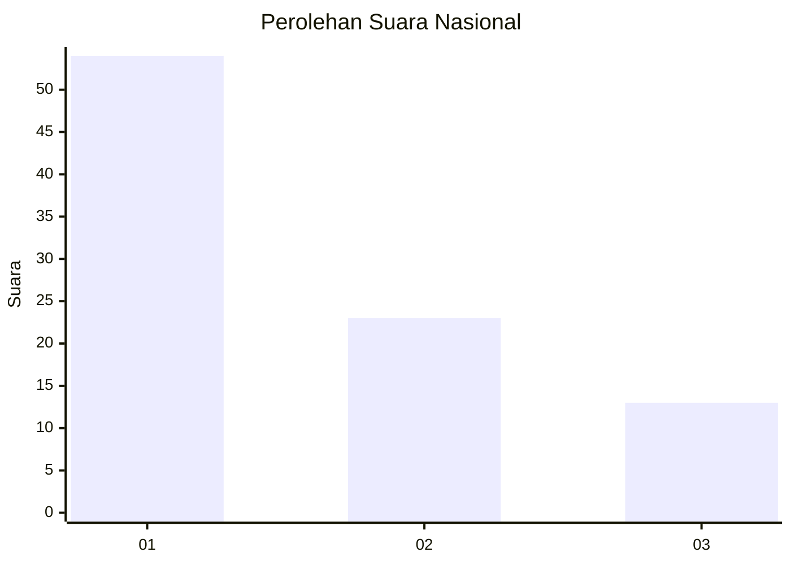
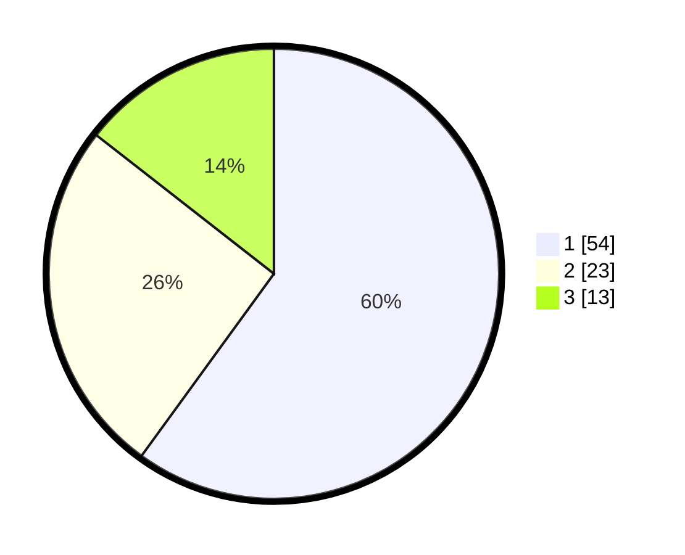

# Hasil

## Grafik

## Tabel

| No. | Nama Paslon    | Suara | Suara (raw) | Persentase |
|:--- |:-------------- | -----:| -----------:| ----------:|
| 1   | ANIES MUHAIMIN | 54    | [54][p-1]   | 60,00      |
| 2   | PRABOWO GIBRAN | 23    | [23][p-2]   | 25,56      |
| 3   | GANJAR MAHFUD  | 13    | [13][p-3]   | 14,44      |

[p-1]: https://github.com/gigit-pemilu/pemilu-2024/blob/main/pilpres/hitung-suara/sub/11-aceh/sub/14-aceh-jaya/sub/02-krueng-sabee/sub/2012-buntha/sub/002-tps/sub/paslon-1.txt
[p-2]: https://github.com/gigit-pemilu/pemilu-2024/blob/main/pilpres/hitung-suara/sub/11-aceh/sub/14-aceh-jaya/sub/02-krueng-sabee/sub/2012-buntha/sub/002-tps/sub/paslon-2.txt
[p-3]: https://github.com/gigit-pemilu/pemilu-2024/blob/main/pilpres/hitung-suara/sub/11-aceh/sub/14-aceh-jaya/sub/02-krueng-sabee/sub/2012-buntha/sub/002-tps/sub/paslon-3.txt

## Foto C Plano

https://sirekap-obj-formc.kpu.go.id/fcd1/pemilu/ppwp/11/14/02/20/12/1114022012002-20240216-155041--c087c7a6-7ec9-4e38-8dc6-d65b99db79be.jpg

https://sirekap-obj-formc.kpu.go.id/fcd1/pemilu/ppwp/11/14/02/20/12/1114022012002-20240216-155042--265f6dd7-5e41-4a29-a793-c01acd598920.jpg

https://sirekap-obj-formc.kpu.go.id/fcd1/pemilu/ppwp/11/14/02/20/12/1114022012002-20240216-155042--95856a08-2009-4147-959a-3299a0aa6b99.jpg

## Metadata

| Key        | Value               |
| ---------- | ------------------- |
| Time Stamp | 2024-02-17 12:00:00 |

## DATA PEMILIH TETAP

Jumlah pemilih dalam DPT: **104**.
 * L: **48**.
 * P: **56**.

## DATA PENGGUNA HAK PILIH

Jumlah pengguna hak pilih dalam DPT: **91**.
 * L: **39**.
 * P: **52**.

Jumlah pengguna hak pilih dalam DPTb: **3**.
 * L: **1**.
 * P: **2**.

Jumlah pengguna hak pilih dalam DPK: **0**.
 * L: **0**.
 * P: **0**.

Jumlah pengguna hak pilih: **94**.
 * L: **40**.
 * P: **54**.

## JUMLAH SUARA SAH DAN TIDAK SAH

JUMLAH SELURUH SUARA SAH: **90**.

JUMLAH SUARA TIDAK SAH: **4**.

JUMLAH SELURUH SUARA SAH DAN SUARA TIDAK SAH: **94**.

