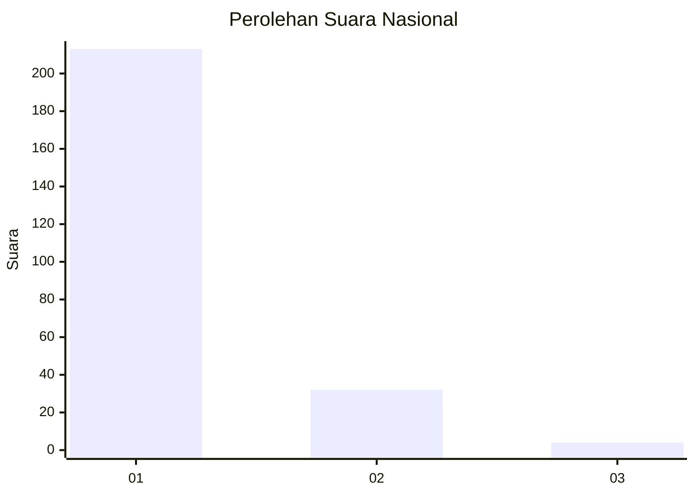
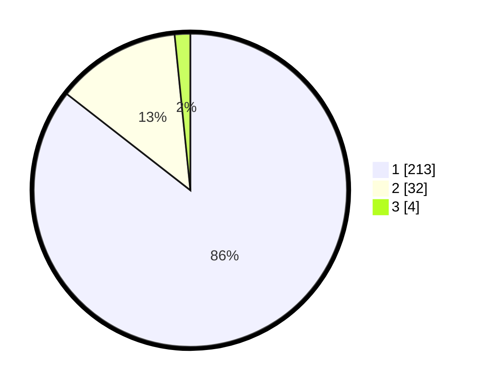

# Hasil

## Grafik

## Tabel

| No. | Nama Paslon    | Suara | Suara (raw) | Persentase |
|:--- |:-------------- | -----:| -----------:| ----------:|
| 1   | ANIES MUHAIMIN | 213   | [213][p-1]  | 85,54      |
| 2   | PRABOWO GIBRAN | 32    | [32][p-2]   | 12,85      |
| 3   | GANJAR MAHFUD  | 4     | [4][p-3]    | 1,61       |

[p-1]: https://github.com/gigit-pemilu/pemilu-2024/blob/main/pilpres/hitung-suara/sub/11-aceh/sub/14-aceh-jaya/sub/03-setia-bakti/sub/2001-sawang/sub/001-tps/sub/paslon-1.txt
[p-2]: https://github.com/gigit-pemilu/pemilu-2024/blob/main/pilpres/hitung-suara/sub/11-aceh/sub/14-aceh-jaya/sub/03-setia-bakti/sub/2001-sawang/sub/001-tps/sub/paslon-2.txt
[p-3]: https://github.com/gigit-pemilu/pemilu-2024/blob/main/pilpres/hitung-suara/sub/11-aceh/sub/14-aceh-jaya/sub/03-setia-bakti/sub/2001-sawang/sub/001-tps/sub/paslon-3.txt

## Foto C Plano

https://sirekap-obj-formc.kpu.go.id/2028/pemilu/ppwp/11/14/03/20/01/1114032001001-20240219-100618--5d58e406-27ba-43d6-b42d-d8ebfdf7b001.jpg

https://sirekap-obj-formc.kpu.go.id/2028/pemilu/ppwp/11/14/03/20/01/1114032001001-20240219-100656--59dbcd6e-c82e-44b8-8d38-ef8aaafbdb69.jpg

https://sirekap-obj-formc.kpu.go.id/2028/pemilu/ppwp/11/14/03/20/01/1114032001001-20240219-100736--830afc92-7080-4a12-a745-f79ac97e4759.jpg

## Metadata

| Key        | Value               |
| ---------- | ------------------- |
| Time Stamp | 2024-02-19 17:00:00 |

