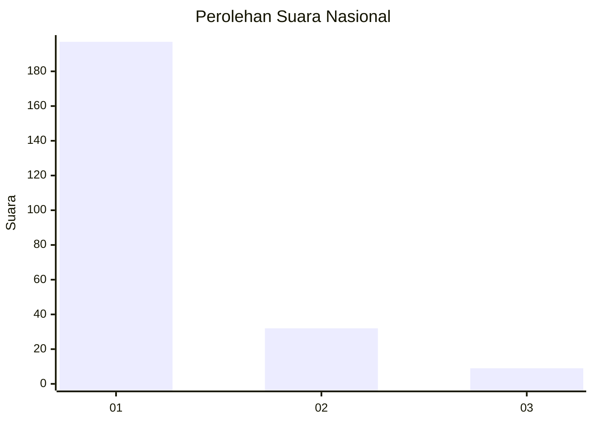
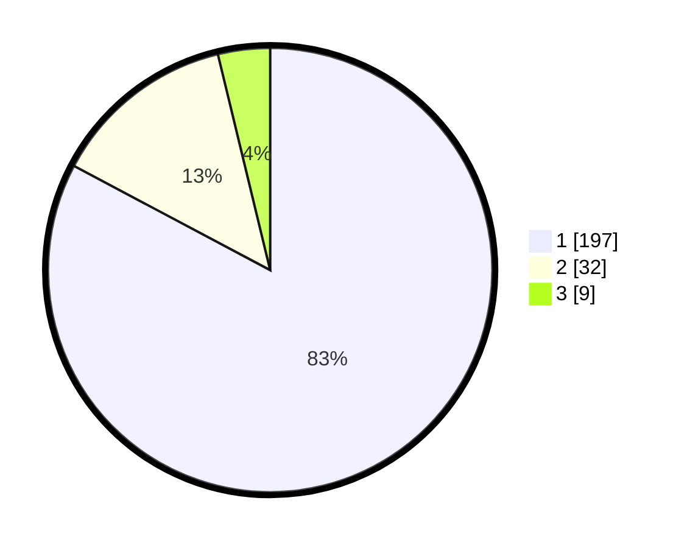

# Hasil

## Grafik

## Tabel

| No. | Nama Paslon    | Suara | Suara (raw) | Persentase |
|:--- |:-------------- | -----:| -----------:| ----------:|
| 1   | ANIES MUHAIMIN | 197   | [197][p-1]  | 82,77      |
| 2   | PRABOWO GIBRAN | 32    | [32][p-2]   | 13,45      |
| 3   | GANJAR MAHFUD  | 9     | [9][p-3]    | 3,78       |

[p-1]: https://github.com/gigit-pemilu/pemilu-2024/blob/main/pilpres/hitung-suara/sub/11-aceh/sub/14-aceh-jaya/sub/03-setia-bakti/sub/2001-sawang/sub/002-tps/sub/paslon-1.txt
[p-2]: https://github.com/gigit-pemilu/pemilu-2024/blob/main/pilpres/hitung-suara/sub/11-aceh/sub/14-aceh-jaya/sub/03-setia-bakti/sub/2001-sawang/sub/002-tps/sub/paslon-2.txt
[p-3]: https://github.com/gigit-pemilu/pemilu-2024/blob/main/pilpres/hitung-suara/sub/11-aceh/sub/14-aceh-jaya/sub/03-setia-bakti/sub/2001-sawang/sub/002-tps/sub/paslon-3.txt

## Foto C Plano

https://sirekap-obj-formc.kpu.go.id/171d/pemilu/ppwp/11/14/03/20/01/1114032001002-20240219-111554--263ff07a-710e-4cf2-aaf7-61fb61891a21.jpg

https://sirekap-obj-formc.kpu.go.id/171d/pemilu/ppwp/11/14/03/20/01/1114032001002-20240219-111752--ceb61f80-e99b-4261-9828-efffcbf26d32.jpg

https://sirekap-obj-formc.kpu.go.id/171d/pemilu/ppwp/11/14/03/20/01/1114032001002-20240219-111901--be03b8b0-0e23-452e-a934-09396c46f480.jpg

## Metadata

| Key        | Value               |
| ---------- | ------------------- |
| Time Stamp | 2024-02-20 11:00:00 |

