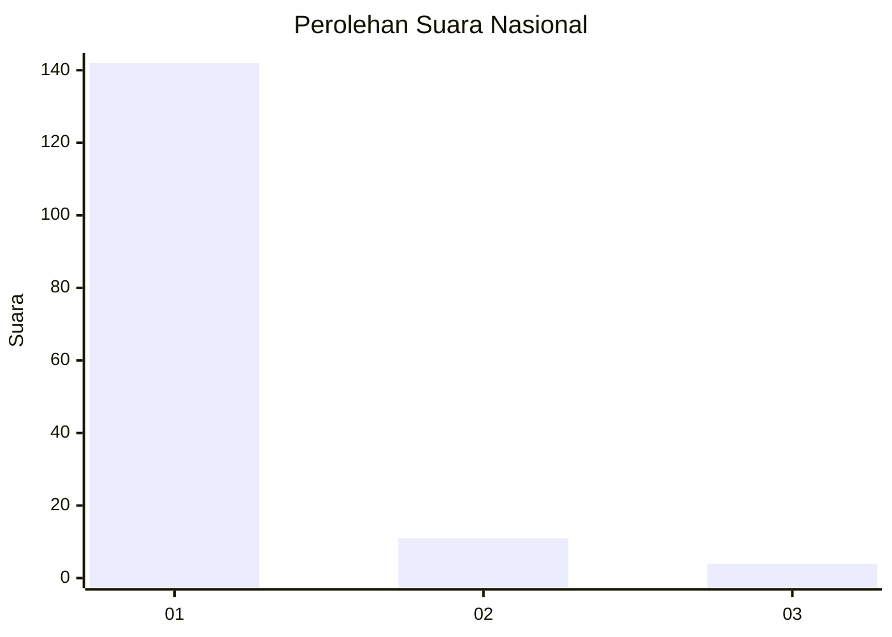
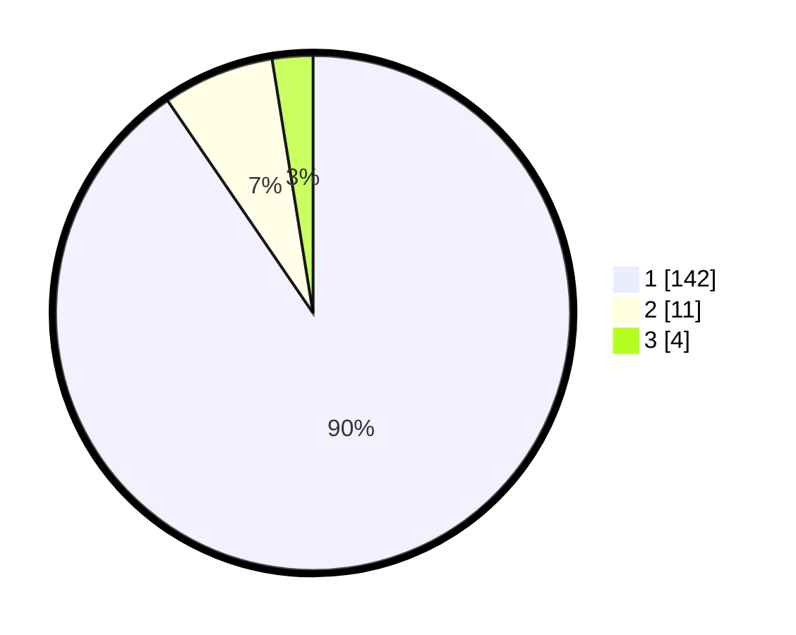

# Hasil

## Grafik

## Tabel

| No. | Nama Paslon    | Suara | Suara (raw) | Persentase |
|:--- |:-------------- | -----:| -----------:| ----------:|
| 1   | ANIES MUHAIMIN | 142   | [142][p-1]  | 90,45      |
| 2   | PRABOWO GIBRAN | 11    | [11][p-2]   | 7,01       |
| 3   | GANJAR MAHFUD  | 4     | [4][p-3]    | 2,55       |

[p-1]: https://github.com/gigit-pemilu/pemilu-2024/blob/main/pilpres/hitung-suara/sub/11-aceh/sub/14-aceh-jaya/sub/03-setia-bakti/sub/2004-gunong-meunasah/sub/001-tps/sub/paslon-1.txt
[p-2]: https://github.com/gigit-pemilu/pemilu-2024/blob/main/pilpres/hitung-suara/sub/11-aceh/sub/14-aceh-jaya/sub/03-setia-bakti/sub/2004-gunong-meunasah/sub/001-tps/sub/paslon-2.txt
[p-3]: https://github.com/gigit-pemilu/pemilu-2024/blob/main/pilpres/hitung-suara/sub/11-aceh/sub/14-aceh-jaya/sub/03-setia-bakti/sub/2004-gunong-meunasah/sub/001-tps/sub/paslon-3.txt

## Foto C Plano

https://sirekap-obj-formc.kpu.go.id/f3a3/pemilu/ppwp/11/14/03/20/04/1114032004001-20240216-121725--2b0ea18c-e06a-4f71-b6bc-007efb2b1498.jpg

https://sirekap-obj-formc.kpu.go.id/f3a3/pemilu/ppwp/11/14/03/20/04/1114032004001-20240216-152541--7ab085e3-c9d5-44ed-9f2b-2a10d1da7d6f.jpg

https://sirekap-obj-formc.kpu.go.id/f3a3/pemilu/ppwp/11/14/03/20/04/1114032004001-20240216-152541--3dde30c2-705a-4ebc-8861-fc12ece6ab35.jpg

## Metadata

| Key        | Value               |
| ---------- | ------------------- |
| Time Stamp | 2024-02-16 16:25:10 |

## DATA PEMILIH TETAP

Jumlah pemilih dalam DPT: **179**.
 * L: **94**.
 * P: **85**.

## DATA PENGGUNA HAK PILIH

Jumlah pengguna hak pilih dalam DPT: **154**.
 * L: **79**.
 * P: **75**.

Jumlah pengguna hak pilih dalam DPTb: **3**.
 * L: **1**.
 * P: **2**.

Jumlah pengguna hak pilih dalam DPK: **3**.
 * L: **1**.
 * P: **2**.

Jumlah pengguna hak pilih: **160**.
 * L: **81**.
 * P: **79**.

## JUMLAH SUARA SAH DAN TIDAK SAH

JUMLAH SELURUH SUARA SAH: **157**.

JUMLAH SUARA TIDAK SAH: **3**.

JUMLAH SELURUH SUARA SAH DAN SUARA TIDAK SAH: **160**.

