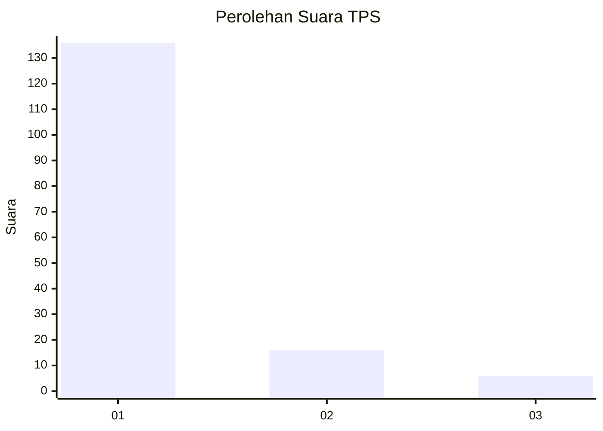
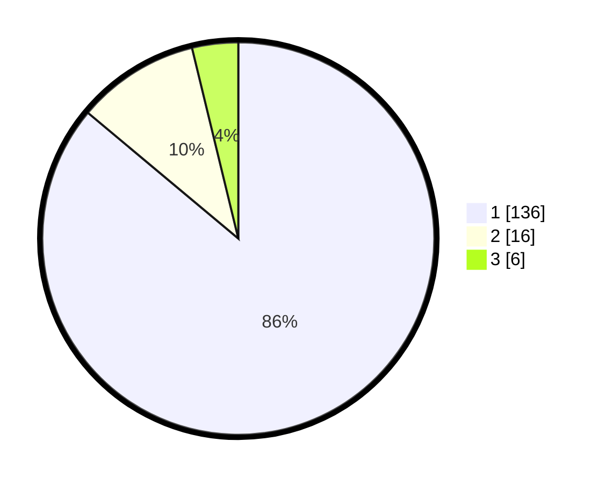

# Hasil

## Grafik

## Tabel

| No. | Nama Paslon    | Suara | Suara (raw) | Persentase |
|:--- |:-------------- | -----:| -----------:| ----------:|
| 1   | ANIES MUHAIMIN | 136   | [136][p-1]  | 86,08      |
| 2   | PRABOWO GIBRAN | 16    | [16][p-2]   | 10,13      |
| 3   | GANJAR MAHFUD  | 6     | [6][p-3]    | 3,80       |

[p-1]: https://github.com/gigit-pemilu/pemilu-2024-11-aceh/blob/main/pilpres/hitung-suara/sub/11-aceh/sub/14-aceh-jaya/sub/03-setia-bakti/sub/2004-gunong-meunasah/sub/002-tps/sub/paslon-1.txt
[p-2]: https://github.com/gigit-pemilu/pemilu-2024-11-aceh/blob/main/pilpres/hitung-suara/sub/11-aceh/sub/14-aceh-jaya/sub/03-setia-bakti/sub/2004-gunong-meunasah/sub/002-tps/sub/paslon-2.txt
[p-3]: https://github.com/gigit-pemilu/pemilu-2024-11-aceh/blob/main/pilpres/hitung-suara/sub/11-aceh/sub/14-aceh-jaya/sub/03-setia-bakti/sub/2004-gunong-meunasah/sub/002-tps/sub/paslon-3.txt

## Foto C Plano

https://sirekap-obj-formc.kpu.go.id/e218/pemilu/ppwp/11/14/03/20/04/1114032004002-20240216-135023--8121374d-31f2-42b5-91e4-59d740d8e2b0.jpg

https://sirekap-obj-formc.kpu.go.id/e218/pemilu/ppwp/11/14/03/20/04/1114032004002-20240216-135024--e5a6530f-19da-4d90-9ced-6b9548b8d204.jpg

https://sirekap-obj-formc.kpu.go.id/e218/pemilu/ppwp/11/14/03/20/04/1114032004002-20240216-135024--11c8b46e-a5ef-4cc5-8d13-8fb7fe5f67aa.jpg

## Metadata

| Key        | Value               |
| ---------- | ------------------- |
| Time Stamp | 2024-02-16 16:25:10 |

## DATA PEMILIH TETAP

Jumlah pemilih dalam DPT: **0**.
 * L: **0**.
 * P: **0**.

## DATA PENGGUNA HAK PILIH

Jumlah pengguna hak pilih dalam DPT: **0**.
 * L: **0**.
 * P: **0**.

Jumlah pengguna hak pilih dalam DPTb: **0**.
 * L: **0**.
 * P: **0**.

Jumlah pengguna hak pilih dalam DPK: **0**.
 * L: **0**.
 * P: **0**.

Jumlah pengguna hak pilih: **0**.
 * L: **0**.
 * P: **0**.

## JUMLAH SUARA SAH DAN TIDAK SAH

JUMLAH SELURUH SUARA SAH: **158**.

JUMLAH SUARA TIDAK SAH: **2**.

JUMLAH SELURUH SUARA SAH DAN SUARA TIDAK SAH: **160**.

