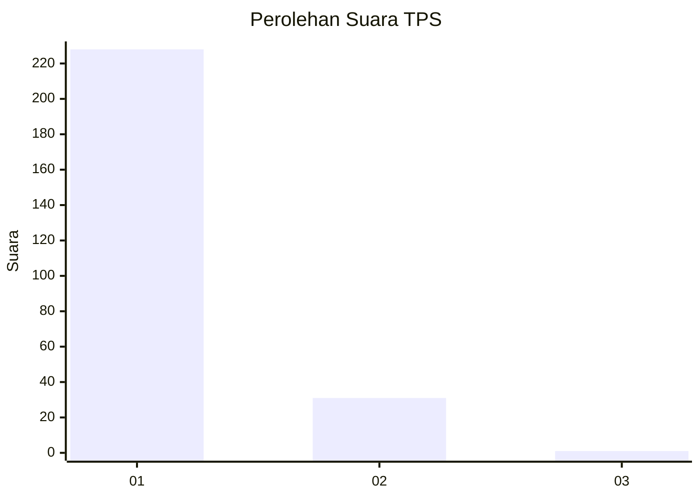
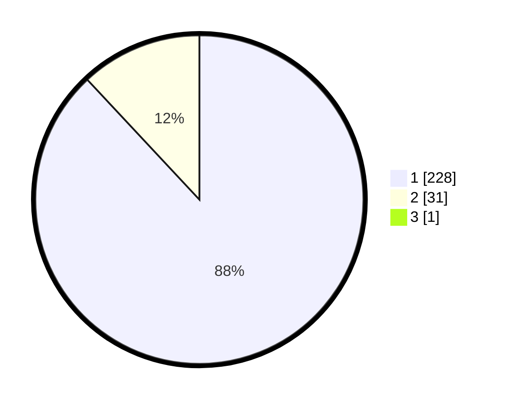

# Hasil

## Grafik

## Tabel

| No. | Nama Paslon    | Suara | Suara (raw) | Persentase |
|:--- |:-------------- | -----:| -----------:| ----------:|
| 1   | ANIES MUHAIMIN | 228   | [228][p-1]  | 87,69      |
| 2   | PRABOWO GIBRAN | 31    | [31][p-2]   | 11,92      |
| 3   | GANJAR MAHFUD  | 1     | [1][p-3]    | 0,38       |

[p-1]: https://github.com/gigit-pemilu/pemilu-2024-11-aceh/blob/main/pilpres/hitung-suara/sub/11-aceh/sub/14-aceh-jaya/sub/03-setia-bakti/sub/2006-pante-kuyun/sub/001-tps/sub/paslon-1.txt
[p-2]: https://github.com/gigit-pemilu/pemilu-2024-11-aceh/blob/main/pilpres/hitung-suara/sub/11-aceh/sub/14-aceh-jaya/sub/03-setia-bakti/sub/2006-pante-kuyun/sub/001-tps/sub/paslon-2.txt
[p-3]: https://github.com/gigit-pemilu/pemilu-2024-11-aceh/blob/main/pilpres/hitung-suara/sub/11-aceh/sub/14-aceh-jaya/sub/03-setia-bakti/sub/2006-pante-kuyun/sub/001-tps/sub/paslon-3.txt

## Foto C Plano

https://sirekap-obj-formc.kpu.go.id/8d39/pemilu/ppwp/11/14/03/20/06/1114032006001-20240215-144821--c1ef58dd-3323-4b8d-a3f3-3cecb12f5133.jpg

https://sirekap-obj-formc.kpu.go.id/8d39/pemilu/ppwp/11/14/03/20/06/1114032006001-20240215-144715--6aa08460-4841-47c8-8236-9b333a85eb7c.jpg

https://sirekap-obj-formc.kpu.go.id/8d39/pemilu/ppwp/11/14/03/20/06/1114032006001-20240215-144951--23f706ce-d988-421d-b89b-82fb150adda0.jpg

## Metadata

| Key        | Value               |
| ---------- | ------------------- |
| Time Stamp | 2024-02-19 06:16:00 |

