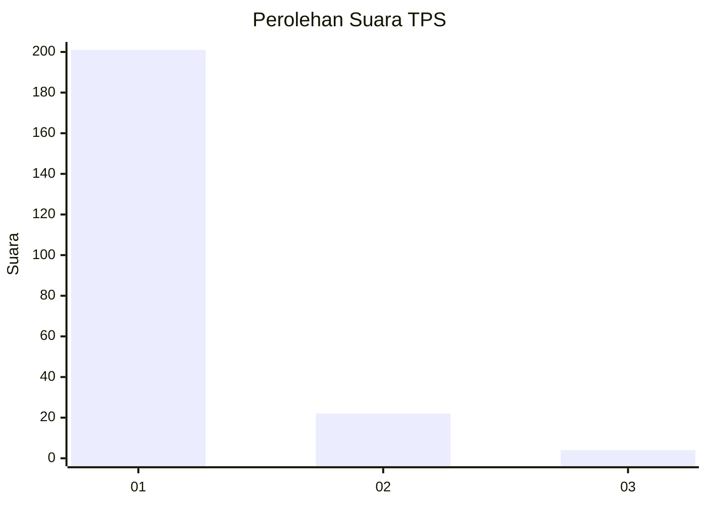
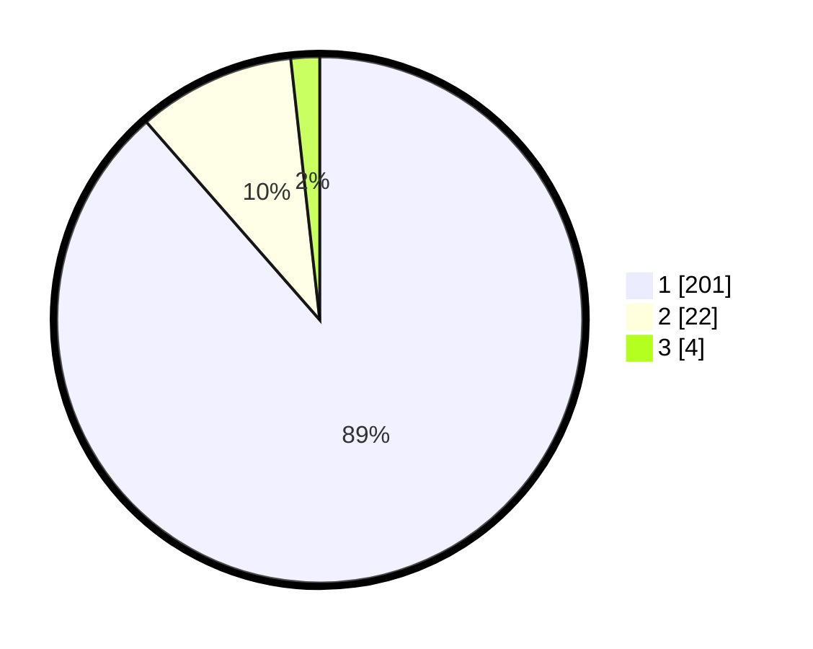

# Hasil

## Grafik

## Tabel

| No. | Nama Paslon    | Suara | Suara (raw) | Persentase |
|:--- |:-------------- | -----:| -----------:| ----------:|
| 1   | ANIES MUHAIMIN | 201   | [201][p-1]  | 88,55      |
| 2   | PRABOWO GIBRAN | 22    | [22][p-2]   | 9,69       |
| 3   | GANJAR MAHFUD  | 4     | [4][p-3]    | 1,76       |

[p-1]: https://github.com/gigit-pemilu/pemilu-2024-11-aceh/blob/main/pilpres/hitung-suara/sub/11-aceh/sub/14-aceh-jaya/sub/03-setia-bakti/sub/2006-pante-kuyun/sub/002-tps/sub/paslon-1.txt
[p-2]: https://github.com/gigit-pemilu/pemilu-2024-11-aceh/blob/main/pilpres/hitung-suara/sub/11-aceh/sub/14-aceh-jaya/sub/03-setia-bakti/sub/2006-pante-kuyun/sub/002-tps/sub/paslon-2.txt
[p-3]: https://github.com/gigit-pemilu/pemilu-2024-11-aceh/blob/main/pilpres/hitung-suara/sub/11-aceh/sub/14-aceh-jaya/sub/03-setia-bakti/sub/2006-pante-kuyun/sub/002-tps/sub/paslon-3.txt

## Foto C Plano

https://sirekap-obj-formc.kpu.go.id/75ec/pemilu/ppwp/11/14/03/20/06/1114032006002-20240214-234508--c76f98a5-8144-4084-b4e8-3080ba3badf0.jpg

https://sirekap-obj-formc.kpu.go.id/75ec/pemilu/ppwp/11/14/03/20/06/1114032006002-20240214-234531--62c6353c-94d5-4c61-b90f-500df6adabb6.jpg

https://sirekap-obj-formc.kpu.go.id/75ec/pemilu/ppwp/11/14/03/20/06/1114032006002-20240214-213327--786983a6-e920-4b2f-9adc-fe62d519b55f.jpg

## Metadata

| Key        | Value               |
| ---------- | ------------------- |
| Time Stamp | 2024-02-15 12:00:28 |

