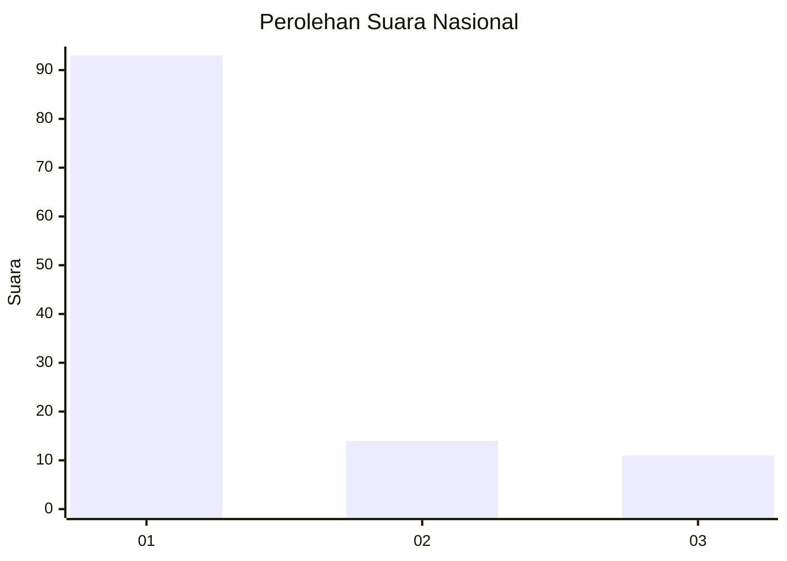
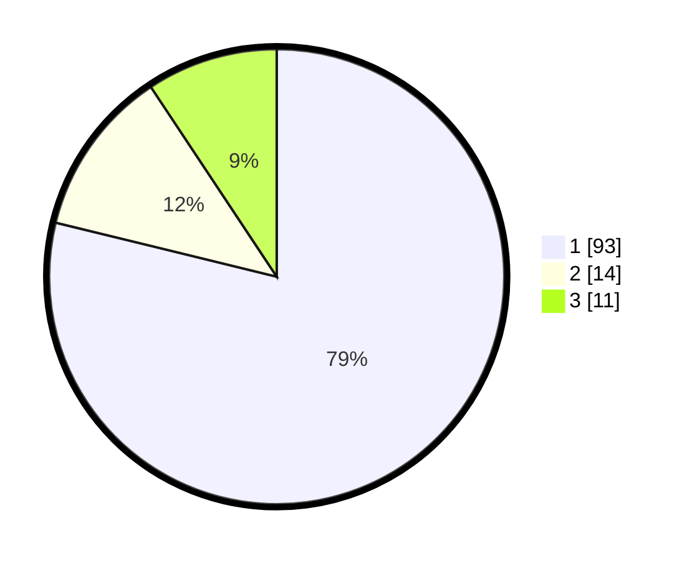

# Hasil

## Grafik

## Tabel

| No. | Nama Paslon    | Suara | Suara (raw) | Persentase |
|:--- |:-------------- | -----:| -----------:| ----------:|
| 1   | ANIES MUHAIMIN | 93    | [93][p-1]   | 78,81      |
| 2   | PRABOWO GIBRAN | 14    | [14][p-2]   | 11,86      |
| 3   | GANJAR MAHFUD  | 11    | [11][p-3]   | 9,32       |

[p-1]: https://github.com/gigit-pemilu/pemilu-2024/blob/main/pilpres/hitung-suara/sub/11-aceh/sub/14-aceh-jaya/sub/03-setia-bakti/sub/2007-glee-seubak/sub/001-tps/sub/paslon-1.txt
[p-2]: https://github.com/gigit-pemilu/pemilu-2024/blob/main/pilpres/hitung-suara/sub/11-aceh/sub/14-aceh-jaya/sub/03-setia-bakti/sub/2007-glee-seubak/sub/001-tps/sub/paslon-2.txt
[p-3]: https://github.com/gigit-pemilu/pemilu-2024/blob/main/pilpres/hitung-suara/sub/11-aceh/sub/14-aceh-jaya/sub/03-setia-bakti/sub/2007-glee-seubak/sub/001-tps/sub/paslon-3.txt

## Foto C Plano

https://sirekap-obj-formc.kpu.go.id/3df3/pemilu/ppwp/11/14/03/20/07/1114032007001-20240215-031923--d0e4b178-dc26-4eda-9232-132c3ff99faa.jpg

https://sirekap-obj-formc.kpu.go.id/3df3/pemilu/ppwp/11/14/03/20/07/1114032007001-20240215-032330--452b1c2b-cf28-4d52-a2ef-a13149d300df.jpg

https://sirekap-obj-formc.kpu.go.id/3df3/pemilu/ppwp/11/14/03/20/07/1114032007001-20240215-032535--33b814c8-7cd5-4fce-9ba5-3085944d7e60.jpg

## Metadata

| Key        | Value               |
| ---------- | ------------------- |
| Time Stamp | 2024-02-15 15:00:29 |

