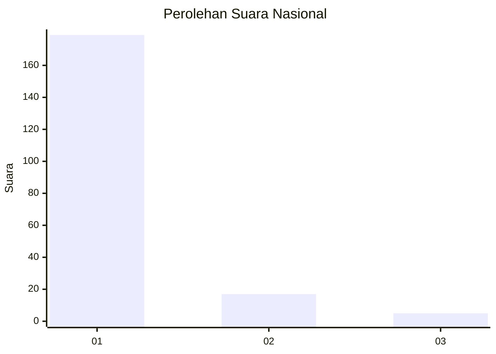
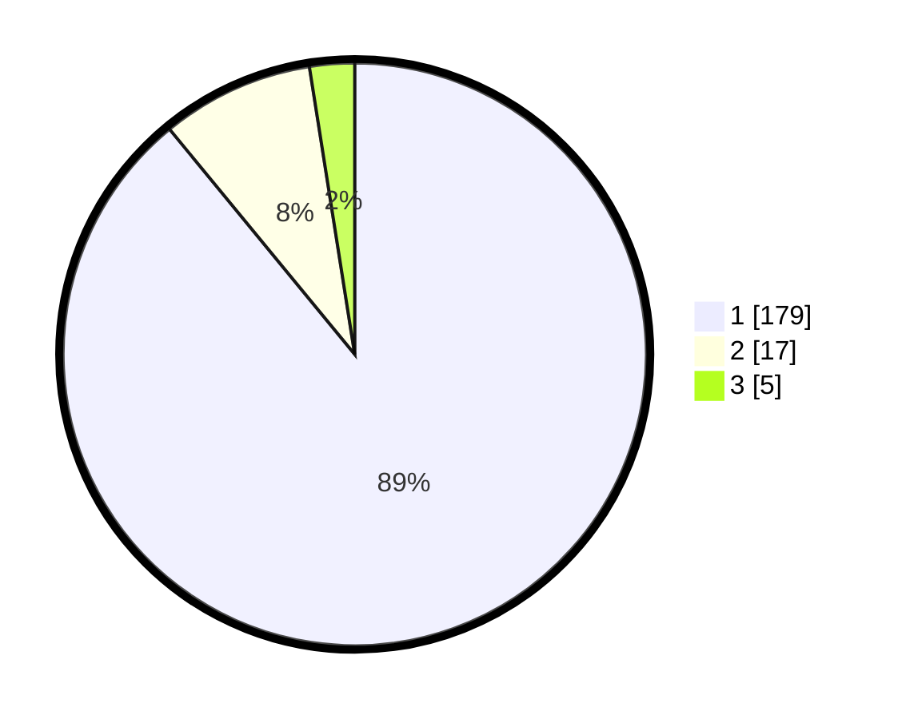

# Hasil

## Grafik

## Tabel

| No. | Nama Paslon    | Suara | Suara (raw) | Persentase |
|:--- |:-------------- | -----:| -----------:| ----------:|
| 1   | ANIES MUHAIMIN | 179   | [179][p-1]  | 89,05      |
| 2   | PRABOWO GIBRAN | 17    | [17][p-2]   | 8,46       |
| 3   | GANJAR MAHFUD  | 5     | [5][p-3]    | 2,49       |

[p-1]: https://github.com/gigit-pemilu/pemilu-2024/blob/main/pilpres/hitung-suara/sub/11-aceh/sub/14-aceh-jaya/sub/03-setia-bakti/sub/2008-gampong-baroh/sub/001-tps/sub/paslon-1.txt
[p-2]: https://github.com/gigit-pemilu/pemilu-2024/blob/main/pilpres/hitung-suara/sub/11-aceh/sub/14-aceh-jaya/sub/03-setia-bakti/sub/2008-gampong-baroh/sub/001-tps/sub/paslon-2.txt
[p-3]: https://github.com/gigit-pemilu/pemilu-2024/blob/main/pilpres/hitung-suara/sub/11-aceh/sub/14-aceh-jaya/sub/03-setia-bakti/sub/2008-gampong-baroh/sub/001-tps/sub/paslon-3.txt

## Foto C Plano

https://sirekap-obj-formc.kpu.go.id/bb57/pemilu/ppwp/11/14/03/20/08/1114032008001-20240214-200319--5bf61ec2-91dd-4e50-85d0-b295e5bca876.jpg

https://sirekap-obj-formc.kpu.go.id/bb57/pemilu/ppwp/11/14/03/20/08/1114032008001-20240214-200442--0c513b45-d973-4a65-8389-a8e7f4df0436.jpg

https://sirekap-obj-formc.kpu.go.id/bb57/pemilu/ppwp/11/14/03/20/08/1114032008001-20240214-200554--9f4caaec-5c5e-4cd2-9336-493085ceb1e5.jpg

## Metadata

| Key        | Value               |
| ---------- | ------------------- |
| Time Stamp | 2024-02-15 16:00:26 |

