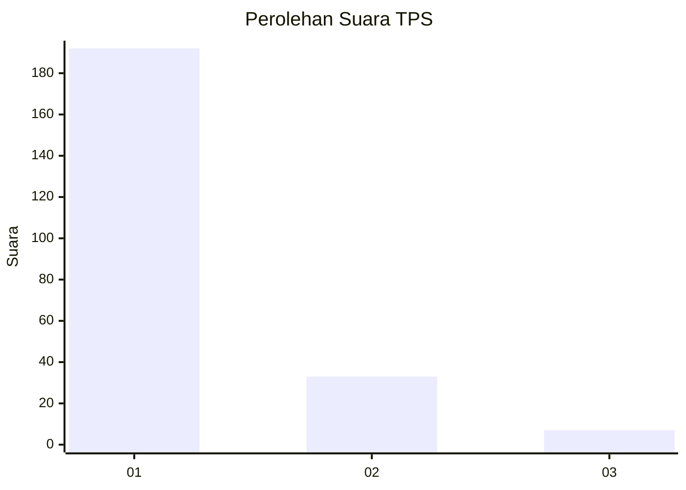
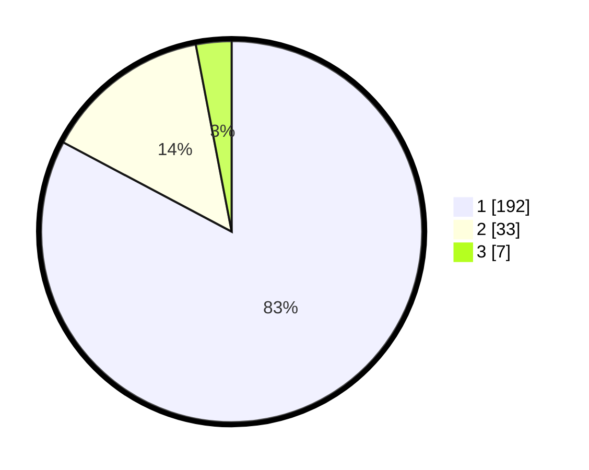

# Hasil

## Grafik

## Tabel

| No. | Nama Paslon    | Suara | Suara (raw) | Persentase |
|:--- |:-------------- | -----:| -----------:| ----------:|
| 1   | ANIES MUHAIMIN | 192   | [192][p-1]  | 82,76      |
| 2   | PRABOWO GIBRAN | 33    | [33][p-2]   | 14,22      |
| 3   | GANJAR MAHFUD  | 7     | [7][p-3]    | 3,02       |

[p-1]: https://github.com/gigit-pemilu/pemilu-2024-11-aceh/blob/main/pilpres/hitung-suara/sub/11-aceh/sub/14-aceh-jaya/sub/03-setia-bakti/sub/2009-lhok-timon/sub/002-tps/sub/paslon-1.txt
[p-2]: https://github.com/gigit-pemilu/pemilu-2024-11-aceh/blob/main/pilpres/hitung-suara/sub/11-aceh/sub/14-aceh-jaya/sub/03-setia-bakti/sub/2009-lhok-timon/sub/002-tps/sub/paslon-2.txt
[p-3]: https://github.com/gigit-pemilu/pemilu-2024-11-aceh/blob/main/pilpres/hitung-suara/sub/11-aceh/sub/14-aceh-jaya/sub/03-setia-bakti/sub/2009-lhok-timon/sub/002-tps/sub/paslon-3.txt

## Foto C Plano

https://sirekap-obj-formc.kpu.go.id/558f/pemilu/ppwp/11/14/03/20/09/1114032009002-20240215-004131--97b11576-85dc-4117-a5eb-1eb991328506.jpg

https://sirekap-obj-formc.kpu.go.id/558f/pemilu/ppwp/11/14/03/20/09/1114032009002-20240215-004546--9ec194bf-b1e9-4189-8b40-fc28a8b6e563.jpg

## Metadata

| Key        | Value               |
| ---------- | ------------------- |
| Time Stamp | 2024-02-15 12:00:28 |

